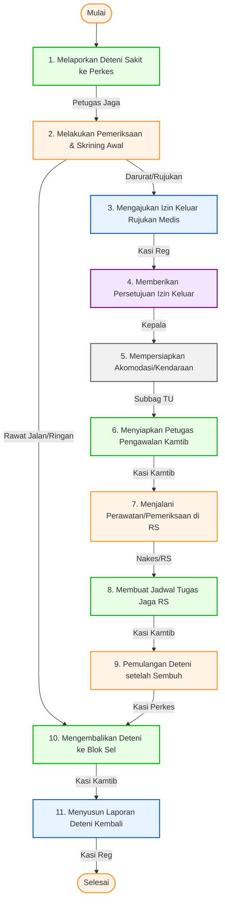

# 📋 SOP Pemeriksaan Kesehatan Deteni Keimigrasian

Dokumen ini menjelaskan tata cara pelayanan, pemeriksaan, dan penanganan kesehatan bagi deteni yang berada di bawah pengawasan Rumah Detensi Imigrasi (Rudenim) Pontianak, baik pemeriksaan rutin maupun rujukan medis darurat luar fasilitas.

---

## 🎯 1. Tujuan & Ruang Lingkup
*   **Tujuan**: Menjamin pemenuhan hak pelayanan kesehatan deteni secara cepat, tepat, dan akuntabel, serta memberikan prosedur rujukan medis yang terkoordinasi secara aman ke Rumah Sakit/Puskesmas mitra kerja sama.
*   **Ruang Lingkup**: Berlaku bagi seluruh deteni yang mengalami keluhan kesehatan selama berada di blok hunian Rudenim Pontianak, melibatkan koordinasi antara petugas jaga seksi Kamtib, tim medis seksi Perkes, seksi Registrasi, dan pimpinan.

---

## 👥 2. Pihak yang Terlibat
1.  **Kepala Rudenim**: Menandatangani Surat Persetujuan Izin Keluar Sementara Deteni untuk keperluan rujukan luar UPT.
2.  **Seksi Registrasi, Administrasi dan Pelaporan**: Mengurus administrasi izin keluar sementara deteni dan menyusun laporan akhir.
3.  **Seksi Perawatan dan Kesehatan (Perkes)**: Melakukan pemeriksaan awal (skrining), mendiagnosis tingkat kedaruratan, memantau perawatan di RS, dan memproses pemulangan deteni sembuh.
4.  **Seksi Keamanan dan Ketertiban (Kamtib)**: Menerima laporan awal deteni sakit, melaksanakan pengawalan rujukan ke RS, menyusun jadwal penjagaan di RS, dan mengembalikan deteni ke blok sel.
5.  **Sub Bagian Tata Usaha**: Mempersiapkan akomodasi atau kendaraan dinas/ambulans untuk membawa deteni ke rumah sakit rujukan.

---

## 🛠️ 3. Persyaratan & Alat Kerja
*   **Persyaratan Administrasi**:
    *   Buku Rekam Medik Deteni.
    *   Surat Izin Keluar Sementara Deteni (jika dirujuk).
    *   Surat Perintah Pengawalan dan Penjagaan RS.
    *   Surat Keterangan Dokter / Rumah Sakit Mitra.
*   **Peralatan / Perlengkapan**:
    *   Laptop/Komputer, Printer, Scanner, dan Jaringan Komunikasi.
    *   Alat Medis Dasar (Stetoskop, Sphygmomanometer/Tensimeter, Termometer).
    *   Perlengkapan Pelindung Diri (Masker, Handscone/Sarung tangan medis, Hand sanitizer).
    *   Alat Pengamanan (Borgol, tongkat pengamanan).
    *   Kendaraan dinas operasional / Ambulans.

---

## 📊 4. Diagram Alur & Mutu Baku (Flowchart)

Berikut adalah bagan alur koordinasi penanganan deteni sakit dan rujukan luar rudenim:

### 📋 Tabel Mutu Baku Prosedur Kerja

| No | Kegiatan | Pelaksana | Mutu Baku: Kelengkapan | Waktu | Output | Keterangan / Catatan |
|:--:|:---|:---|:---|:--:|:---|:---|
| **1** | Petugas Jaga melaporkan adanya deteni mengeluh sakit kepada Seksi Perkes | Seksi Keamanan dan Ketertiban | Laporan lisan / digital | 2 Menit | Laporan keluhan deteni | **Mulai**. |
| **2** | Pemeriksaan awal oleh Nakes untuk penentuan sakit gawat atau tidak gawat | Seksi Perawatan dan Kesehatan | Rekam medik deteni, stetoskop, sphygmomanometer | 15 Menit | Pernyataan status kedaruratan medis | |
| **3** | Pengajuan surat izin keluar sementara deteni untuk dirujuk ke RS/Puskesmas mitra | Seksi Registrasi, Administrasi dan Pelaporan | Komputer, printer, data deteni | 10 Menit | Berkas usulan izin rujukan luar rudenim | Jika terindikasi gawat darurat / butuh penanganan spesialis. |
| **4** | Persetujuan izin keluar sementara | Kepala Rudenim | Persetujuan Kepala Rudenim / Tanda tangan | 5 Menit | Surat Izin Keluar Sementara | |
| **5** | Persiapan akomodasi dan kendaraan operasional | Sub Bagian Tata Usaha | Kendaraan dinas / Ambulans | 2 Menit | Kendaraan siap digunakan | |
| **6** | Mempersiapkan petugas pengawalan | Seksi Keamanan dan Ketertiban | Petugas pengamanan, borgol, tongkat pengamanan | 5 Menit | Surat Perintah Pengawalan | |
| **7** | Deteni dirawat di Rumah Sakit / Puskesmas mitra | Seksi Perawatan dan Kesehatan | Hasil lab, resep obat, keterangan dokter | 60 Menit | Surat Keterangan Medis Dokter / RS | Perawatan medis profesional di luar Rudenim. |
| **8** | Membuat jadwal tugas jaga pengawalan deteni di RS/Puskesmas | Seksi Keamanan dan Ketertiban | Form jadwal piket | 120 Menit / 3 Hari | Jadwal piket jaga rumah sakit | Pengamanan ketat 24 jam selama deteni dirawat. |
| **9** | Pemulangan deteni yang dinyatakan membaik/sembuh oleh dokter RS | Seksi Perawatan dan Kesehatan | Surat keterangan sembuh dokter | 60 Menit | Surat Rekomendasi Pemulangan Deteni | |
| **10** | Deteni kembali masuk ke blok hunian | Seksi Keamanan dan Ketertiban | Kunci blok, catatan mutasi | 10 Menit | Penempatan deteni ke dalam blok semula | Serah terima fisik deteni pasca-perawatan. |
| **11** | Melaporkan kembalinya deteni ke dalam blok kepada pimpinan | Seksi Registrasi, Administrasi dan Pelaporan | Komputer, printer, data register | 5 Menit | Laporan Atensi Pimpinan | **Selesai**. Laporan dikirim ke Kanwil dan Ditjenim. |

---

## 🔄 5. Tahapan Prosedur Kerja (Langkah demi Langkah)

### Langkah 1: Pengaduan / Deteksi Keluhan Sakit
1. Deteni yang sakit atau petugas blok hunian melaporkan adanya keluhan kesehatan kepada Petugas Jaga Kamtib.
2. Petugas Jaga Kamtib menghubungi piket medis (Perkes) secara lisan maupun melalui sistem komunikasi internal.

### Langkah 2: Skrining Kelaikan Medis Awal
1. Petugas Medis (Nakes) mendatangi deteni di blok hunian atau memanggilnya ke ruang poliklinik Rudenim.
2. Nakes melakukan pemeriksaan tanda-tanda vital (tensi, nadi, suhu) dan mencatatnya di Buku Rekam Medik.
3. Nakes memutuskan status medis deteni:
    *   *Jika sakit ringan/tidak gawat*: Diberikan obat rawat jalan dan diistirahatkan di blok semula (lanjut ke Langkah 10).
    *   *Jika gawat/darurat*: Direkomendasikan rujukan segera ke RS/Puskesmas mitra.

### Langkah 3: Penyusunan Dokumen Rujukan
1. Seksi Registrasi menyiapkan kelengkapan berkas deteni sakit dan membuat draf Surat Izin Keluar Sementara Deteni untuk pengobatan luar UPT.
2. Draf diajukan kepada Kepala Rudenim.

### Langkah 4: Persetujuan Kepala Rudenim
1. Kepala Rudenim menandatangani Surat Izin Keluar Sementara Deteni demi alasan kemanusiaan dan kesehatan.

### Langkah 5: Penyiapan Transportasi & Akomodasi
1. Berdasarkan izin yang diterbitkan, staf TU menyiapkan kendaraan dinas ambulans atau kendaraan operasional yang aman.

### Langkah 6: Mobilisasi Petugas Pengawal
1. Seksi Kamtib menugaskan personel pengamanan khusus dan melengkapinya dengan peralatan standar (borgol, alat komunikasi).
2. Kasi Kamtib menandatangani Surat Perintah Pengawalan.

### Langkah 7: Perawatan di Fasilitas Kesehatan Luar UPT
1. Deteni dibawa ke RS/Puskesmas rujukan didampingi oleh Nakes Rudenim dan dikawal ketat petugas Kamtib.
2. Dokter RS memeriksa deteni dan memutuskan apakah deteni memerlukan rawat inap atau rawat jalan.
3. Hasil diagnosis medis dicatat oleh Nakes pendamping.

### Langkah 8: Penjagaan dan Pengamanan Stasioner
1. Jika deteni wajib rawat inap, Kasi Kamtib menyusun jadwal piket jaga bergilir (*shift*) untuk mengawal deteni di ruangan perawatan RS guna menghindari upaya pelarian diri.

### Langkah 9: Rekomendasi Pemulangan Medis
1. Setelah kondisi deteni dinyatakan membaik/sembuh oleh dokter RS, Nakes Rudenim berkoordinasi untuk pengeluaran deteni dari RS.
2. Petugas meminta Surat Pernyataan Boleh Pulang / Surat Keterangan Sembuh asli dari RS.

### Langkah 10: Pemulangan ke Blok Hunian
1. Petugas pengawal membawa deteni kembali ke Rudenim Pontianak.
2. Petugas Jaga Kamtib melakukan serah terima fisik deteni dan mengembalikannya ke kamar hunian semula.

### Langkah 11: Pelaporan Akhir
1. Seksi Registrasi mendokumentasikan rekam medik penanganan kesehatan deteni.
2. Menyusun Laporan Atensi Pimpinan tentang riwayat penanganan deteni sakit dan melaporkannya kepada Kepala Rudenim dengan tembusan ke Kepala Divisi Keimigrasian Kanwil.

---

## ⚡ 6. Alur Integrasi SIMKIM
Setiap mutasi keluar deteni untuk keperluan berobat luar UPT dicatat dalam menu mutasi lokal SIMKIM. Status rekam medik deteni di-update agar terdata dalam database riwayat pengawasan detensi keimigrasian secara terintegrasi.

---

## ⚖️ 7. Referensi & Dasar Hukum
*   **Undang-Undang Nomor 6 Tahun 2011** tentang Keimigrasian.
*   **Peraturan Pemerintah Nomor 31 Tahun 2011** tentang Keimigrasian sebagaimana telah diubah dengan Peraturan Pemerintah Nomor 26 Tahun 2016.
*   **Keputusan Menteri Kehakiman dan Hak Asasi Manusia Nomor M.01.PR.07.04 Tahun 2004** tentang Organisasi dan Tata Kerja Rumah Detensi Imigrasi.
*   **Peraturan Menteri Hukum dan Hak Asasi Manusia Nomor M.05.IL.02.01 Tahun 2006** tentang Rumah Detensi Imigrasi.
*   **Peraturan Direktorat Jenderal Imigrasi Nomor IMI.1917-OT.02.01 Tahun 2013** Tentang Standar Operasional Prosedur Rumah Detensi Imigrasi.
