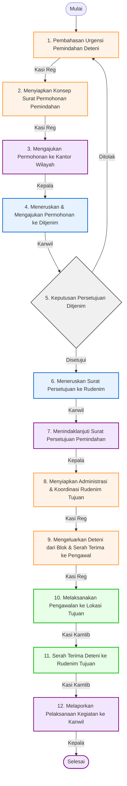

# 📋 SOP Pemindahan Deteni Antar Rudenim Keimigrasian

Dokumen ini menjelaskan tata cara dan langkah-langkah pelaksanaan pemindahan deteni dari Rumah Detensi Imigrasi (Rudenim) Pontianak ke Rudenim lain di seluruh Indonesia, berkoordinasi dengan Kantor Wilayah dan Direktorat Jenderal Imigrasi.

---

## 🎯 1. Tujuan & Ruang Lingkup
*   **Tujuan**: Menjamin proses mutasi / pemindahan deteni berjalan tertib secara hukum administrasi, meminimalisasi risiko keamanan selama pengawalan lintas daerah, serta mengatasi masalah kelebihan kapasitas (*overcapacity*) hunian.
*   **Ruang Lingkup**: Berlaku pada proses pengajuan, persetujuan Ditjenim, persiapan administrasi, pelaksanaan pengawalan fisik, hingga serah terima deteni pada Rudenim penerima (tujuan).

---

## 👥 2. Pihak yang Terlibat
1.  **Seksi Registrasi, Administrasi dan Pelaporan (Kasi Reg)**: Melakukan identifikasi urgensi, menyiapkan konsep permohonan, mengurus berkas administrasi pemindahan, dan menginput data mutasi.
2.  **Kepala Rudenim**: Mengajukan surat permohonan ke Kanwil, mendisposisi surat persetujuan, dan melaporkan akhir kegiatan.
3.  **Kantor Wilayah Kemenkumham (Kadiv Keimigrasian)**: Menindaklanjuti permohonan Rudenim dan meneruskan persetujuan Ditjenim.
4.  **Direktorat Jenderal Imigrasi (Ditjenim - Direktur Wasdakim)**: Memberikan persetujuan atau penolakan permohonan pemindahan deteni serta menentukan Rudenim tujuan.
5.  **Seksi Keamanan dan Ketertiban (Kasi Kamtib)**: Melakukan pengawalan fisik deteni dari UPT pengirim menuju UPT tujuan dan melaksanakan serah terima.

---

## 🛠️ 3. Persyaratan & Alat Kerja
*   **Persyaratan Dokumen**:
    *   Notula rapat internal tentang urgensi pemindahan.
    *   Surat Permohonan Pemindahan Deteni.
    *   Surat Keputusan Persetujuan Pemindahan dari Ditjenim.
    *   Surat Perintah Pengawalan dan Surat Perintah Pengeluaran Deteni.
    *   Berita Acara Pengeluaran Deteni dan Berita Acara Serah Terima (BAST).
*   **Peralatan / Perlengkapan**:
    *   Komputer, Printer, Scanner, Jaringan Internet.
    *   Aplikasi SiSUmaker / SIMKIM.
    *   Peralatan pengamanan pengawalan (borgol, alat komunikasi).
    *   Kamera untuk dokumentasi.

---

## 📊 4. Diagram Alur & Mutu Baku (Flowchart)

Berikut adalah bagan alur koordinasi pemindahan deteni antar-Rudenim:

### 📋 Tabel Mutu Baku Prosedur Kerja

| No | Kegiatan | Pelaksana | Mutu Baku: Kelengkapan | Waktu | Output | Keterangan / Catatan |
|:--:|:---|:---|:---|:--:|:---|:---|
| **1** | Melaksanakan pembahasan terkait urgensi Deteni untuk dipindahkan dari Rudenim | Kasi Registrasi, Administrasi dan Pelaporan | a. Identitas Deteni b. Notula rapat | 1 Jam | Notula rapat | **Mulai**. Mengidentifikasi urgensi pemindahan (kesehatan, overcapacity, keamanan). |
| **2** | Menyiapkan konsep Surat Permohonan Pemindahan Deteni ditujukan kepada Kakanwil | Kasi Registrasi, Administrasi dan Pelaporan | a. Identitas Deteni b. Notula rapat | 1 Jam | Konsep Surat Permohonan Pemindahan | |
| **3** | Mengajukan permohonan pemindahan deteni kepada Kakanwil u.p Kepala Divisi Keimigrasian | Kepala Rudenim | Konsep Surat Permohonan | 1 Jam | Surat Permohonan Pemindahan | |
| **4** | Menindaklanjuti permohonan pemindahan Deteni kepada Dirjenim u.p. Direktur Wasdakim | Kepala Kantor Wilayah | Surat Permohonan Pemindahan dari Rudenim | 1 Hari | Surat Permohonan Pemindahan dari Kanwil | Melampirkan surat permohonan dari Rudenim pengirim. |
| **5** | Memberikan persetujuan atau penolakan atas permohonan pemindahan Deteni | Direktur Jenderal Imigrasi | Surat Permohonan Pemindahan | 3 Hari | Surat persetujuan/penolakan pemindahan | Jika ditolak, kembali ke proses awal. Ditjenim menentukan Rudenim tujuan. |
| **6** | Meneruskan surat persetujuan pemindahan Deteni kepada Rudenim | Kepala Kantor Wilayah | Surat persetujuan pemindahan | 1 Hari | a. Surat persetujuan pemindahan b. Disposisi | |
| **7** | Menindaklanjuti surat persetujuan pemindahan Deteni | Kepala Rudenim | a. Surat persetujuan pemindahan b. Disposisi | 1 Jam | a. Surat persetujuan pemindahan b. Disposisi | |
| **8** | Menyiapkan administrasi pemindahan Deteni dan berkoordinasi dengan Rudenim tujuan | Kasi Registrasi, Administrasi dan Pelaporan | a. Surat persetujuan pemindahan b. Disposisi | 1 Jam | a. Surat perintah pengawalan b. Surat perintah pengeluaran c. Berita acara pengeluaran d. Input SIMKIM | Koordinasi waktu penjemputan dan armada transportasi. |
| **9** | Mengeluarkan deteni dari blok kamar dan serah terima kepada petugas pengawalan | Kasi Registrasi, Administrasi dan Pelaporan | Berkas administrasi lengkap, kunci sel, barang bawaan deteni | 1 Jam | Berita acara serah terima deteni kepada pengawal | Serah terima berkas portofolio fisik deteni. |
| **10** | Melaksanakan pengawalan ke lokasi tujuan | Kasi Keamanan dan Ketertiban | a. BAST pengawal b. Surat perintah pengawalan c. Borgol, HT | 1-3 Hari | Laporan Atensi Pimpinan | Pengawalan lintas daerah (udara/darat/laut). Rasio pengawal minimal 2 petugas per 1 deteni. |
| **11** | Melakukan serah terima Deteni kepada Rudenim tujuan | Kasi Keamanan dan Ketertiban | a. Surat perintah pengawalan b. Berkas deteni c. BAST tujuan | 1 Jam | Berita acara serah terima Deteni ke Rudenim tujuan | **Selesai fisik**. Rudenim tujuan memproses registrasi masuk. |
| **12** | Melaporkan pelaksanaan kegiatan kepada Kakanwil u.p Kadiv Imigrasi | Kepala Rudenim | Berita acara serah terima ke Rudenim tujuan | 1 Hari | Laporan pelaksanaan kegiatan | **Selesai administratif**. Ditembuskan ke Dirwasdakim Ditjenim. |

---

## 🔄 5. Tahapan Prosedur Kerja (Langkah demi Langkah)

### Langkah 1: Rapat Penentuan Urgensi
1. Seksi Registrasi mengidentifikasi deteni yang memenuhi alasan pemindahan (misalnya: masa detensi terlalu lama, faktor kerusuhan antarkelompok, atau rekomendasi medis).
2. Mengadakan rapat koordinasi terbatas untuk menyusun notula urgensi.

### Langkah 2: Penyusunan Draf Surat Permohonan
1. Operator Registrasi menyusun draf Surat Permohonan Pemindahan yang memuat profil lengkap deteni dan alasan perpindahan.
2. Draf diajukan kepada Kasi Reg untuk diperiksa.

### Langkah 3: Pengajuan ke Kanwil
1. Kepala Rudenim menandatangani Surat Permohonan resmi dan mengirimkannya ke Kepala Divisi Keimigrasian Kantor Wilayah Kemenkumham Kalimantan Barat.

### Langkah 4: Pengurusan Tingkat Wilayah
1. Divisi Keimigrasian Kanwil meneliti permohonan. Jika disetujui secara regional, Kanwil menerbitkan surat rekomendasi pengantar dan mengirimkannya ke Direktorat Jenderal Imigrasi di Jakarta.

### Langkah 5: Keputusan Direktur Jenderal Imigrasi (Ditjenim)
1. Ditjenim (Subdit Pencegahan, Penindakan dan Deportasi) menelaah berkas.
2. Menerbitkan **Surat Keputusan Persetujuan Pemindahan Deteni** (menyebutkan UPT Rudenim tujuan secara spesifik) atau Surat Penolakan jika kapasitas nasional tidak memadai.

### Langkah 6: Distribusi Surat Persetujuan ke Kanwil
1. Ditjenim mengirimkan surat persetujuan kepada Kanwil pengirim untuk diteruskan ke Rudenim Pontianak.

### Langkah 7: Disposisi Kepala Rudenim
1. Kepala Rudenim menerima surat persetujuan dari Kanwil, membubuhkan disposisi instruksi pelaksanaan kepada Kasi Reg dan Kasi Kamtib.

### Langkah 8: Penyiapan Administrasi & Koordinasi Logistik
1. Seksi Registrasi menerbitkan Surat Perintah Pengeluaran Deteni dan Berita Acara Pengeluaran.
2. Melakukan update status pemindahan di modul mutasi SIMKIM.
3. Kasi Reg menghubungi Rudenim tujuan untuk konfirmasi waktu kedatangan dan koordinasi serah terima.

### Langkah 9: Pengeluaran Deteni dari Blok
1. Petugas registrasi mendatangi blok hunian, melakukan pencocokan identitas deteni, mengembalikan barang titipan berharga deteni, dan mengeluarkan deteni dari sel hunian.
2. Melakukan serah terima berkas fisik portofolio kasus kepada petugas pengawal.

### Langkah 10: Pengawalan Lintas Wilayah
1. Petugas Seksi Kamtib membawa deteni menuju bandara/pelabuhan/jalur darat.
2. Selama perjalanan, deteni dikawal ketat sesuai protokol pengamanan (diborgol jika berisiko melarikan diri).

### Langkah 11: Serah Terima di Rudenim Tujuan
1. Setibanya di Rudenim tujuan, petugas pengawal menyerahkan fisik deteni beserta dokumen kasusnya.
2. Menandatangani **Berita Acara Serah Terima (BAST)** resmi antara Rudenim pengirim dan penerima.

### Langkah 12: Pelaporan Akhir
1. Seksi Registrasi menyusun Laporan Pelaksanaan Kegiatan Pemindahan Deteni.
2. Kepala Rudenim menandatangani laporan tersebut dan mengirimkannya ke Kantor Wilayah Kalimantan Barat dengan tembusan ke Direktur Wasdakim Ditjenim Jakarta.

---

## ⚡ 6. Alur Integrasi SIMKIM & SiSUmaker
Pencatatan mutasi pemindahan menggunakan **SIMKIM** pada modul pengeluaran deteni dengan kategori "Dipindahkan ke Rudenim Lain". Surat menyurat dinas diproses terintegrasi menggunakan aplikasi **SiSUmaker** (Sistem Surat Masuk & Keluar) Kementerian.

---

## ⚖️ 7. Referensi & Dasar Hukum
*   **Undang-Undang Nomor 6 Tahun 2011** tentang Keimigrasian sebagaimana telah diubah dengan Undang-Undang Nomor 6 Tahun 2023 tentang Cipta Kerja.
*   **Peraturan Pemerintah Nomor 31 Tahun 2013** tentang Peraturan Pelaksanaan Undang-Undang Nomor 6 Tahun 2011 Keimigrasian jo PP No. 48 Tahun 2021.
*   **Peraturan Presiden Nomor 125 Tahun 2016** tentang Penanganan Pengungsi dari Luar Negeri.
*   **Peraturan Menteri Hukum dan Hak Asasi Manusia Nomor M.05.IL.02.01 Tahun 2006** tentang Rumah Detensi Imigrasi.
*   **Keputusan Menteri Kehakiman dan Hak Asasi Manusia Nomor M.01.PR.07.04 Tahun 2004** tentang Organisasi dan Tata Kerja Rumah Detensi Imigrasi.
*   **Surat Edaran Direktur Jenderal Imigrasi Nomor IMI-1022.GR.03.03 Tahun 2019** tentang Tata Cara Pemindahan, Pemulangan, Penempatan ke Negara Ketiga, Pengawasan Deteni, Pencari Suaka dan Pengungsi.
