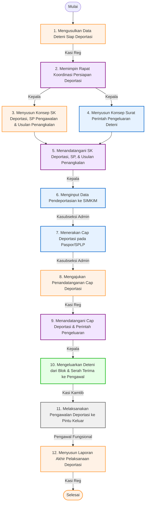

# 📋 SOP Pendeportasian Deteni Keimigrasian

Dokumen ini menjelaskan tata cara pelaksanaan pendeportasian (pemulangan paksa) deteni warga negara asing ke negara asalnya serta proses administrasi penangkalan keimigrasian pada Rumah Detensi Imigrasi (Rudenim) Pontianak.

---

## 🎯 1. Tujuan & Ruang Lingkup
*   **Tujuan**: Menjamin proses penegakan hukum keimigrasian melalui pemulangan deteni berjalan secara sah, aman, berkoordinasi dengan perwakilan negara asing, serta memastikan data deteni dicegah-tangkal di database nasional.
*   **Ruang Lingkup**: Berlaku pada pengajuan usulan, persidangan/pembahasan kasus, penerbitan Surat Keputusan Deportasi & Penangkalan, pembubuhan cap deportasi pada paspor, pelaksanaan pengawalan fisik ke pintu keluar (*border/airport*), hingga pelaporan akhir.

---

## 👥 2. Pihak yang Terlibat
1.  **Kepala Rudenim**: Memimpin rapat persiapan, menandatangani keputusan pendeportasian, menandatangani surat pengusulan penangkalan, menandatangani Surat Perintah Pengawalan/Pengeluaran, dan menandatangani cap deportasi di dokumen perjalanan.
2.  **Kepala Seksi Registrasi, Administrasi dan Pelaporan (Kasi Reg)**: Mengusulkan data deteni siap deportasi, menyusun konsep keputusan pendeportasian dan penangkalan, mengajukan cap deportasi, serta menyusun laporan akhir pelaksanaan.
3.  **Kepala Subseksi Administrasi dan Pelaporan (Kasubseksi Admin)**: Menyusun konsep surat perintah pengeluaran deteni, menginput data pendeportasian ke aplikasi Rudenim, dan menerakan cap deportasi pada paspor.
4.  **Kepala Seksi Keamanan dan Ketertiban (Kasi Kamtib)**: Mengeluarkan deteni dari sel hunian, mencocokkan data fisik barang, dan melakukan serah terima fisik kepada petugas pengawal.
5.  **Pejabat Fungsional (Petugas Pengawal/Jaga)**: Melaksanakan pengamanan fisik deteni selama perjalanan ke bandara internasional/titik keberangkatan, menyelesaikan proses imigrasi keluar (*exit permit*), dan mendokumentasikan pemulangan.

---

## 🛠️ 3. Persyaratan & Alat Kerja
*   **Persyaratan Dokumen**:
    *   Dokumen perjalanan yang sah dan masih berlaku (Paspor / Surat Perjalanan Laksana Paspor - SPLP).
    *   Tiket perjalanan (*Flight Ticket*) kembali ke negara asal.
    *   Rekomendasi dari Perwakilan Negara Asing (Kedutaan/Konsulat).
    *   Surat Keputusan Tindakan Administratif Keimigrasian (TAK) berupa Pendeportasian.
    *   Surat Perintah Pengeluaran Deteni & Surat Perintah Pengawalan.
*   **Peralatan / Perlengkapan**:
    *   Komputer, Printer, Scanner, dan Jaringan Komunikasi.
    *   Aplikasi SIMKIM / Sisumaker.
    *   Cap Dinas dan Cap Deportasi (*Deportation Stamp*).
    *   Alat pengamanan standar (borgol, alat komunikasi).
    *   Perlengkapan medis pelindung diri (masker, sarung tangan).

---

## 📊 4. Diagram Alur & Mutu Baku (Flowchart)

Berikut adalah bagan alur koordinasi pelaksanaan deportasi deteni:

### 📋 Tabel Mutu Baku Prosedur Kerja

| No | Kegiatan | Pelaksana | Mutu Baku: Kelengkapan | Waktu | Output | Keterangan / Catatan |
|:--:|:---|:---|:---|:--:|:---|:---|
| **1** | Mengusulkan data Deteni yang sudah siap untuk dilakukan pendeportasian | Kepala Seksi Registrasi, Administrasi dan Pelaporan | a. Travel document b. Tiket | 20 Menit | Nota Dinas usulan | **Mulai**. |
| **2** | Memimpin pembahasan persiapan pendeportasian Deteni | Kepala | a. Ruang rapat b. Nota dinas c. Absensi d. Dokumentasi | 60 Menit | Notulen rapat | Rapat membahas identifikasi kelengkapan tiket, paspor/SPLP, serta status penangkalan. |
| **3** | Menindaklanjuti hasil rapat dengan menyusun konsep SK deportasi, SP pengawalan, surat bantuan, dan usulan penangkalan | Kepala Seksi Registrasi, Administrasi dan Pelaporan | a. Notulensi rapat b. Aplikasi Sisumaker | 15 Menit | a. Draf SK deportasi b. Draf SP pengawalan c. Draf surat bantuan keberangkatan d. Draf usulan penangkalan | |
| **4** | Menindaklanjuti hasil rapat dengan menyusun konsep surat perintah pengeluaran Deteni | Kepala Subseksi Administrasi dan Pelaporan | a. Notulensi rapat b. Aplikasi Sisumaker | 15 Menit | Draf Surat Perintah Pengeluaran Deteni | |
| **5** | Menandatangani berkas SK deportasi, SP pengawalan, SP pengeluaran, surat bantuan, dan usulan penangkalan | Kepala | a. Notulensi rapat b. Aplikasi Sisumaker | 30 Menit | a. Surat Keputusan b. Surat Perintah Pengawalan c. Surat perintah pengeluaran d. Surat usulan penangkalan | |
| **6** | Menginput data deteni dalam aplikasi Rudenim | Kepala Subseksi Administrasi dan Pelaporan | a. Komputer b. Jaringan c. Aplikasi SIMKIM d. Printer/Scanner | 60 Menit | Register pendeportasian | Pencatatan status deportasi di database SIMKIM. |
| **7** | Menerakan cap deportasi pada dokumen perjalanan serta menyerahkan ke Kasi RAP | Kepala Subseksi Administrasi dan Pelaporan | a. Cap deportasi b. ATK | 5 Menit | Teraan cap deportasi | Paspor dibubuhi stempel deportasi resmi. |
| **8** | Pengajuan penandatanganan cap deportasi | Kepala Seksi Registrasi, Administrasi dan Pelaporan | ATK, paspor tercap | 5 Menit | Data dukung dokumen pendeportasian | |
| **9** | Menandatangani cap deportasi dan memerintahkan pengeluaran Deteni | Kepala | a. Surat keputusan b. Paspor tercap | 15 Menit | Penandatanganan cap | Kepala Rudenim menandatangani cap deportasi di paspor deteni. |
| **10** | Mengeluarkan Deteni dari kamar dan serah terima kepada petugas pengawalan | Kepala Seksi Keamanan dan Ketertiban | a. Masker b. Sarung tangan c. Alat keamanan/komunikasi d. ATK, Kamera | 20 Menit | Berita Acara Serah Terima Deteni | Deteni diserahkan secara fisik kepada tim pengawal. |
| **11** | Melakukan pengawalan Deteni ke bandara keberangkatan | Pejabat Fungsional | a. SK TAK Deportasi b. SP Pengawalan/Pengeluaran c. Tiket, dokumen perjalanan | 3 Hari | a. Pendeportasian Deteni b. Tanda keluar paspor c. BAST boarding | Pengawal mengawal deteni hingga boarding pesawat meninggalkan wilayah Indonesia. |
| **12** | Melaporkan pelaksanaan pendeportasian kepada pimpinan | Kepala Seksi Registrasi, Administrasi dan Pelaporan | Dokumen serah terima keberangkatan, foto boarding | 1 Hari | Laporan | **Selesai**. Laporan dikirimkan ke Direktorat Jenderal Imigrasi dan Kanwil. |

---

## 🔄 5. Tahapan Prosedur Kerja (Langkah demi Langkah)

### Langkah 1: Pengusulan Deteni
1. Kasi Reg mendata deteni yang telah memiliki tiket penerbangan pulang yang valid (*confirmed*) serta dokumen perjalanan (Paspor/SPLP) yang diterbitkan kedutaan.
2. Mengajukan Nota Dinas usulan rapat persiapan deportasi kepada Kepala Rudenim.

### Langkah 2: Rapat Pembahasan Kasus
1. Kepala Rudenim mengadakan rapat persiapan bersama seksi Registrasi, Kamtib, dan petugas intelijen keimigrasian.
2. Membahas konfirmasi rute penerbangan, status cekal terpusat, pengawalan, koordinasi dengan maskapai dan pihak imigrasi bandara keberangkatan.

### Langkah 3 & 4: Penyusunan Dokumen Keputusan & Pengeluaran
1. Seksi Registrasi menyusun dokumen draf Keputusan Tindakan Administratif Keimigrasian (TAK) pendeportasian, draf Surat Perintah Pengawalan, dan Surat Pengusulan Penangkalan (agar deteni masuk daftar cekal nasional).
2. Kasubseksi Admin menyusun draf Surat Perintah Pengeluaran Deteni.

### Langkah 5: Penandatanganan Berkas Utama
1. Kepala Rudenim memeriksa dan menandatangani seluruh berkas keputusan pendeportasian, surat perintah, dan usulan penangkalan secara serentak.

### Langkah 6: Update Database SIMKIM
1. Kasubseksi Admin melakukan perekaman data rencana deportasi ke dalam aplikasi SIMKIM, melampirkan file scan tiket, dokumen perjalanan, dan Surat Keputusan Deportasi.

### Langkah 7, 8, & 9: Pembubuhan Cap Deportasi
1. Kasubseksi Admin menerakan cap deportasi resmi pada halaman paspor atau lembar SPLP deteni.
2. Dokumen paspor diajukan oleh Kasi Reg kepada Kepala Rudenim.
3. Kepala Rudenim menandatangani di atas teraan cap deportasi tersebut sebagai pengesahan akhir hukum keberangkatan.

### Langkah 10: Pengeluaran & Serah Terima Fisik
1. Seksi Kamtib membawa deteni keluar dari blok hunian, mengembalikan sisa barang bawaan yang dititipkan, serta melakukan serah terima fisik deteni kepada tim pengawal (Fungsional) disertai penandatanganan Berita Acara Serah Terima Deteni.

### Langkah 11: Pengawalan & Keberangkatan (Deportasi)
1. Petugas pengawal membawa deteni menuju bandara internasional (misalnya Bandara Supadio Pontianak untuk transit ke Bandara Soekarno-Hatta).
2. Petugas mengawal deteni melintasi pemeriksaan paspor imigrasi bandara, memastikan petugas imigrasi bandara membubuhi cap keberangkatan (*departure stamp*).
3. Mengawal deteni hingga masuk ke dalam pintu pesawat (*boarding*).

### Langkah 12: Penyusunan Laporan Kegiatan
1. Setelah deteni lepas landas, tim pengawal menyerahkan bukti cap paspor dan boarding pass kepada Seksi Registrasi.
2. Kasi Reg menyusun Laporan Pelaksanaan Pendeportasian dan mengirimkannya secara tertulis kepada Kepala Kantor Wilayah u.p Kepala Divisi Keimigrasian, serta ditembuskan ke Direktorat Jenderal Imigrasi untuk aktivasi masa penangkalan (cekal) deteni tersebut.

---

## ⚡ 6. Alur Integrasi SIMKIM
Setelah pendeportasian selesai, operator registrasi meng-update status akhir deteni pada modul SIMKIM dari status "Deteni Aktif" menjadi "Telah Dideportasi". Sistem secara otomatis mengirimkan usulan penangkalan ke server pusat Ditjenim untuk memblokir deteni masuk kembali ke wilayah Indonesia.

---

## ⚖️ 7. Referensi & Dasar Hukum
*   **Undang-Undang Nomor 6 Tahun 2011** tentang Keimigrasian (Pasal 75 mengenai Tindakan Administratif Keimigrasian dan Pasal 83 mengenai Pendeportasian).
*   **Peraturan Pemerintah Nomor 31 Tahun 2011** tentang Keimigrasian sebagaimana telah diubah dengan Peraturan Pemerintah Nomor 26 Tahun 2016.
*   **Keputusan Menteri Kehakiman dan Hak Asasi Manusia Nomor M.01.PR.07.04 Tahun 2004** tentang Organisasi dan Tata Kerja Rumah Detensi Imigrasi.
*   **Peraturan Menteri Hukum dan Hak Asasi Manusia Nomor M.05.IL.02.01 Tahun 2006** tentang Rumah Detensi Imigrasi.
*   **Peraturan Direktorat Jenderal Imigrasi Nomor IMI.1917-OT.02.01 Tahun 2013** Tentang Standar Operasional Prosedur Rumah Detensi Imigrasi.
