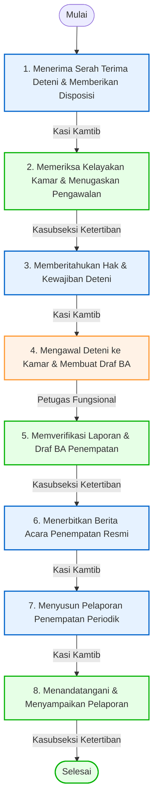

# 📋 SOP Penempatan Deteni Keimigrasian

Dokumen ini menjelaskan tata cara penempatan deteni ke dalam kamar atau blok hunian pada Rumah Detensi Imigrasi (Rudenim) Pontianak berdasarkan klasifikasi keamanan, jenis kelamin, kewarganegaraan, dan faktor risiko.

---

## 🎯 1. Tujuan & Ruang Lingkup
*   **Tujuan**: Menjamin keamanan dan ketertiban di lingkungan UPT dengan menempatkan deteni baru pada blok/kamar yang sesuai, menghindari ketegangan antar-kewarganegaraan, serta menjamin pemenuhan standar kelayakan hunian.
*   **Ruang Lingkup**: Prosedur ini dijalankan oleh jajaran Seksi Keamanan dan Ketertiban setelah menerima serah terima deteni yang selesai diregistrasi dan dinyatakan sehat dari Seksi Registrasi, Administrasi dan Pelaporan.

---

## 👥 2. Pihak yang Terlibat
1.  **Kepala Seksi Keamanan dan Ketertiban (Kasi Kamtib)**: Menerima serah terima awal, memberikan disposisi penempatan, memberitahukan hak-kewajiban, menerbitkan Berita Acara (BA) Penempatan, dan menyusun laporan periodik.
2.  **Kepala Subseksi Ketertiban (Kasubseksi Ketertiban)**: Memeriksa ketersediaan kamar, menunjuk pengawal, memproses BA Penempatan, menandatangani laporan, dan memfinalisasi berkas.
3.  **Pemangku Jabatan Fungsional (Petugas Jaga/Pengawal)**: Melakukan pengawalan fisik deteni ke blok, memasukkan deteni ke kamar, menyusun laporan penempatan, dan draf Berita Acara.

---

## 🛠️ 3. Persyaratan & Alat Kerja
*   **Persyaratan Dokumen**:
    *   Berita Acara Serah Terima Deteni dari Seksi Registrasi.
    *   Surat Keterangan Sehat (dari Seksi Perkes).
    *   Profil awal / berkas ringkasan kasus deteni.
*   **Peralatan / Perlengkapan**:
    *   Komputer, Printer, dan Jaringan Komunikasi.
    *   Papan Blok Daftar Deteni (informasi kapasitas kamar).
    *   Kartu Blok Deteni.
    *   Alat Pengamanan (kunci blok, kunci sel).
    *   Perlengkapan kesehatan (masker, sarung tangan).
    *   Alat Tulis Kantor (ATK).

---

## 📊 4. Diagram Alur & Mutu Baku (Flowchart)

Berikut adalah bagan alur koordinasi penempatan deteni ke kamar hunian:

### 📋 Tabel Mutu Baku Prosedur Kerja

| No | Kegiatan | Pelaksana | Mutu Baku: Kelengkapan | Waktu | Output | Keterangan / Catatan |
|:--:|:---|:---|:---|:--:|:---|:---|
| **1** | Menerima Deteni dari Seksi Registrasi, Administrasi dan Pelaporan serta memberikan disposisi atau arahan tindak lanjut | Kepala Seksi Keamanan dan Ketertiban | Berita Acara Serah Terima Deteni | 5 Menit | Disposisi penempatan deteni | **Mulai**. |
| **2** | Memeriksa kelayakan ketersediaan dan menentukan kamar Deteni serta menugaskan petugas jaga untuk pengawalan penempatan | Kepala Subseksi Ketertiban | a. Formulir kesehatan b. Data kamar layak dan siap pakai | 10 Menit | Kartu Blok Deteni | Membagi deteni berdasarkan kelompok kerawanan/klasifikasi. |
| **3** | Memberitahukan hak dan kewajiban Deteni | Kepala Seksi Keamanan dan Ketertiban | Formulir informasi tentang hak dan kewajiban | 10 Menit | Formulir pernyataan telah mengerti tentang hak dan kewajiban | Memastikan deteni memahami tata tertib Rudenim Pontianak. |
| **4** | Melakukan pengawalan, menempatkan Deteni di kamar, serta menyusun konsep Berita Acara Penempatan | Pemangku Jabatan Fungsional | a. Kartu blok deteni b. Alat keamanan c. Masker d. Sarung tangan e. Kunci kamar | 10 Menit | a. Penempatan Deteni di kamar b. Konsep Berita Acara Penempatan | Petugas jaga mengantar deteni secara langsung dan mengunci sel. |
| **5** | Menerima laporan dan konsep Berita Acara Penempatan | Kepala Subseksi Ketertiban | a. Komputer b. Jaringan c. Printer | 5 Menit | Konsep Berita Acara Penempatan | Pemeriksaan draf BA untuk diajukan ke Kasi Kamtib. |
| **6** | Menerbitkan Berita Acara Penempatan | Kepala Seksi Keamanan dan Ketertiban | a. Komputer b. Jaringan c. Printer | 5 Menit | Berita Acara Penempatan | Memuat: Hari/tanggal/jam, pejabat tanda tangan, biodata deteni, kasus, dan kamar. |
| **7** | Penyusunan pelaporan penempatan Deteni secara periodik | Kepala Seksi Keamanan dan Ketertiban | a. Komputer b. Jaringan c. ATK d. Printer | 60 Menit | Laporan | Disusun setiap bulan. Ditujukan kepada Direktur Pengawasan & Penindakan Keimigrasian, Dir. Intelijen, Dir. Kerja Sama. |
| **8** | Penandatanganan dan penyampaian pelaporan | Kepala Subseksi Ketertiban | Laporan | 5 Menit | Laporan yang telah ditandatangani | **Selesai**. Tembusan dikirim ke Kanwil Kemenkumham u.p. Kadiv Imigrasi. |

---

## 🔄 5. Tahapan Prosedur Kerja (Langkah demi Langkah)

### Langkah 1: Penerimaan Disposisi
1. Kasi Kamtib menerima berkas administrasi dan BAST fisik deteni dari seksi Registrasi.
2. Kasi Kamtib meneliti riwayat kasus untuk meminimalkan penempatan deteni bermusuhan dalam satu area, lalu menerbitkan disposisi penempatan.

### Langkah 2: Skrining Hunian & Penugasan
1. Kasubseksi Ketertiban memeriksa status hunian saat ini menggunakan papan blok deteni.
2. Menentukan nomor blok dan kamar hunian yang aman dan layak.
3. Kasubseksi menugaskan petugas jaga (Fungsional) untuk bersiap mengawal penempatan.

### Langkah 3: Sosialisasi Hak & Kewajiban
1. Kasi Kamtib mengumpulkan deteni baru di ruang pengarahan.
2. Petugas menjelaskan hak-hak deteni (makan, layanan medis, akses komunikasi) serta kewajibannya (mematuhi tata tertib, larangan membawa senjata/ponsel, jam istirahat).
3. Deteni menandatangani formulir pernyataan telah memahami hak dan kewajiban.

### Langkah 4: Pengawalan Fisik ke Kamar
1. Petugas Fungsional melakukan penggeledahan badan terakhir, memakaikan masker, lalu mengawal deteni baru ke kamar hunian yang ditentukan.
2. Petugas membuka gembok sel, memasukkan deteni, mengunci pintu kamar, dan mencatat nomor sel ke dalam Kartu Blok Deteni.
3. Petugas Fungsional menyusun draf Berita Acara Penempatan.

### Langkah 5: Verifikasi Dokumen BA
1. Kasubseksi Ketertiban memeriksa draf Berita Acara Penempatan yang diajukan oleh petugas pengawal untuk diverifikasi kesesuaian biodata dan kamar huniannya.

### Langkah 6: Penerbitan BA Resmi
1. Kasi Kamtib menandatangani Berita Acara Penempatan secara resmi. Berkas didokumentasikan di Seksi Kamtib dan registrasi.

### Langkah 7: Pengolahan Laporan Periodik
1. Setiap akhir bulan, Kasi Kamtib menyusun Laporan Evaluasi Penempatan Deteni yang merangkum jumlah deteni masuk, mutasi kamar, tingkat keterisian kapasitas (kapasitas blok), dan kerawanan ketertiban.

### Langkah 8: Penandatanganan & Penyampaian
1. Kasubseksi Ketertiban memfinalisasi naskah laporan, membubuhkan paraf/tanda tangan, dan menyampaikannya kepada Kepala Rudenim untuk dikirimkan secara berkala ke Direktorat Jenderal Imigrasi dan Kantor Wilayah.

---

## ⚡ 6. Alur Integrasi SIMKIM
Data nomor blok dan nomor kamar hunian deteni diinput ke dalam modul Penempatan SIMKIM oleh operator Registrasi berdasarkan Berita Acara Penempatan yang dikirim oleh Seksi Kamtib. Hal ini penting untuk pencarian lokasi deteni secara digital.

---

## ⚖️ 7. Referensi & Dasar Hukum
*   **Undang-Undang Nomor 6 Tahun 2011** tentang Keimigrasian.
*   **Peraturan Pemerintah Nomor 31 Tahun 2011** tentang Keimigrasian sebagaimana telah diubah dengan Peraturan Pemerintah Nomor 26 Tahun 2016.
*   **Keputusan Menteri Kehakiman dan Hak Asasi Manusia Nomor M.01.PR.07.04 Tahun 2004** tentang Organisasi dan Tata Kerja Rumah Detensi Imigrasi.
*   **Peraturan Menteri Hukum dan Hak Asasi Manusia Nomor M.05.IL.02.01 Tahun 2006** tentang Rumah Detensi Imigrasi.
*   **Peraturan Direktorat Jenderal Imigrasi Nomor IMI.1917-OT.02.01 Tahun 2013** Tentang Standar Operasional Prosedur Rumah Detensi Imigrasi.
