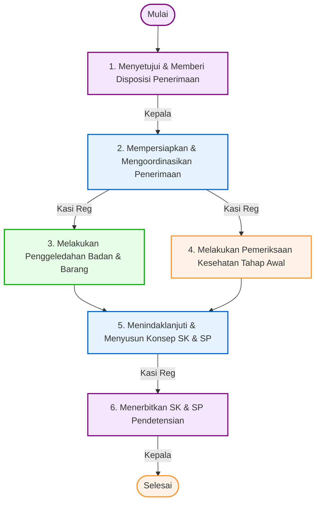

# 📋 SOP Penerimaan Calon Deteni Keimigrasian

Dokumen ini menjelaskan tata cara dan prosedur pelaksanaan penerimaan calon deteni baru yang diserahkan dari Kantor Imigrasi (Kanim) pengirim atau instansi lain kepada Rumah Detensi Imigrasi (Rudenim) Pontianak.

---

## 🎯 1. Tujuan & Ruang Lingkup
*   **Tujuan**: Menjamin proses serah terima calon deteni berjalan aman, tertib, sesuai ketentuan administrasi hukum keimigrasian, serta memastikan kondisi kesehatan fisik dan keamanan awal calon deteni.
*   **Ruang Lingkup**: Berlaku pada proses penerimaan fisik dan berkas administrasi calon deteni baru di lingkungan Rumah Detensi Imigrasi Pontianak.

---

## 👥 2. Pihak yang Terlibat
1.  **Kepala Rudenim**: Memberikan persetujuan akhir serta menerbitkan Surat Keputusan dan Surat Perintah Pendetensian.
2.  **Kepala Seksi Registrasi, Administrasi dan Pelaporan (Kasi Reg)**: Mempersiapkan dan mengoordinasikan penerimaan berkas serta menyusun konsep keputusan pendetensian.
3.  **Kepala Seksi Keamanan dan Ketertiban (Kasi Kamtib)**: Melakukan penggeledahan badan dan barang bawaan calon deteni.
4.  **Kepala Seksi Perawatan dan Kesehatan (Kasi Perkes)**: Melakukan pemeriksaan kesehatan fisik awal calon deteni.

---

## 🛠️ 3. Persyaratan & Alat Kerja
*   **Persyaratan Dokumen**:
    *   Surat Pengantar dari Kantor Imigrasi asal / instansi pengirim.
    *   Berkas kasus keimigrasian calon deteni.
    *   Dokumen Perjalanan (Paspor atau dokumen pengganti paspor).
*   **Peralatan/Perlengkapan**:
    *   Komputer, Printer, dan Scanner.
    *   Kamera SLR / Webcam untuk dokumentasi.
    *   Alat tulis kantor (ATK).
    *   Cap Dinas.
    *   Peralatan medis dasar (Tensimeter, stetoskop, timbangan berat badan, pengukur tinggi badan, testpack kehamilan, testpack narkoba, lampu senter).
    *   Sarung tangan medis, masker, kantong plastik barang bukti, dan metal detektor.
    *   Ruang Penggeledahan dan Ruang Pemeriksaan Kesehatan.

---

## 📊 4. Diagram Alur & Mutu Baku (Flowchart)

Berikut adalah bagan alur koordinasi dalam proses penerimaan calon deteni:

### 📋 Tabel Mutu Baku Prosedur Kerja

| No | Kegiatan | Pelaksana | Mutu Baku: Kelengkapan | Waktu | Output | Keterangan / Catatan |
|:--:|:---|:---|:---|:--:|:---|:---|
| **1** | Memberikan persetujuan/disposisi/arahan penerimaan calon Deteni | Kepala | Dokumen pengantar / berkas usulan | 5 Menit | Disposisi persetujuan | **Mulai**. |
| **2** | Mempersiapkan dan/atau mengoordinasikan penerimaan calon Deteni berdasarkan persetujuan/disposisi/arahan | Kepala Seksi Registrasi, Administrasi dan Pelaporan | a. Verifikasi penerimaan calon Deteni b. Disposisi surat pengantar c. Sistem Informasi Keimigrasian | 5 Menit | Persetujuan elektronik / disposisi manual | |
| **3** | Melakukan penggeledahan calon Deteni | Kepala Seksi Keamanan dan Ketertiban | a. Sarung tangan b. Masker c. Kantong plastik d. Metal detektor e. ATK f. Kamera g. Ruang penggeledahan | 10 Menit | Berita Acara Penitipan Barang dan Daftar Barang titipan | Penggeledahan badan dan barang bawaan untuk mencegah barang terlarang masuk Rudenim. |
| **4** | Melakukan Pemeriksaan Kesehatan Tahap Awal | Kepala Seksi Perawatan dan Kesehatan | a. Masker b. Sarung tangan c. Tensimeter d. Stetoskop e. Alat ukur berat badan f. Alat ukur tinggi badan g. Testpack kehamilan h. Testpack narkoba i. Lampu senter j. Formulir kesehatan k. ATK l. Tempat tidur pemeriksaan m. Ruang pemeriksaan n. Baju pemeriksaan | 30 Menit | Surat Keterangan Sehat | Pemeriksaan kondisi fisik dasar untuk memastikan kelaikan kesehatan deteni. |
| **5** | Menindaklanjuti hasil pemeriksaan awal dan penggeledahan dengan membuat surat keputusan dan surat perintah | Kepala Seksi Registrasi, Administrasi dan Pelaporan | a. Komputer b. Printer c. ATK d. Cap dinas e. Berita Acara Penitipan Barang f. Surat Keterangan Sehat | 10 Menit | Konsep Surat Keputusan dan Berita Acara Serah Terima (BAST) | Konsep diusulkan ke Kepala Rudenim. |
| **6** | Menerbitkan Surat Keputusan dan surat perintah Pendetensian | Kepala | a. Konsep Surat Keputusan b. Konsep surat perintah c. Berita Acara Serah Terima | 5 Menit | 1. Surat Keputusan Pendetensian 2. Surat Perintah Pendetensian | **Selesai**. Ditembuskan ke Perwakilan Negara Deteni. |

---

## 🔄 5. Tahapan Prosedur Kerja (Langkah demi Langkah)

### Langkah 1: Pengajuan Disposisi Awal
1. Petugas pengirim dari Kanim/Instansi lain menyerahkan dokumen pengantar beserta calon deteni kepada staf piket Rudenim.
2. Berkas diserahkan kepada Kepala Rudenim untuk disetujui. Kepala Rudenim meneliti berkas dan memberikan disposisi/arahan penerimaan.

### Langkah 2: Koordinasi & Verifikasi Berkas
1. Kasi Reg menerima berkas dengan disposisi dari Kepala Rudenim.
2. Kasi Reg memverifikasi kesesuaian dokumen dan menginstruksikan seksi Kamtib serta seksi Perkes untuk melakukan tindakan teknis pemeriksaan.

### Langkah 3: Penggeledahan Badan & Barang
1. Petugas Seksi Kamtib membawa calon deteni ke ruang penggeledahan.
2. Petugas menggeledah badan dan barang bawaan deteni menggunakan metal detektor untuk meminimalisasi penyelundupan senjata tajam, obat terlarang, atau barang berbahaya lain.
3. Barang berharga (uang, handphone, identitas asli) didata, disimpan di loker pengaman, dan diterbitkan **Berita Acara Penitipan Barang** yang ditandatangani kedua belah pihak.

### Langkah 4: Pemeriksaan Kesehatan Fisik
1. Calon deteni diarahkan ke Klinik/Ruang Kesehatan Rudenim.
2. Petugas medis (Nakes) di bawah pengawasan Kasi Perkes melakukan anamnesa dan pemeriksaan fisik (tensi darah, suhu, berat/tinggi badan).
3. Melakukan pemeriksaan khusus seperti tes kehamilan (bagi deteni wanita) dan tes urine narkoba.
4. Nakes menerbitkan **Surat Keterangan Sehat** (atau rekomendasi rujukan apabila deteni dalam keadaan sakit gawat).

### Langkah 5: Penyusunan Konsep Pendetensian
1. Seksi Registrasi mengumpulkan Berita Acara Penitipan Barang dan Surat Keterangan Sehat.
2. Operator menyusun konsep Surat Keputusan Pendetensian, Surat Perintah Pendetensian, dan BAST.
3. Berkas konsep divalidasi oleh Kasi Reg.

### Langkah 6: Penerbitan SK & Penyerahan Fisik
1. Kepala Rudenim menandatangani Surat Keputusan Pendetensian dan Surat Perintah Pendetensian secara elektronik/manual.
2. Petugas mencetak dokumen tersebut dan menyerahkan salinannya kepada deteni.
3. Deteni diproses lebih lanjut untuk registrasi biometrik dan penempatan kamar blok hunian.

---

## ⚡ 6. Alur Integrasi SIMKIM
Data penerimaan awal, termasuk surat pengantar Kanim dan surat perintah pendetensian yang baru diterbitkan, direkam ke dalam modul Pengawasan SIMKIM untuk mengunci profil awal deteni di database keimigrasian nasional.

---

## ⚖️ 7. Referensi & Dasar Hukum
*   **Undang-Undang Nomor 6 Tahun 2011** tentang Keimigrasian.
*   **Peraturan Pemerintah Nomor 31 Tahun 2011** tentang Keimigrasian sebagaimana telah diubah dengan Peraturan Pemerintah Nomor 26 Tahun 2016.
*   **Keputusan Menteri Kehakiman dan Hak Asasi Manusia Nomor M.01.PR.07.04 Tahun 2004** tentang Organisasi dan Tata Kerja Rumah Detensi Imigrasi.
*   **Peraturan Menteri Hukum dan Hak Asasi Manusia Nomor M.05.IL.02.01 Tahun 2006** tentang Rumah Detensi Imigrasi.
*   **Peraturan Direktorat Jenderal Imigrasi Nomor IMI.1917-OT.02.01 Tahun 2013** Tentang Standar Operasional Prosedur Rumah Detensi Imigrasi.
