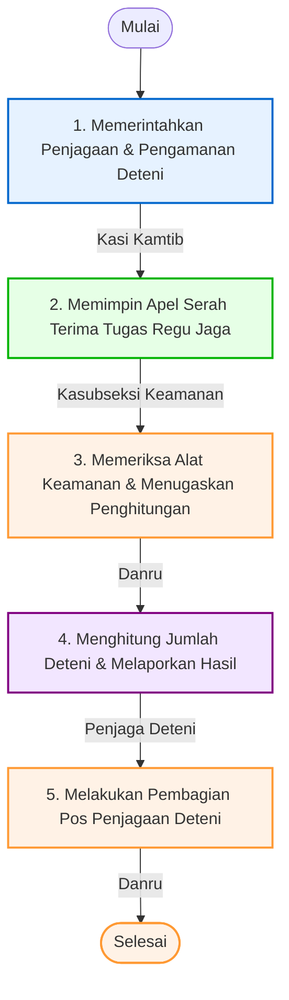

# 📋 SOP Penjagaan dan Pengamanan Deteni Keimigrasian

Dokumen ini menjelaskan tata cara pengamanan area Rumah Detensi Imigrasi (Rudenim) Pontianak, pelaksanaan apel serah terima regu jaga, pembagian tugas pos pengamanan, serta mekanisme penghitungan berkala jumlah deteni.

---

## 🎯 1. Tujuan & Ruang Lingkup
*   **Tujuan**: Mewujudkan kondisi keamanan dan ketertiban yang kondusif di lingkungan UPT, mencegah upaya pelarian diri deteni, meminimalisasi konflik fisik, serta memastikan kesiapan personel dan kelayakan peralatan pengamanan.
*   **Ruang Lingkup**: Berlaku pada pelaksanaan tugas penjagaan harian secara terus menerus (24 jam) oleh regu pengamanan di blok hunian dan pos jaga Rudenim Pontianak.

---

## 👥 2. Pihak yang Terlibat
1.  **Kepala Seksi Keamanan dan Ketertiban (Kasi Kamtib)**: Memberikan perintah umum penjagaan dan bertanggung jawab atas kebijakan keamanan makro.
2.  **Kepala Subseksi Keamanan (Kasubseksi Keamanan)**: Memimpin apel serah terima tugas regu jaga, mengawasi kepatuhan regu pengamanan, dan memverifikasi buku mutasi.
3.  **Komandan Regu (Danru)**: Mempersiapkan peralatan taktis keamanan, menugaskan perhitungan deteni, membagi personel ke pos jaga, dan menutup apel serah terima.
4.  **Penjaga Deteni (Petugas Jaga)**: Melakukan patroli keliling, memeriksa kondisi fisik jeruji sel, menghitung fisik deteni, dan mencatat jurnal harian.

---

## 🛠️ 3. Persyaratan & Alat Kerja
*   **Persyaratan Dokumen**:
    *   Jurnal Harian Jaga Regu.
    *   Buku Jurnal Serah Terima Inventaris Alat Keamanan.
    *   Daftar Nominatif Penempatan Deteni (Blok/Kamar).
*   **Peralatan / Perlengkapan taktis**:
    *   Kunci Blok dan Kunci Kamar Sel.
    *   Handie Talkie (HT) / Alat Komunikasi Nirkabel.
    *   Borgol baja dan Tongkat Pengamanan (Tongkat T).
    *   Lampu senter taktis (untuk patroli malam).
    *   CCTV dan Layar Monitor Pemantau.
    *   Alat Pemadam Api Ringan (APAR) & Alarm Darurat.
    *   Komputer, Printer, dan ATK.

---

## 📊 4. Diagram Alur & Mutu Baku (Flowchart)

Berikut adalah bagan alur koordinasi penjagaan harian dan serah terima piket jaga:

### 📋 Tabel Mutu Baku Prosedur Kerja

| No | Kegiatan | Pelaksana | Mutu Baku: Kelengkapan | Waktu | Output | Keterangan / Catatan |
|:--:|:---|:---|:---|:--:|:---|:---|
| **1** | Memerintahkan untuk melakukan penjagaan dan pengamanan Deteni | Kepala Seksi Keamanan dan Ketertiban | a. Jurnal harian regu b. Jurnal serah terima alat keamanan | 10 Menit | Bukti serah terima penjagaan yang ditandatangani dalam jurnal | **Mulai**. |
| **2** | Memimpin apel serah terima tugas regu jaga | Kepala Subseksi Keamanan | a. Alat pengeras suara b. Pakaian dinas lapangan (PDL) c. Buku piket | 10 Menit | Laporan serah terima tugas regu jaga | Dilakukan setiap pergantian regu jaga (pagi/siang/malam). |
| **3** | Mempersiapkan, memeriksa alat keamanan yang dibutuhkan, dan menugaskan penghitungan Deteni | Komandan Regu | a. Alat keamanan b. Jurnal serah terima | 10 Menit | Daftar inventaris alat keamanan | Alat keamanan: Kunci blok, HT, borgol, tongkat T, dan lampu senter. |
| **4** | Melaksanakan penghitungan deteni dengan disaksikan perwakilan regu sebelumnya dan melaporkan hasil | Penjaga Deteni | a. ATK b. Jurnal harian regu | 60 Menit | a. Laporan dalam jurnal harian b. Dokumentasi penghitungan deteni | Kegiatan menghitung fisik deteni langsung di tiap kamar sel. |
| **5** | Melakukan pembagian petugas penjaga Deteni | Komandan Regu | a. Jurnal harian regu b. Alat tulis kantor c. Alat keamanan | 10 Menit | Penempatan petugas di pos jaga | **Selesai**. Petugas menempati pos-pos (pintu utama, blok, menara pantau). |

---

## 🔄 5. Tahapan Prosedur Kerja (Langkah demi Langkah)

### Langkah 1: Instruksi Pengamanan
1. Kasi Kamtib memberikan arahan harian kepada Kasubseksi Keamanan mengenai tingkat kewaspadaan, antisipasi cuaca ekstrem, serta isu khusus terkait kondisi psikologis deteni.
2. Memastikan jurnal serah terima periode sebelumnya terisi dengan baik.

### Langkah 2: Apel Serah Terima Pergantian Regu Jaga
1. Kasubseksi Keamanan mengumpulkan Regu Jaga Lama (yang selesai bertugas) dan Regu Jaga Baru (yang akan bertugas) di lapangan apel Rudenim Pontianak.
2. Kasubseksi memimpin apel untuk memeriksa kerapian pakaian dinas, kondisi kesehatan petugas, dan menerima laporan kejadian menonjol dari Danru lama.
3. Menandatangani berkas serah terima tugas piket jaga.

### Langkah 3: Pemeriksaan Inventaris Taktis
1. Danru baru bersama perwakilan regu melakukan cek fisik terhadap seluruh alat keamanan:
    *   Kelengkapan anak kunci blok hunian (dipastikan tidak ada yang hilang/duplikat liar).
    *   Baterai dan fungsi pancar HT.
    *   Jumlah borgol, tongkat T, dan lampu senter.
2. Mengisi dan menandatangani Buku Jurnal Serah Terima Inventaris Alat Keamanan.

### Langkah 4: Penghitungan Fisik Deteni (*Roll Call*)
1. Petugas Jaga baru didampingi saksi dari petugas jaga lama mendatangi setiap sel di seluruh blok hunian.
2. Melakukan penghitungan fisik deteni satu per satu secara visual (wajib melihat langsung wajah dan fisik deteni, tidak boleh sekadar menebak angka).
3. Mencocokkan jumlah riil di lapangan dengan data pada papan hunian dan daftar nominatif detensi.
4. Melaporkan hasil penghitungan kepada Danru. Jika ditemukan selisih angka, Danru wajib memerintahkan penyisiran ulang dan membunyikan alarm jika terkonfirmasi kabur.

### Langkah 5: Pembagian dan Pengisian Pos Jaga
1. Setelah jumlah deteni dipastikan lengkap dan akurat, Danru menempatkan petugas jaga baru di pos-pos pengamanan yang telah ditentukan:
    *   *Pos Pintu Utama (P2U)*: Mengawasi keluar masuk orang/barang.
    *   *Pos Blok Hunian*: Mengawasi aktivitas deteni di dalam sel dan koridor.
    *   *Pos Menara Pantau*: Mengawasi perimeter luar Rudenim.
2. Petugas mulai melaksanakan pengamanan aktif dan patroli berkala setiap 1 atau 2 jam sekali.

---

## ⚡ 6. Alur Integrasi SIMKIM
Data laporan berkala tentang jumlah fisik deteni harian yang terdata dalam jurnal dikirimkan ke administrator SIMKIM untuk disinkronkan dengan data database lokal dan nasional. Hal ini meminimalkan ketidaksesuaian jumlah deteni aktif.

---

## ⚖️ 7. Referensi & Dasar Hukum
*   **Undang-Undang Nomor 6 Tahun 2011** tentang Keimigrasian.
*   **Peraturan Pemerintah Nomor 31 Tahun 2011** tentang Keimigrasian sebagaimana telah diubah dengan Peraturan Pemerintah Nomor 26 Tahun 2016.
*   **Keputusan Menteri Kehakiman dan Hak Asasi Manusia Nomor M.01.PR.07.04 Tahun 2004** tentang Organisasi dan Tata Kerja Rumah Detensi Imigrasi.
*   **Peraturan Menteri Hukum dan Hak Asasi Manusia Nomor M.05.IL.02.01 Tahun 2006** tentang Rumah Detensi Imigrasi.
*   **Peraturan Direktorat Jenderal Imigrasi Nomor IMI.1917-OT.02.01 Tahun 2013** Tentang Standar Operasional Prosedur Rumah Detensi Imigrasi.
