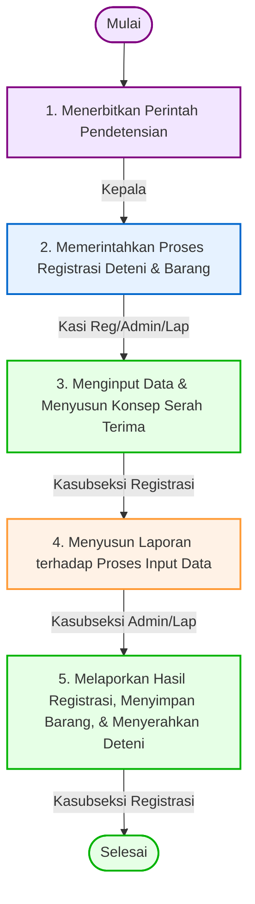

# 📋 SOP Registrasi Deteni Keimigrasian (SIMKIM)

Dokumen ini menjelaskan tata cara dan prosedur pelaksanaan registrasi deteni secara elektronik menggunakan modul pendataan SIMKIM pada Rumah Detensi Imigrasi (Rudenim) Pontianak.

---

## 🎯 1. Tujuan & Ruang Lingkup
*   **Tujuan**: Melakukan pendataan identitas lengkap deteni secara administratif dan biometrik guna menjamin akurasi data serta menghindari kepemilikan identitas ganda (*double identity*).
*   **Ruang Lingkup**: Berlaku pada Seksi Registrasi, Administrasi, dan Pelaporan Rudenim Pontianak dalam menindaklanjuti serah terima fisik deteni baru.

---

## 👥 2. Pihak yang Terlibat
1.  **Operator Registrasi (Seksi Registrasi)**: Bertanggung jawab melakukan input biodata, perekaman biometrik, pengunggahan dokumen, dan pencetakan kartu.
2.  **Kepala Seksi Registrasi & Administrasi**: Bertindak sebagai supervisor yang mengawasi akurasi data dan menyetujui mutasi status deteni.
3.  **Petugas Seksi Keamanan & Ketertiban (Kamtib)**: Bertanggung jawab atas pengawalan fisik deteni dari blok penahanan sementara ke ruang registrasi.
4.  **Deteni (Warga Negara Asing)**: Subjek yang wajib memberikan keterangan jujur dan menjalani pengambilan data biometrik.

---

## 🛠️ 3. Persyaratan & Alat Kerja
*   **Dokumen Masukan**:
    *   Surat Perintah Pendetensian dari Kantor Imigrasi pengirim.
    *   Resume berkas kasus keimigrasian.
    *   Paspor Kebangsaan atau Dokumen Perjalanan (*Travel Document*) asli/fotokopi (jika ada).
    *   Berita Acara Serah Terima (BAST) calon deteni.
*   **Perangkat Keras & Lunak**:
    *   Komputer Desktop/Workstation dengan akses aplikasi SIMKIM.
    *   Koneksi VPN Direktorat Jenderal Imigrasi (intranet aman).
    *   Pemindai Sidik Jari (*Flatbed Fingerprint Scanner*).
    *   Kamera Web (*Webcam*) / Kamera digital terhubung.
    *   Printer Kartu PVC untuk mencetak Kartu Identitas Deteni.

---

## 📊 4. Diagram Alur & Mutu Baku (Flowchart)

Berikut adalah diagram alur koordinasi pelaksana dalam proses registrasi deteni berdasarkan bagan alur resmi:

### 📋 Tabel Mutu Baku Prosedur Kerja

| No | Kegiatan | Pelaksana | Mutu Baku: Kelengkapan | Waktu | Output | Keterangan / Catatan |
|:--:|:---|:---|:---|:--:|:---|:---|
| **1** | Menerbitkan perintah pendetensian | Kepala Rudenim | Keputusan Pendetensian | 5 Menit | Kelengkapan dokumen administrasi | **Mulai**. |
| **2** | Memerintahkan proses registrasi deteni dan barang | Kasi Registrasi, Administrasi, dan Pelaporan | Disposisi | 5 Menit | Disposisi | Berdasarkan disposisi dari Kepala. |
| **3** | Menginput data dan menyusun konsep serah terima deteni dan barang | Kasubseksi Registrasi | Booth registrasi, komputer, jaringan komunikasi, aplikasi registrasi, printer, scanner, mesin sidik jari, kamera/webcam, latar belakang merah, formulir penyimpanan dan penyerahan barang deteni | 10 Menit | Nomor register, data barang deteni | Pendaftaran dilaksanakan dengan memberikan nomor register manual & elektronik deteni, serta nomor register penitipan barang dan dokumen. |
| **4** | Menyusun laporan terhadap proses input data | Kasubseksi Administrasi dan Pelaporan | Komputer, jaringan, aplikasi registrasi, printer, scanner, formulir penyimpanan dan penyerahan barang deteni | 5 Menit | Konsep berita acara serah terima, konsep laporan | Konsep disiapkan untuk laporan ke tingkat atas. |
| **5** | Melaporkan hasil registrasi deteni (pendetensian), menyimpan barang deteni dan menyerahkan deteni kepada seksi Keamanan dan ketertiban | Kasubseksi Registrasi | Komputer, jaringan, aplikasi registrasi, printer, scanner, formulir penyimpanan dan penyerahan barang deteni | 10 Menit | Berita acara serah terima deteni, registrasi barang, laporan | **Selesai**. Laporan dikirimkan ke:  a. Direktorat Jenderal Imigrasi  b. Kepala Kantor Wilayah u.p. Kepala Divisi Keimigrasian |

---

## 🔄 5. Tahapan Prosedur Kerja (Langkah demi Langkah)

### Langkah 1: Persiapan dan Verifikasi Dokumen
1.  Operator menerima berkas fisik penyerahan calon deteni dari Seksi Registrasi.
2.  Operator memverifikasi kesesuaian berkas (Surat Perintah Pendetensian, BAST, dan paspor).
3.  Petugas Kamtib memanggil deteni dan mendampinginya di ruang registrasi.

### Langkah 2: Login dan Pencarian Data Awal (De-duplikasi)
1.  Operator login ke aplikasi **SIMKIM** menggunakan kredensial (user ID & password) yang sah.
2.  Operator mengakses **Modul Pengawasan dan Cekal**.
3.  Operator melakukan pencarian awal menggunakan nama deteni, tanggal lahir, dan kewarganegaraan untuk memastikan apakah deteni tersebut sudah terdaftar di sistem keimigrasian nasional sebelumnya.
    *   *Jika sudah terdaftar*: Operator menarik data lama untuk diperbarui (menghindari duplikasi NIK/Register).
    *   *Jika belum terdaftar*: Operator membuat entri register detensi baru.

### Langkah 3: Perekaman Data Biometrik
1.  **Pengambilan Foto Wajah**:
    *   Deteni diposisikan tegak lurus menghadap kamera web.
    *   Operator melakukan pengambilan foto wajah (*face capture*) dengan latar belakang sesuai ketentuan keimigrasian (merah).
2.  **Pemindaian Sidik Jari**:
    *   Deteni menempelkan jari tangan pada *flatbed scanner*.
    *   Operator memindai 10 sidik jari tangan (jempol hingga kelingking kanan dan kiri).
3.  **Pemindaian Retina (*Iris Scan*)** *(jika hardware tersedia)*:
    *   Melakukan perekaman retina mata untuk pengamanan identitas lapis kedua.

### Langkah 4: Input Biodata Deteni
Operator menginput data secara manual pada **Modul Pendataan Deteni SIMKIM** berdasarkan berkas kasus:
*   Nama lengkap (sesuai dokumen perjalanan)
*   Tempat, tanggal lahir, dan jenis kelamin
*   Kewarganegaraan / Kebangsaan asal
*   Nomor paspor/dokumen perjalanan beserta masa berlakunya
*   Jenis pelanggaran keimigrasian (contoh: *overstay*, *illegal entry*, dll)
*   Nomor Surat Perintah Pendetensian
*   Kantor Imigrasi (Kanim) asal pengirim deteni
*   Tanggal masuk fasilitas Rudenim

### Langkah 5: Pencocokan Cekal Terpusat
1.  Setelah data biodata dan biometrik terisi lengkap, operator menekan tombol **"Verifikasi Cekal"**.
2.  Sistem SIMKIM secara otomatis mengirimkan query pencocokan data biometrik ke server pusat Ditjenim Jakarta untuk mendeteksi apakah deteni masuk dalam Daftar Pencegahan dan Penangkalan nasional atau DPO instansi penegak hukum lain.

### Langkah 6: Penerbitan Nomor Registrasi & Cetak Kartu
1.  Setelah proses pencocokan selesai dan data divalidasi aman, operator menyimpan entri data.
2.  Sistem menerbitkan **Nomor Registrasi Deteni** unik (sebagai ID utama detensi).
3.  Operator mencetak **Kartu Identitas Deteni** menggunakan printer kartu PVC.
4.  Kartu tersebut ditandatangani oleh Kepala Seksi Registrasi & Administrasi (atau pejabat yang ditunjuk).

### Langkah 7: Pengarsipan & Penyerahan
1.  Kartu Identitas Deteni diserahkan kepada deteni sebagai bukti identitas selama di dalam rudenim.
2.  Operator mencetak Berita Acara Registrasi Fisik untuk ditandatangani oleh operator dan deteni.
3.  Semua berkas fisik dimasukkan ke dalam Map Portofolio Deteni dan disimpan di lemari arsip dinas.
4.  Deteni diserahkan kembali kepada petugas Kamtib untuk proses penempatan blok (SOP berikutnya).

---

## ⚡ 6. Alur Integrasi SIMKIM
Data yang diinput dan biometrik yang direkam terkirim secara langsung (*real-time*) ke basis data terpusat Direktorat Jenderal Imigrasi di Jakarta. Riwayat ini akan dikunci dan dijadikan rujukan utama ketika diterbitkannya keputusan akhir seperti pemindahan (SOP 6) maupun pendeportasian (SOP 7).

---

## ⚖️ 7. Referensi & Dasar Hukum
*   **Undang-Undang Nomor 6 Tahun 2011** tentang Keimigrasian (Pasal 1 angka 31 mengenai SIMKIM dan Ketentuan Pendetensian).
*   **Perdirjen Imigrasi No. IMI.1917-OT.02.01 Tahun 2013** tentang SOP Rumah Detensi Imigrasi.

