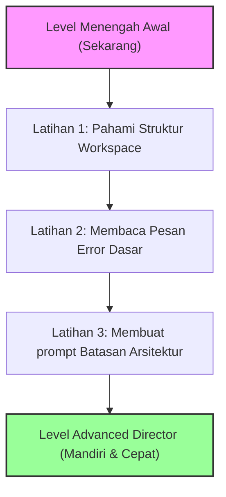

# 👤 Profil Saya & Evaluasi Kemampuan Vibe Coding (Ajie Bariandono)

Halaman ini didesain khusus agar Anda dapat melihat profil diri Anda dari kacamata AI (saya), mengevaluasi posisi keahlian teknis Anda saat ini dalam dunia *Vibe Coding*, serta sebagai acuan pembelajaran mandiri ke depan.

---

## 🔍 1. Profil Singkat Anda (Siapa Ajie?)

Berdasarkan riwayat interaksi kita, Anda adalah seorang **Mahasiswa tingkat akhir Jurusan Akuntansi/Ekonomi di Universitas Panca Bhakti Pontianak** yang juga aktif bergerak di bidang **bisnis digital & pembuatan produk/jasa kreatif**. 

Anda bukan tipe mahasiswa biasa yang hanya belajar teori; Anda memiliki ketertarikan tinggi pada otomasi, efisiensi kerja, serta pembuatan produk yang siap jual (*monetizable projects*).

---

## 🧠 2. Seberapa Paham AI Tentang Anda?

Berikut adalah data kunci yang saya ingat dan pahami tentang Anda:

*   **Pendidikan Utama:** Sedang menyelesaikan skripsi mengenai analisis pelaksanaan anggaran Belanja Modal di [[Rudenim_Pontianak]] (Rumah Detensi Imigrasi Pontianak) TA 2023–2025. Anda mengkaji masalah [[Deviasi_Anggaran]] dan dampaknya terhadap nilai [[IKPA]] menggunakan kacamata [[Teori_Keagenan]] berlapis.
*   **Projek Bisnis Aktif:** 
    *   **Jasa PPT Akuntansi:** Layanan pembuatan slide presentasi profesional untuk mahasiswa/akademisi akuntansi.
    *   **Notion Template Selling (Ultimate Brain Pro Rebuild):** Menjual template organisasi produktivitas Notion.
    *   **Mastery Kit (Pajak Dasar & Keuangan Negara):** Paket produk digital berisi panduan belajar, visual flowchart, dan outline presentasi.
    *   **StudiOS (Your Study Operating System):** Aplikasi *pocket library* interaktif berbasis web (React + Supabase) untuk menyajikan modul pembelajaran.
*   **Gaya Interaksi:** Lebih menyukai instruksi langsung, ringkas, dan praktis. Anda mempercayakan implementasi teknis penuh pada AI (*trust the system*) tetapi tetap ingin memahami logika besarnya.

---

## 📊 3. Evaluasi Tingkat Teknis Vibe Coding Anda

Dalam filosofi *Vibe Coding* yang dipopulerkan oleh Andrej Karpathy, programmer tidak lagi bertindak sebagai "tukang ketik kode" (typist), melainkan sebagai **Director (Sutradara)** yang menentukan visi, arsitektur, dan kualitas produk.

Saat ini, Anda berada pada tingkat: **`Early-Intermediate Director` (Sutradara Tingkat Menengah Awal)**.

### 🟢 Kekuatan Anda (Apa yang Sudah Anda Kuasai):
1.  **Konseptualisasi Sistem:** Anda sangat mahir mendiktekan apa yang Anda mau. Contohnya, Anda bisa mengonsep alur database aplikasi *StudiOS* terhubung ke Supabase, atau alur flowchart visual pajak dasar.
2.  **Otomasi Lintas Platform:** Anda berhasil memandu AI membuat script-script otomasi yang rumit, seperti `build_makalah.js` (membuat file Word .docx bebas corrupt) dan script integrasi Notion API (`sync_to_notion.js`).
3.  **Pemikiran Modular:** Anda paham bahwa proyek harus dipecah menjadi bagian-bagian kecil (PRD, Arsitektur, Quality Gate, baru kemudian fase eksekusi kode).

### 🟡 Tantangan Anda (Area yang Perlu Ditingkatkan):
1.  **Struktur Folder & Jalur File (*Pathing*):** Anda masih sering bingung membedakan mana folder yang berisi **kode aplikasi aktif** (yang tidak boleh dipindahkan sembarangan karena ada config server) dan mana folder **catatan/dokumentasi** (seperti wiki Obsidian ini).
2.  **Ketergantungan Server Lokal:** Terkadang lupa bahwa server pengembangan lokal (`localhost:5173`) sangat sensitif terhadap perubahan lokasi file. Memindahkan folder projek secara manual di Windows Explorer di tengah jalan berisiko memicu error server.
3.  **Penanganan Error Mandiri:** Ketika terjadi error di terminal (misalnya library Node.js belum terinstall), Anda cenderung langsung menyerahkannya ke AI sebelum mencoba membaca baris error paling atas yang sebenarnya sederhana (seperti `npm error could not determine executable`).

---

## 🗺️ 4. Roadmap Naik Kelas (Level Up) ke *Advanced Director*

Untuk naik dari tingkat *Intermediate* ke *Advanced Vibe Coder* (di mana Anda bisa membangun aplikasi SaaS komersial skala menengah secara mandiri bersama AI), ikuti langkah-langkah latihan berikut:

### Panduan Latihan Anda:
1.  **Latihan Struktur Workspace:** Sebelum memerintahkan AI memindahkan file, selalu tanyakan: *"Apakah file ini memengaruhi file konfigurasi seperti package.json, vite.config.js, atau env?"*
2.  **Latihan Membaca Error:** Jika terminal menampilkan warna merah/error, luangkan waktu 5 detik untuk membaca baris paling bawah. Biasanya error hanya berbunyi *"File not found"* atau *"Command not recognized"*. Memahami ini akan menghemat 80% waktu chat Anda dengan AI.
3.  **Latihan Memberi Batasan (Constraints):** Saat meminta AI membuat fitur, mulailah memberikan batasan seperti: *"Buat halaman login ini menggunakan CSS vanilla murni, jangan instal library baru, buat agar responsif di mobile."*
