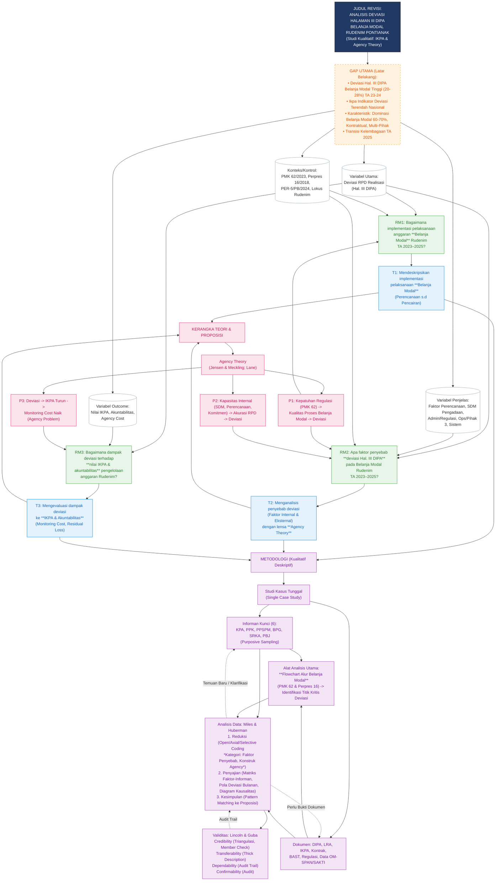

# Hasil Audit Koherensi & Benang Merah Lintas-Bab

## 1. PETA BENANG MERAH (6 Titik Koneksi)

| Titik | Elemen | Isi (Kutipan/Kesimpulan dari Teks) | Konsisten? |
|:---:|:---|:---|:---:|
| **1** | **Judul** | **ANALISIS PELAKSANAAN ANGGARAN BELANJA PADA RUMAH DETENSI IMIGRASI PONTIANAK**  *(Fokus Umum: "Anggaran Belanja" - tidak spesifik jenis belanja)* | **⚠️ PERHATIAN** |
| **2** | **Latar Belakang (Gap)** | **Gap Utama:** Deviasi Halaman III DIPA (Indikator IKPA) tinggi pada **Belanja Modal** (rata-rata 20-28% TA 2023-2024) di Rudenim Pontianak.  **Tiga Indikasi Masalah:** (1) Terjadi deviasi rencana-realisasi Belanja Modal, (2) Perlu menelaah penyebab deviasi, (3) Perlu menganalisis dampak deviasi.  **Fokus Khusus:** **Belanja Modal** (komposisi 60-70% TA 2025), regulasi PMK 62/2023 & PER-5/PB/2024, lensa Agency Theory. | **❌ vs Judul** *(Judul: "Anggaran Belanja" [Umum] vs Latbel: Fokus Eksklusif "Belanja Modal")* |
| **3** | **Rumusan Masalah (RM)** | **RM1:** Bagaimana implementasi pelaksanaan anggaran belanja...? *(Umum)* **RM2:** Apa penyebab terjadinya deviasi pelaksanaan anggaran belanja...? *(Umum)* **RM3:** Apa dampak deviasi pelaksanaan anggaran belanja...? *(Umum)* *Catatan: Penomoran 8,9,10 aneh tapi bukan inkonistensi logika.* | **❌ vs Latbel** *(Latbel spesifik Belanja Modal & Deviasi; RM1-3 menggunakan frasa "anggaran belanja" umum tanpa penekanan "Belanja Modal" & "Deviasi" sebagai fokus utama RM1)* |
| **4** | **Tujuan Penelitian** | **T1:** Mendeskripsikan implementasi..., **khususnya Belanja Modal**... **T2:** Menganalisis penyebab terjadinya deviasi... **T3:** Mengevaluasi dampak... deviasi... | **✅ vs RM** (Mapping 1:1 jelas) **❌ vs RM** *(T1 menambahkan "khususnya Belanja Modal" yang tidak ada di RM1. T2/T3 konsisten dengan RM2/RM3)* |
| **5** | **Tinjauan Pustaka (Teori/Variabel)** | **Variabel Utama:** Pelaksanaan Belanja Modal, Deviasi RPD (Hal. III DIPA), Penyebab Deviasi (5 Kategori: Perencanaan, SDM, Admin, Ops/Pihak 3, Sistem), Dampak Deviasi (3 Tingkat: Mikro/Meso/Makro), IKPA (Indikator Deviasi Hal III), Agency Theory (Asimetri Info, Moral Hazard, Monitoring). **Proposisi:** 3 proposisi (Regulasi -> Kualitas; Faktor Internal -> Deviasi; Deviasi -> IKPA -> Akuntabilitas). **Kerangka:** Input (Regulasi) -> Proses (Perencanaan/Pelaksanaan Belanja Modal) -> Output (Deviasi) -> Outcome (IKPA) -> Teori (Agency). | **✅ vs Variabel Latbel/RM** *(Landasan teori sangat kaya dan mendukung fokus Belanja Modal/Deviasi/IKPA/Agency. Hanya saja Judul & RM belum eksplisit menyebut "Belanja Modal" & "IKPA")* |
| **6** | **Metodologi (Analisis)** | **Pendekatan:** Kualitatif Deskriptif (Single Case Study). **Data:** Primer (Wawancara Mendalam 6 Informan Kunci: KPA, PPK, PPSPM, BPG, SRKA, PBJ) + Sekunder (Dokumen: DIPA, LRA, IKPA, Kontrak, BAST, Regulasi). **Analisis:** Model Interaktif Miles & Huberman (Reduksi -> Penyajian -> Kesimpulan) + **Flowchart Alur Pelaksanaan (PMK 62/2023 & Perpres 16/2018)** sebagai peta analitis titik kritis deviasi. **Validitas:** Credibility (Triangulasi Sumber/Metode, Member Check), Transferability (Thick Description), Dependability (Audit Trail), Confirmability (Audit). | **✅ vs RM & Tujuan** *(Teknik wawancara & dokumen ideal untuk menjawab "Bagaimana implementasi" (RM1), "Penyebab" (RM2), "Dampak" (RM3). Flowchart & Matriks Faktor-Informan cocok untuk RM2 & RM3. Member Check & Triangulasi kuat untuk kredibilitas.)* |

---

## 2. ANALISIS KONSISTENSI VARIABEL

| Variabel / Konsep Kunci | Di Judul? | Di Latbel? | Di RM? | Di Tujuan? | Di Tinpus? | Di Metode? | Status |
|:---|:---:|:---:|:---:|:---:|:---:|:---:|:---|
| **Pelaksanaan Anggaran Belanja** (Umum) | ✅ (Judul Utama) | ✅ (Konteks Awal) | ✅ (RM1, RM2, RM3) | ✅ (T1, T2, T3) | ✅ (Sub-bab 2.1.1) | ✅ (Fokus Umum) | **KONSISTEN** (Tapi Terlalu Umum) |
| **Belanja Modal** (Spesifik) | ❌ | ✅ **(Fokus Utama: 60-70%, Tabel 1.3-1.5)** | ❌ *(Hanya "anggaran belanja")* | ✅ **(T1: "khususnya Belanja Modal")** | ✅ **(Sub-bab 2.1.2 Mendalam)** | ✅ **(Fokus Pengadaan, Kontrak, Informan PPK/PBJ)** | **❌ INKONSISTENSI KRITIS** (Hilang di Judul & RM) |
| **Deviasi Halaman III DIPA / RPD** | ❌ | ✅ **(Metrik Utama IKPA, Data Tabel 1.3-1.5)** | ✅ **(RM2, RM3: "deviasi...")** | ✅ **(T2, T3: "deviasi...")** | ✅ **(Sub-bab 2.1.3, 2.1.5, Proposisi)** | ✅ **(Flowchart Titik Kritis, Matriks Pola Deviasi)** | **❌ INKONSISTENSI KRITIS** (Hilang di Judul) |
| **IKPA (Indikator Kinerja)** | ❌ | ✅ **(Alat Evaluasi, Tabel 1.1, 1.2)** | ❌ | ❌ | ✅ **(Sub-bab 2.1.5, Proposisi 3)** | ✅ **(Sumber Data Dokumen IKPA, LRA)** | **⚠️ INKONSISTENSI SEDANG** (Hilang di Judul, RM, Tujuan) |
| **Agency Theory** (Lensa Analisis) | ❌ | ✅ **(Sub-bab 1.1 akhir, 2.1.4)** | ❌ | ❌ | ✅ **(Sub-bab 2.1.4, Proposisi 3, Kerangka)** | ⚠️ *(Disebut "kerangka konseptual" tapi tidak eksplisit jadi kategori coding)* | **⚠️ INKONSISTENSI SEDANG** (Tidak terefleksi di RM/Tujuan/Analisis Explisit) |
| **Penyebab Deviasi** (5 Faktor) | ❌ | ✅ **(Identifikasi 3 Indikasi Masalah #2)** | ✅ **(RM2)** | ✅ **(T2)** | ✅ **(Sub-bab 2.1.3, Tabel 2.1)** | ✅ **(Kode Axial Coding, Matriks Faktor-Informan)** | **KONSISTEN** (Mulai RM ke bawah) |
| **Dampak Deviasi** (3 Tingkat) | ❌ | ✅ **(Identifikasi 3 Indikasi Masalah #3)** | ✅ **(RM3)** | ✅ **(T3)** | ✅ **(Sub-bab 2.1.3)** | ✅ **(Diagram Hubungan Penyebab-Dampak)** | **KONSISTEN** (Mulai RM ke bawah) |
| **Rudenim Pontianak** (Lokus) | ✅ | ✅ | ✅ | ✅ | ✅ | ✅ | **KONSISTEN** |
| **PMK 62/2023 & Perpres 16/2018** (Regulasi Dasar) | ❌ | ✅ | ❌ | ❌ | ✅ **(Landasan Utama)** | ✅ **(Dasar Flowchart & Dokumen)** | **⚠️ INKONSISTENSI RENDAH** (Biasa tidak di Judul/RM) |

> **KESIMPULAN VARIABEL:** **Judul dan Rumusan Masalah terlalu umum ("Anggaran Belanja")** sedangkan **seluruh isi proposal (Latbel, Tujuan, Tinjauan Pustaka, Metode) fokus eksklusif pada "Belanja Modal", "Deviasi Halaman III DIPA/IKPA", dan "Agency Theory"**. Ini menciptakan *Expectation Gap* bagi pembaca.

---

## 3. ANALISIS JUMLAH POIN (Quantity Mismatch)

| Elemen | Jumlah Poin | Detail | Kesesuaian Kuantitas |
|:---|:---:|:---|:---:|
| **Rumusan Masalah (RM)** | **3** | RM1: Implementasi (Deskriptif) RM2: Penyebab Deviasi (Eksplanatif) RM3: Dampak Deviasi (Evaluatif) | **Baseline** |
| **Tujuan Penelitian** | **3** | T1: Mendeskripsikan Implementasi (khusus Belanja Modal) T2: Menganalisis Penyebab Deviasi T3: Mengevaluasi Dampak Deviasi | ✅ **SEMPURNA (1:1 Mapping)** |
| **Hipotesis** | **0** | Penelitian Kualitatif (Tidak menguji hipotesis statistik) | ✅ **SESUAI** (Kualitatif) |
| **Proposisi Penelitian** | **3** | P1: Regulasi (PMK 62) -> Kualitas Pelaksanaan Belanja Modal P2: Faktor Internal (SDM, Perencanaan, Komitmen) -> Deviasi P3: Deviasi -> IKPA -> Akuntabilitas (Agency Theory) | ✅ **SESUAI** (Mapping ke RM2, RM3, & Kerangka) |
| **Teknik Analisis Data** | **3 Tahap + 1 Alat** | 1. Reduksi Data (Open/Axial/Selective Coding) 2. Penyajian Data (Matriks Faktor-Informan, Matriks Pola Deviasi, Diagram Kausalitas) 3. Penarikan Kesimpulan (Pattern Matching, Verifikasi) **Alat Bantu:** Flowchart Alur Pelaksanaan (PMK 62/Perpres 16) sebagai *Analytical Framework* | ✅ **KOMPREHENSIF** *(Mapping: Flowchart & Matriks -> RM1; Coding Axial/Selective & Matriks Faktor -> RM2; Diagram Kausalitas & Evaluasi IKPA -> RM3)* |

**Catatan Quantity:** Jumlah RM = Tujuan = 3 (Konsisten). Proposisi = 3 (Konsisten dengan struktur argumen: Input-Proses-Output-Outcome). Teknik analisis multidimensi mencakup kebutuhan ketiga RM.

---

## 4. ANALISIS KATA KERJA OPERASIONAL

| Tujuan | Kata Kerja | Implikasi Jenis Penelitian | Sesuai dengan Bab III? | Catatan QA |
|:---|:---|:---|:---:|:---|
| **T1:** Mendeskripsikan implementasi pelaksanaan anggaran belanja, khususnya Belanja Modal... | **Mendeskripsikan** | **Deskriptif-Kualitatif**. Menjawab "Bagaimana prosesnya?" (What/How). Membutuhkan narasi alur, aktor, dokumen, realita lapangan. | ✅ **SESUAI** | Bab III: Flowchart (Gambar 3.1) sebagai kerangka deskriptif struktur; Wawancara & Dokumentasi untuk narasi proses aktual. *Sangat cocok.* |
| **T2:** Menganalisis penyebab terjadinya deviasi pelaksanaan anggaran belanja... | **Menganalisis** (Penyebab) | **Eksplanatif-Kualitatif**. Menjawab "Mengapa?" (Why). Membutuhkan identifikasi mekanisme kausal, perspektif informan, triangulasi faktor internal/eksternal. | ✅ **SESUAI** | Bab III: *Axial Coding* (pengkategorian ke 5 faktor penyebab), *Matriks Faktor-Informan-Bukti*, *Triangulasi Sumber* (KPA vs PPK vs PBJ). *Cocok untuk analisis sebab-akibat kompleks.* |
| **T3:** Mengevaluasi dampak dari terjadinya deviasi pelaksanaan anggaran belanja... | **Mengevaluasi** | **Evaluatif-Kualitatif**. Menjawab "Apa konsekuensinya?" (So What). Membutuhkan kriteria evaluasi (IKPA, Akuntabilitas, Agency Cost), penilaian nilai (buruk/baik), rekomendasi. | ✅ **SESUAI** | Bab III: *Diagram Hubungan Penyebab-Dampak*, analisis IKPA (Kuanti kualitatifkan), *Member Check* validitas dampak, lensa *Agency Theory* (Proposisi 3) sebagai kerangga evaluasi normatif. *Cocok.* |

**EDGE CASE CHECK:**
- ❌ Tidak ada kata kerja "Mengetahui" (Terlalu umum).
- ❌ Tidak ada "Menganalisis Pengaruh" (Implikasi Regresi/Kuantitatif).
- ✅ "Menganalisis penyebab" & "Mengevaluasi dampak" digunakan dengan benar untuk kualitatif.
- ✅ Tidak ada "Mengembangkan" (Bukan R&D).

---

## 5. ANALISIS KERANGKA BERPIKIR vs HIPOTESIS (PROPOSISI)

*Catatan: Gambar 2.1 (Kerangka Penelitian) kosong di teks sumber, analisis berdasarkan deskripsi teks (Sub-bab 2.3 & 2.4) dan alur logika Landasan Teori.*

**Struktur Kerangka Berpikir (Direkonstruksi dari Teks):**
1.  **Input (Konteks & Regulasi):** PMK 62/2023, Perpres 16/2018, PER-5/PB/2024, Karakteristik Rudenim (Perbatasan, Dominasi Belanja Modal).
2.  **Proses (Pelaksanaan Belanja Modal):** Perencanaan (RPD) -> Pengadaan (Kontrak) -> Pelaksanaan (Fisik/BAST) -> Pembayaran (SPP-SPM-SP2D). *Titik Kritis Deviasi identifikasi di Flowchart Bab III.*
3.  **Output (Deviasi):** Simpangan RPD vs Realisasi (Deviasi Hal. III DIPA) -> Indikator IKPA Turun.
4.  **Outcome (Dampak & Akuntabilitas):** Penurunan Nilai IKPA (Kategori Cukup/Kurang) -> Pembinaan Ketat KPPN -> Agency Cost (Monitoring Cost, Bonding Cost, Residual Loss) -> Akuntabilitas Publik Terancam.
5.  **Lensa Teori:** Agency Theory (Principal: DJPb/KPPN/Kemenkeu; Agent: Rudenim/PPK/Penyedia; Asimetri Informasi pada estimasi RPD & progres fisik).

**Pemetaan Proposisi ke Kerangka:**
| Proposisi | Elemen Kerangka yang Diuji | Konsisten? |
|:---|:---|:---:|
| **P1:** Regulasi (PMK 62) memiliki hubungan langsung dengan kualitas pelaksanaan Belanja Modal. Kepatuhan mekanisme -> Tingkat Deviasi. | **Input -> Proses -> Output** | ✅ **YA** (Mengujikausalitas regulasi ke kualitas proses/output). |
| **P2:** Faktor Internal (SDM Pengadaan, Kematangan Perencanaan, Komitmen Pimpinan) berhubungan dengan Deviasi. | **Proses (Faktor Internal) -> Output (Deviasi)** | ✅ **YA** (Mengujiprediktor internal deviasi, sesuai Lit Review 2.1.3). |
| **P3:** Deviasi berhubungan dengan penurunan IKPA -> Akuntabilitas/Reputasi (Agency Problem). | **Output -> Outcome (IKPA -> Agency)** | ✅ **YA** (Menghubungkan metrik kinerja ke teori akuntabilitas). |

**Kesesuaian Arah Hipotesis/Proposisi dengan Teori (Bab II):**
-   **P1 & P2:** Konsisten dengan *Ratnasari (2022)*, *Manangin et al. (2023)*, *Nugroho et al. (2023)* yang menyatakan perencanaan, SDM, regulasi -> Akurasi RPD/IKPA.
-   **P3:** Konsisten dengan *Hanafi & Wulandari (2023)* (Satker penegakan hukum lemah deviasi) & *Lane (2003)* (Multilevel Agency Chain). Arah: Deviasi Tinggi -> IKPA Rendah -> Monitoring Cost Tinggi (Pembinaan KPPN) -> Agency Problem Terverifikasi. **Logika arah positif (Deviasi naik -> IKPA turun -> Masalah Agency naik) konsisten.**

**Kekurangan:** Kerangka Berpikir (Gambar 2.1) **tidak divisualisasikan** di teks proposal. Harus dibuat eksplisit memetakan: *Antecedent (Regulasi/Faktor Internal) -> Process (Titik Kritis Flowchart) -> Deviation (Output) -> IKPA/Agency (Outcome).*

---

## 6. TEMUAN INKONSISTENSI (Diurutkan berdasarkan Keparahan)

| No | Elemen A | Elemen B | Jenis Inkonsistensi | Keparahan | Saran Perbaikan |
|:---|:---|:---|:---|:---:|:---|
| **1** | **Judul** ("Anggaran Belanja" - Umum) | **Seluruh Isi Proposal** (Fokus Eksklusif: **Belanja Modal**, **Deviasi Hal III DIPA/IKPA**, **Agency Theory**) | **Scope Mismatch (Cakupan Terlalu Luas di Judul)** | **KRITIS** 🔴 | **Ganti Judul:** *"ANALISIS DEVIASI HALAMAN III DIPA BELANJA MODAL PADA RUMAH DETENSI IMIGRASI PONTIAK TA 2023–2025: STUDI KUALITATIF BERBASIS IKPA DAN AGENCY THEORY"* Atau minimal: *"ANALISIS PELAKSANAAN **BELANJA MODAL**..."* |
| **2** | **RM 1, 2, 3** (Menggunakan frasa **"pelaksanaan anggaran belanja"** tanpa kata "Belanja Modal" & "Deviasi" pada RM1) | **Tujuan 1** (Menyebut **"khususnya Belanja Modal"**) & **Latbel** (Fokus Deviasi Belanja Modal) | **Missing Variable in RM** (Variabel Kunci Hilang di Pertanyaan Utama) | **KRITIS** 🔴 | **Revisi RM:** **RM1:** Bagaimana implementasi pelaksanaan **anggaran Belanja Modal** pada Rudenim Pontianak TA 2023–2025? **RM2:** Apa faktor-faktor penyebab **deviasi Halaman III DIPA pada Belanja Modal**...? **RM3:** Bagaimana dampak **deviasi tersebut terhadap nilai IKPA dan akuntabilitas pengelolaan anggaran**...? |
| **3** | **Proposisi 3 / Kerangka (Agency Theory)** | **Teknik Analisis Data (Bab 3.3.2)** | **Teori Tidak Teroperasionalkan di Analisis** (Theory-Underutilization) | **SEDANG** 🟠 | Tambahkan pada **Sub-bab 3.3.2 (Reduksi/Penyajian):** - *Axial Coding* kategori: **Asimetri Informasi** (Estimasi vs Realita), **Moral Hazard** (Penyedia/Kontraktor), **Monitoring Cost** (Verifikasi PPSPM/KPPN), **Agency Cost** (Revisi DIPA, Pembinaan). - *Pattern Matching* eksplisit terhadap konstruk Agency Theory (Jensen & Meckling; Lane). |
| **4** | **Gambar 2.1 Kerangka Penelitian** | **Teks Proposal (Bab 2.4)** | **Visualisasi Hilang (Missing Diagram)** | **SEDANG** 🟠 | **Wajib buat Diagram Mermaid/Visio** memetakan:  Konteks (Regulasi/Lokus) -> Input (Sumber Daya) -> Proses (Alur Belanja Modal + Titik Kritis Deviasi) -> Output (Deviasi/IKPA) -> Outcome (Dampak/Agency) -> Teori (Lensa). |
| **5** | **IKPA** (Sebagai Metrik Evaluasi Utama di Latbel & Tinpus) | **RM & Tujuan** (Tidak menyebut "IKPA" secara eksplisit) | **Implicit Variable in Objectives** | **RENDAH** 🟡 | Tambahkan referensi IKPA di **RM3 & Tujuan 3** (lihat saran No 2). IKPA adalah *operasionalisasi* "Dampak" & "Kinerja". |
| **6** | **Penomoran RM (8, 9, 10) & Tujuan (11, 12, 13)** | **Standar Penulisan Akademik** | **Format Penomoran Aneh (Cosmetic)** | **RENDAH** 🟡 | Perbaiki penomoran jadi **1.1, 1.2, 1.3** (RM) dan **1, 2, 3** (Tujuan). |
| **7** | **Transisi Kelembagaan (Kode Satker Berubah TA 2025)** | **Analisis Perbandingan TA 2023-2025** | **Potential Confounding Variable** (Tidak dieksplorasi sebagai faktor penyebab) | **RENDAH** 🟡 | Tambahkan di **RM2/Tujuan 2/Proposisi 2**: "Apakah transisi kelembagaan (Kemenkumham -> Kemimipas) TA 2025 memengaruhi deviasi?". Masukkan ke wawancara KPA/PPK. |

---

## 7. MINDMAP ALUR LOGIKA IDEAL (Mermaid.js)

Diagram ini merepresentasikan **seharusnya** benang merah proposal ini setelah perbaikan inkonsistensi di atas.

---

### **RINGKASAN EKSEKUTIF UNTUK MAHASISWA (AJIE)**

1.  **PERBAIKAN WAJIB (KRITIS):** Ganti **Judul** agar spesifik **"Belanja Modal"** & **"Deviasi Halaman III DIPA/IKPA"**. Revisi **RM 1, 2, 3** agar mencerminkan variabel *Belanja Modal*, *Deviasi*, dan *IKPA* secara eksplisit. Saat ini Judul & RM "menipu" pembaca mengira penelitian tentang belanja umum (Pegawai/Barang/Modal), padahal isinya 100% Belanja Modal.
2.  **PERBAIKAN WAJIB (SEDANG):** Buat **Gambar 2.1 (Kerangka Penelitian)** yang *benar-benar memvisualisasikan* alur: Regulasi -> Proses Belanja Modal (Titik Kritis) -> Deviasi -> IKPA -> Agency Theory. Jangan kosongkan.
3.  **PERBAIKAN TEKNIS (SEDANG):** Di **Bab 3.3.2 (Analisis Data)**, tambahkan eksplisit: *"Kode axial coding mencakup konstruk Agency Theory: Asimetri Informasi (RPD vs Realita), Moral Hazard (Penyedia), Monitoring Cost (Verifikasi PPSPM/KPPN), Agency Cost (Revisi DIPA/Pembinaan)"*. Agar teori di Bab II benar-benar "terpakai" di Bab III.
4.  **PERBAIKAN MINOR:** Perbaiki penomoran RM (1,2,3) & Tujuan (1,2,3). Pertimbangkan masukkan **Transisi Kelembagaan TA 2025** sebagai salah satu faktor penyebab potensial di RM2/Proposisi 2 (data Tabel 1.3 menunjukkan perbaikan drastis TA 2025, apakah karena transisi ini?).

**Status Keseluruhan:** **KONDISI PERBAIKAN MAYOR (Major Revision)** pada struktur awal (Judul, RM, Kerangka Visual), namun **FONDASI TEORITIS & METODOLOGIS (Bab II & III) SANGAT KUAT, MENDALAM, DAN KONSISTEN SECARA INTERNAL**. Hanya perlu "menyelaraskan ujung-ujungnya" (Judul & RM) dengan "isi yang sudah bagus" (Bab II & III).