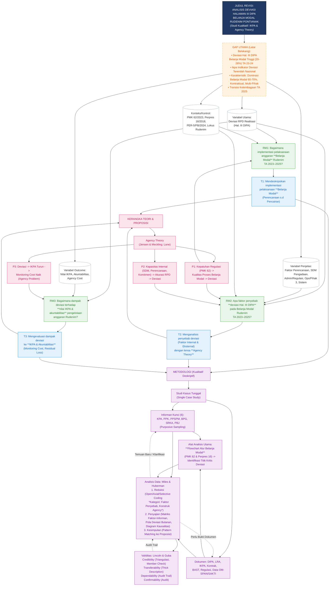

# LAPORAN AUDIT PROPOSAL — TIER PRO MAX

---

---

# AUDIT PUEBI & EJAAN

# Hasil Audit PUEBI dan Tata Bahasa

# Laporan Temuan Kesalahan Tata Bahasa dan PUEBI

## Makalah Seminar: Analisis Pelaksanaan Anggaran Belanja pada Rumah Detensi Imigrasi Pontianak

---

| No | Teks Asli | Saran Perbaikan | Alasan |
|----|-----------|-----------------|--------|
| 1 | `Bapak Risal S.E, M.Si, CA selaku ketua jurusan Akuntansi` (Kata Pengantar, poin 3) | **Bapak Risal, S.E., M.Si., C.A. selaku Ketua Jurusan Akuntansi** | (a) Gelar akademik harus didahului koma dan diakhiri titik sesuai PUEBI; (b) "CA" (Chartered Accountant) seharusnya "C.A." dengan tanda titik; (c) Jabatan yang mengikuti nama diri "Ketua Jurusan" ditulis kapital. Bandingkan dengan penulisan gelar di halaman ii yang sudah benar sebagian. |
| 2 | `Ibu Wilda Sari S.E., M.Ak. selaku Dosen Pembimbing Akademik` (Kata Pengantar, poin 4) | **Ibu Wilda Sari, S.E., M.Ak. selaku Dosen Pembimbing Akademik** | Tidak ada tanda koma antara nama orang dan gelar akademik yang mengikutinya. Sesuai PUEBI, gelar yang ditulis di belakang nama dipisahkan oleh tanda koma. |
| 3 | `Bapak Dr. Purwanto, SH, M.Hum., FCBArb` (Kata Pengantar, poin 1) | **Bapak Dr. Purwanto, S.H., M.Hum., FCBArb** | Singkatan gelar "SH" (Sarjana Hukum) harus ditulis "S.H." dengan tanda titik sesuai PUEBI dan Permendikbud Nomor 43 Tahun 2023. |
| 4 | `Kelima prinsip tersebut, yaitu efisiensi, efektivitas, transparansi, keadilan, dan kepatutan` (BAB I, paragraf 1) | Perbaikan redaksional: prinsip yang disebut dalam UU 17/2003 ada **tujuh** (tertib, taat peraturan, efisien, ekonomis, efektif, transparan, bertanggung jawab), bukan lima. Kalimat sebelumnya sudah menyebut tujuh prinsip. | Inkonsistensi logis/faktual: paragraf sebelumnya menyebutkan **tujuh** prinsip secara eksplisit, namun kalimat penyimpul mereduksinya menjadi lima tanpa penjelasan. Ini bukan sekadar kesalahan gaya, melainkan potensi kekeliruan substantif yang dapat memengaruhi argumen akademik. |
| 5 | `Agency Theory` (BAB I, paragraf terakhir; BAB II sub-judul 2.1.4; BAB III) | ***Agency Theory*** (dicetak miring di seluruh naskah) | Istilah asing (*Agency Theory*) wajib dicetak miring sesuai PUEBI Bab V tentang penulisan kata. Dalam teks ditemukan inkonsistensi: kadang miring, kadang tidak (misalnya di paragraf terakhir BAB I dan di beberapa bagian BAB II). |
| 6 | `principal` dan `agent` tanpa cetak miring (BAB II, sub-bab 2.1.4, paragraf 1) | ***principal*** dan ***agent*** | Kata bahasa asing yang belum diserap ke dalam bahasa Indonesia dan digunakan dalam konteks teknis wajib dicetak miring sesuai PUEBI. Dalam paragraf yang sama, penulisannya tidak konsisten — kata dalam kurung tidak miring sementara yang di luar kurung miring. |
| 7 | `adverse selection` dan `moral hazard` tanpa cetak miring (BAB II, sub-bab 2.1.4) | ***adverse selection*** dan ***moral hazard*** | Istilah teknis berbahasa asing yang belum terserap penuh ke dalam bahasa Indonesia wajib dicetak miring. Kedua istilah ini ditulis tegak dalam teks. |
| 8 | `monitoring and control` tanpa cetak miring (BAB II, sub-bab 2.1.4, paragraf terakhir) | ***monitoring and control*** | Frasa bahasa Inggris yang digunakan sebagai istilah teknis harus dicetak miring sesuai PUEBI. |
| 9 | `bottleneck` tanpa cetak miring (BAB II, sub-bab 2.1.2 paragraf terakhir; BAB III sub-bab 3.3.1) | ***bottleneck*** | Kata serapan tidak resmi dari bahasa Inggris ini belum masuk KBBI sebagai kata baku; harus dicetak miring. Alternatif: gunakan padanan "sumbatan/hambatan alur" jika ingin menghindari istilah asing. |
| 10 | Nomor urut Rumusan Masalah dimulai dari angka **8, 9, 10** (BAB I, sub-bab 1.2) | Ubah menjadi **1, 2, 3** | Penomoran rumusan masalah, tujuan penelitian (11, 12, 13), dan kriteria informan (14, 15, 16) merupakan kelanjutan otomatis dari penomoran daftar isi/bernomor di bagian sebelumnya — ini adalah artefak format *outline* yang tidak dirapikan. Penomoran setiap sub-bagian harus dimulai ulang dari 1. |
| 11 | `an approach for exploring and understanding the meaning individuals or groups ascribe to a social or human problem` (BAB III, sub-bab 3.1) | Kutipan bahasa Inggris tersebut harus dicetak **miring**: *an approach for exploring and understanding the meaning individuals or groups ascribe to a social or human problem* | Sesuai PUEBI dan konvensi penulisan ilmiah, kutipan langsung dalam bahasa asing dicetak miring. |
| 12 | `interactive model` tanpa cetak miring (BAB III, sub-bab 3.3.2) | ***interactive model*** | Istilah teknis berbahasa Inggris yang tidak memiliki padanan baku dalam teks ini harus dicetak miring. |
| 13 | `open coding`, `axial coding`, `selective coding` tanpa cetak miring (BAB III, sub-bab 3.3.2) | ***open coding***, ***axial coding***, ***selective coding*** | Istilah metodologi berbahasa Inggris yang digunakan sebagai istilah teknis wajib dicetak miring. |
| 14 | `credibility, transferability, dependability, dan confirmability` tanpa cetak miring (BAB III, sub-bab 3.3.3) | ***credibility***, ***transferability***, ***dependability***, dan ***confirmability*** | Keempat istilah ini adalah terminologi teknis berbahasa Inggris dari Lincoln & Guba yang dalam teks tidak diberi cetak miring, padahal seharusnya demikian sesuai PUEBI. |
| 15 | `thick description` tanpa cetak miring (BAB III, sub-bab 3.3.3) | ***thick description*** | Istilah teknis metodologi kualitatif berbahasa Inggris; harus dicetak miring. |
| 16 | `general interview guide approach` tanpa cetak miring (BAB III, sub-bab 3.2.1) | ***general interview guide approach*** | Istilah metodologi berbahasa Inggris yang diambil langsung dari Patton (2015) harus dicetak miring sebagai istilah asing. |
| 17 | `in-depth interview` — penulisan tidak konsisten di seluruh naskah (kadang miring, kadang tidak, kadang dengan tanda kurung penjelasan, kadang tanpa) | Tetapkan satu konvensi: ***in-depth interview*** (dicetak miring konsisten) atau gunakan padanan "wawancara mendalam" secara konsisten tanpa istilah asing | Inkonsistensi penulisan istilah asing yang sama dalam satu dokumen melanggar prinsip konsistensi penulisan ilmiah dan PUEBI. |
| 18 | `supply chain` tanpa cetak miring (BAB II, sub-bab 2.1.3; BAB III sub-bab 3.3.1) | ***supply chain*** | Istilah ekonomi/logistik berbahasa Inggris yang belum terserap penuh ke dalam bahasa Indonesia; harus dicetak miring. Padanan yang dapat dipertimbangkan: "rantai pasok." |
| 19 | `early warning system` tanpa cetak miring — judul penelitian Sholawatunnisa & Supriyanto disebut dalam teks naratif (BAB II, sub-bab 2.2) | ***early warning system*** | Ketika istilah asing digunakan dalam kalimat naratif (bukan sebagai judul artikel yang dikutip), istilah tersebut harus dicetak miring. |
| 20 | `audit trail` dan `confirmability audit` tanpa cetak miring (BAB III, sub-bab 3.3.3) | ***audit trail*** dan ***confirmability audit*** | Istilah teknis metodologi berbahasa Inggris; harus dicetak miring sesuai PUEBI. |

---

## Catatan Prioritas

> **Temuan paling krusial** yang perlu segera diperbaiki sebelum seminar:
> 1. **No. 4** — Inkonsistensi faktual jumlah prinsip UU 17/2003 (tujuh vs. lima) berpotensi mendapat pertanyaan tajam dari narasumber/penguji.
> 2. **No. 10** — Penomoran yang salah pada Rumusan Masalah (8–10), Tujuan Penelitian (11–13), dan Kriteria Informan (14–16) menunjukkan dokumen belum diedit final dan berkesan tidak profesional.
> 3. **No. 1–3** — Penulisan gelar akademik yang tidak konsisten pada bagian Kata Pengantar, sementara di Lembar Konsultasi (halaman ii) sebagian sudah benar, menunjukkan perbedaan standar dalam satu dokumen yang sama.

---

# AUDIT REGISTER & BAHASA AKADEMIK

# Hasil Audit Register & Kualitas Bahasa Akademik

# LAPORAN EVALUASI KUALITAS BAHASA AKADEMIK

## Catatan Pembuka Reviewer

Secara umum, kualitas register akademik proposal ini **sudah tergolong baik hingga sangat baik** untuk standar skripsi/makalah seminar. Penulis konsisten menggunakan istilah teknis, menyediakan data empiris yang kuat (Tabel 1.3–1.5), dan sebagian besar klaim sudah didukung sitasi. Temuan di bawah ini bersifat **penghalusan (fine-tuning)**, bukan kesalahan fatal. Berikut hasil pemindaian per bab.

---

## BAB I — PENDAHULUAN

| No | Lokasi (Paragraf) | Kalimat Asli | Masalah | Saran Perbaikan Akademis |
|----|-------------------|--------------|---------|--------------------------|
| 1 | 1.1 ¶5 (RPD bulanan) | "RPD bulanan ini bukan sekadar formalitas administratif; **ia** merupakan instrumen perencanaan kas..." | Penggunaan pronomina "ia" untuk benda mati bergaya esai populer, kurang lazim dalam register ilmiah formal | "...RPD bulanan ini bukan sekadar formalitas administratif, **melainkan** merupakan instrumen perencanaan kas..." |
| 2 | 1.1 ¶ (deviasi nyata) | "Salah satu pola yang **persisten bermasalah** di berbagai satker K/L..." | Kolokasi tidak baku/campuran register ("persisten bermasalah") | "Salah satu pola yang **secara persisten menjadi permasalahan** di berbagai satker K/L..." |
| 3 | 1.1 ¶ (membaik) | "Kondisi ini **membaik signifikan** pada TA 2025..." | Frasa kasual; "membaik signifikan" kurang presisi secara statistik | "Kondisi ini **mengalami perbaikan yang substansial** pada TA 2025..." |
| 4 | 1.1 ¶ (membaik) | "...mekanisme apa yang mengubahnya — pertanyaan yang masih **belum optimal dijawab** melalui data agregat semata" | "belum optimal dijawab" konstruksi tidak efektif/rancu | "...mekanisme apa yang mengubahnya — pertanyaan yang **belum dapat dijawab secara memadai** melalui data agregat semata" |
| 5 | 1.1 ¶ (deviasi terkonsentrasi) | "...sama sekali tidak terealisasi pada bulan bersangkutan (deviasi 100%)" | "sama sekali" merupakan intensifier kasual yang melemahkan nada akademik | "...**tidak terealisasi sepenuhnya** pada bulan bersangkutan (deviasi 100%)" |
| 6 | 1.1 ¶ akhir (agency theory) | "...penelitian ini menggunakan Agency Theory sebagai lensa analitis sebagaimana diuraikan pada BAB II." | Tidak ada masalah register, namun klaim metodologis di Bab I sebaiknya memakai hedging | (Opsional) "...penelitian ini **memanfaatkan** Agency Theory sebagai lensa analitis..." |
| 7 | 1.1 ¶ (Komposisi Belanja Modal) | "Komposisi Belanja Modal pada Rudenim Pontianak **meningkat signifikan** menjadi 60–70%..." | "meningkat signifikan" — istilah "signifikan" sebaiknya dicadangkan untuk konteks statistik inferensial; di sini deskriptif | "Komposisi Belanja Modal pada Rudenim Pontianak **meningkat secara tajam** menjadi 60–70%..." |

**Catatan Bab I:** Penggunaan "akan" pada Bab I relatif terkendali. Frasa "memengaruhi volume dan pola pengeluaran anggarannya **secara signifikan**" (¶ Rudenim) juga sebaiknya diganti "**secara nyata/substansial**" karena bukan konteks uji statistik.

---

## BAB II — TINJAUAN PUSTAKA

| No | Lokasi (Paragraf) | Kalimat Asli | Masalah | Saran Perbaikan Akademis |
|----|-------------------|--------------|---------|--------------------------|
| 8 | 2.1.2 ¶ akhir | "**Sifat inilah** yang menjadikan pelaksanaan Belanja Modal lebih kompleks..." | Konstruksi penekanan ("-lah") bergaya lisan/persuasif | "**Karakteristik inilah** / **Sifat tersebut** yang menjadikan pelaksanaan Belanja Modal lebih kompleks..." |
| 9 | 2.1.2 ¶ (metode pemilihan) | "...metode pemilihan penyedia yang **dipakai** untuk merealisasikan..." | "dipakai" lebih kasual daripada padanan formalnya | "...metode pemilihan penyedia yang **digunakan** untuk merealisasikan..." |
| 10 | 2.1.3 ¶ (deviasi positif) | "...deviasi positif (underrun atau penyerapan di bawah rencana awal) **lebih sering muncul**..." | "lebih sering muncul" agak kasual | "...deviasi positif... **lebih kerap terjadi**..." |
| 11 | 2.1.3 ¶ (faktor administratif) | "...persyaratan dokumen pendukung yang tidak terpenuhi tepat waktu **kerap menggeser** realisasi..." | Pernyataan kausal cukup absolut; sebaiknya diberi hedging | "...**berpotensi menggeser** realisasi dari bulan yang direncanakan..." |
| 12 | 2.1.3 ¶ (operasional) | "...menjadikan jadwal termin pembayaran **sangat rawan bergeser**." | "sangat rawan" intensifier kasual | "...menjadikan jadwal termin pembayaran **rentan mengalami pergeseran**." |
| 13 | 2.1.4 ¶ (agency problem) | "...deviasi antara RPD dan realisasi **dapat ditafsirkan sebagai** sinyal adanya agency problem..." | Sudah memiliki hedging yang baik ("dapat ditafsirkan"). Tidak ada masalah — dicatat sebagai praktik baik | — (pertahankan) |
| 14 | 2.2 ¶ (Hanafi) | "...Rudenim, sebagai satuan kerja penegakan keimigrasian, **berisiko tinggi mengalami** deviasi..." | Klaim cukup absolut untuk satker yang belum diteliti; perlu hedging | "...**diduga berisiko lebih tinggi** mengalami deviasi..." |

**Catatan Bab II:** Bab ini menunjukkan kualitas hedging yang baik secara keseluruhan (banyak penggunaan "dapat", "berpotensi", "cenderung"). Penggunaan "akan" pada Bab II hampir tidak ditemukan — sangat baik.

---

## BAB III — METODE PENELITIAN

| No | Lokasi (Paragraf) | Kalimat Asli | Masalah | Saran Perbaikan Akademis |
|----|-------------------|--------------|---------|--------------------------|
| 15 | 3.1 ¶1 | "...apa yang terjadi saat rencana **berbenturan dengan realitas operasional**..." | Diksi metaforis/jurnalistik ("berbenturan") | "...saat rencana **tidak selaras dengan realitas operasional**..." |
| 16 | 3.2 (Tabel 3.2 judul kolom) | "Daftar dokumen yang **akan diakses**..." | Penggunaan "akan" dapat diterima di Bab III (rencana), namun di teks paparan dapat dihaluskan | (Boleh dipertahankan untuk Bab III) atau "Daftar dokumen yang **diakses dalam penelitian ini**..." |
| 17 | 3.3.1 ¶ (Fase Perencanaan) | "...harga referensi e-katalog... dapat berbeda **signifikan** dari harga pasar aktual..." | "signifikan" deskriptif, bukan statistik | "...dapat berbeda **secara substansial** dari harga pasar aktual..." |
| 18 | 3.3.1 ¶ (titik kritis) | "...fase yang memiliki titik kritis **paling banyak**..." | Frasa kasual | "...fase yang memiliki **jumlah titik kritis terbanyak**..." |
| 19 | 3.1 ¶3 | "...rentang tiga tahun yang memberikan variasi antar-tahun yang **cukup** untuk membedakan pola deviasi persisten dari anomali" | "cukup" sebagai kualifikasi vague; perlu lebih presisi | "...rentang tiga tahun yang memberikan variasi antar-tahun yang **memadai** untuk membedakan pola deviasi persisten dari anomali" |

**Catatan Bab III:** Penggunaan "akan" di Bab III (misalnya pada Tabel 3.2) **dapat diterima** karena bab ini memang memuat rencana metodologis. Register Bab III sangat solid dan teknis.

---

## RINGKASAN TEMUAN

| Kategori Masalah | Jumlah Temuan | Tingkat Keparahan |
|------------------|---------------|-------------------|
| Pleonasme/Redundansi | 0 | — (bersih) |
| Bahasa Kasual/Informal | 8 (No. 1,2,5,9,10,12,15,18) | Ringan |
| Kalimat Tanpa Data | 0 | — (data sangat kuat) |
| Subjektivitas | 0 | — (sudah memakai "peneliti"/"penelitian ini") |
| Kalimat Tidak Efektif | 2 (No. 4,19) | Ringan |
| Hedging Kurang | 3 (No. 11,12,14) | Sedang |
| Penyalahgunaan "signifikan" (non-statistik) | 4 (No. 3,7,17, + cat. Bab I) | Sedang |
| "akan" berlebihan | 0 di Bab I–II | — (terkendali) |

## REKOMENDASI PRIORITAS

1. **Prioritas Tinggi:** Konsistensikan penggunaan kata **"signifikan"** — cadangkan istilah ini khusus untuk konteks uji statistik inferensial. Untuk deskripsi besaran, gunakan "substansial", "tajam", "nyata", atau "mencolok". Ini penting karena penelitian Anda **kualitatif**, sehingga "signifikan" statistik tidak relevan.
2. **Prioritas Sedang:** Tambahkan hedging pada klaim kausal absolut (No. 11, 14), khususnya prediksi tentang Rudenim yang belum diteliti.
3. **Prioritas Rendah:** Halus kan diksi metaforis/penekanan lisan ("ia", "-lah", "berbenturan", "dipakai").

**Kesimpulan Reviewer:** Register akademik proposal ini **sudah memenuhi standar publikasi** dengan revisi minor. Tidak ditemukan subjektivitas ("saya rasa", "menurut penulis") maupun pleonasme — suatu pencapaian yang patut diapresiasi.

---

# AUDIT SITASI & DAFTAR PUSTAKA

# Hasil Audit Sitasi & Daftar Pustaka

# LAPORAN AUDIT SITASI DAN DAFTAR PUSTAKA
## Proposal Skripsi: "Analisis Pelaksanaan Anggaran Belanja pada Rumah Detensi Imigrasi Pontianak"

---

## 1. Ghost Citations (Dikutip di Teks, Tidak Ada di Daftar Pustaka)

Setelah penelusuran menyeluruh, sebagian besar sitasi penulis dapat ditemukan di Daftar Pustaka. Berikut hasil verifikasi:

| No | Nama Penulis (Tahun) | Lokasi di Teks (Bab/Paragraf) | Status |
|----|---------------------|-------------------------------|--------|
| 1 | — | — | Tidak ditemukan ghost citation untuk sitasi penulis (author-date) |

**Catatan Penting:** Semua sitasi penulis (Mardiasmo 2018; Jensen & Meckling 1976; Lane 2003; Creswell 2014; Patton 2015; Lincoln & Guba 1985; Miles & Huberman 1994; Ratnasari 2022; Manangin et al. 2023; Hanafi & Wulandari 2023; Nugroho et al. 2023; Sholawatunnisa & Supriyanto 2025; Direktorat Jenderal Perbendaharaan 2025; Direktorat Jenderal Imigrasi 2025) **TERVERIFIKASI ADA** di Daftar Pustaka.

**Namun, terdapat catatan untuk sitasi peraturan/regulasi** yang disebut di teks tetapi perlu dicek keberadaannya di Daftar Pustaka:

| No | Regulasi Dikutip di Teks | Lokasi | Status di Daftar Pustaka |
|----|--------------------------|--------|--------------------------|
| 1 | Peraturan Pemerintah Nomor 45 Tahun 2013 | Bab I & II | **TIDAK ADA entri mandiri** (hanya disebut dalam judul PP 50/2018) |
| 2 | Peraturan Menteri Keuangan Nomor 62 Tahun 2023 | Berkali-kali (Bab I, II, III) | ADA |
| 3 | UU No. 6 Tahun 2011 tentang Keimigrasian | Bab I | ADA |

---

## 2. Orphan References (Ada di Daftar Pustaka, Tidak Pernah Dikutip)

| No | Referensi di Daftar Pustaka | Dikutip di Teks? |
|----|-----------------------------|------------------|
| 1 | **Undang-Undang Nomor 30 Tahun 2014 tentang Administrasi Pemerintahan** | **TIDAK** — tidak ditemukan rujukan apa pun di seluruh teks (Bab I–III) |
| 2 | Direktorat Jenderal Imigrasi. (2025). *Rencana kerja dan anggaran...* | **TIDAK eksplisit** — RKA-K/L Ditjen Imigrasi disebut di Tabel 3.2 sebagai dokumen, tetapi tidak dikutip sebagai sumber dengan format (Direktorat Jenderal Imigrasi, 2025) |
| 3 | Rumah Detensi Imigrasi Pontianak. (2025). *Database rencana penarikan dana...* | **TIDAK eksplisit** — sumber tabel menyebut "OM-SPAN/MEBE diolah peneliti", bukan entri ini secara langsung |
| 4 | Rumah Detensi Imigrasi Pontianak. (2025). *Laporan Kinerja Instansi Pemerintah (LKjIP)...* | **TIDAK eksplisit** — LKjIP hanya muncul di Tabel 3.2 sebagai daftar dokumen, tanpa sitasi dalam teks |

**Rekomendasi:** UU No. 30 Tahun 2014 adalah orphan reference yang jelas. Hapus dari daftar pustaka jika tidak digunakan, atau tambahkan rujukan di teks (relevan untuk pembahasan tindakan administratif pemerintahan).

---

## 3. Konsistensi Format Sitasi

**Gaya Utama:** APA Style (7th edition) — secara umum konsisten.

### Temuan Inkonsistensi:

| Aspek | Status | Keterangan |
|-------|--------|------------|
| **Penggunaan "&" vs "dan"** | ⚠️ **INKONSISTEN** | Dalam sitasi naratif teks digunakan "**dan**" (contoh: "Sholawatunnisa **dan** Supriyanto (2025)", "Hanafi **dan** Wulandari (2023)", "Miles **dan** Huberman (1994)"). Namun dalam sitasi kurung dan Daftar Pustaka digunakan "**&**" (contoh: "(Sholawatunnisa & Supriyanto, 2025)", "Jensen & Meckling, 1976"). |
| **"et al." vs "dkk."** | ✅ KONSISTEN | Konsisten menggunakan "**et al.**" (Manangin et al., 2023; Nugroho et al., 2023). Tidak ada "dkk." |
| **Format naratif vs kurung** | ✅ KONSISTEN | Pola sudah benar sesuai APA: naratif "Mardiasmo (2018)" vs kurung "(Jensen & Meckling, 1976)" |
| **Sitasi dengan halaman** | ✅ BAIK | Creswell (2014, hlm. 4), Miles dan Huberman (1994, hlm. 10–12) — konsisten mencantumkan halaman untuk kutipan langsung |

**Catatan:** Inkonsistensi "&" vs "dan" sebenarnya **dapat diterima dalam APA** (gunakan "dan/and" untuk naratif, "&" untuk dalam kurung). Namun perlu dipastikan konsistensi: dalam Bahasa Indonesia, beberapa pedoman menyarankan "dan" di kedua konteks. **Pilih satu konvensi dan terapkan seragam.**

---

## 4. Recency Check (Kebaruan Referensi)

**Tahun referensi dasar: 2026**

### Klasifikasi (Hanya menghitung sumber ilmiah — buku, jurnal, working paper; regulasi dikecualikan dari recency karena sifatnya sebagai dasar hukum):

**Total entri Daftar Pustaka: 31 entri**
- Sumber ilmiah (buku/jurnal/paper): **14 entri**
- Regulasi/peraturan/UU: **11 entri**
- Dokumen institusional/internal: **6 entri**

### Analisis Kebaruan Sumber Ilmiah (14 entri):

| Kategori Usia | Jumlah | Daftar |
|---------------|--------|--------|
| **> 10 tahun (sebelum 2016)** | 5 | Jensen & Meckling (1976); Lane (2003); Lincoln & Guba (1985); Miles & Huberman (1994); Creswell (2014) |
| **5–10 tahun (2016–2021)** | 2 | Mardiasmo (2018); Patton (2015)* |
| **< 5 tahun (2022–2026)** | 7 | Ratnasari (2022); Manangin et al. (2023); Hanafi & Wulandari (2023); Nugroho et al. (2023); Sholawatunnisa & Supriyanto (2025); Dirjen Perbendaharaan (2025); Dirjen Imigrasi (2025) |

*Patton (2015) tepat di batas 11 tahun → masuk kategori >10 jika ketat; ditempatkan borderline.

### Persentase Referensi Terbaru (< 5 tahun):
- **7 dari 14 sumber ilmiah = 50%**

### Penilaian:
> ⚠️ **BELUM MEMENUHI standar ideal.** Untuk bidang manajemen/akuntansi sektor publik, rekomendasi 70%+ dari 5 tahun terakhir. Capaian saat ini **50%**.

**Catatan Pembelaan:** Referensi lama (Jensen & Meckling 1976; Lane 2003; Lincoln & Guba 1985; Miles & Huberman 1994; Creswell 2014) adalah **karya seminal/klasik metodologi dan teori** yang memang wajar dipertahankan. Namun, **landasan empiris** (jurnal terkait IKPA/deviasi anggaran) sudah cukup baru (mayoritas 2022–2025), yang merupakan kekuatan proposal ini.

**Rekomendasi:** Tambahkan 2–3 referensi jurnal empiris terbaru (2024–2026) tentang Agency Theory sektor publik atau Belanja Modal untuk memperkuat aspek teoritis kontemporer.

---

## 5. Klaim Tanpa Sitasi

| No | Kalimat Klaim | Lokasi (Bab/Paragraf) | Jenis Klaim |
|----|---------------|----------------------|-------------|
| 1 | "Komposisi Belanja Modal pada Rudenim Pontianak meningkat signifikan menjadi 60–70% dari total pagu DIPA pada Tahun Anggaran 2025..." | Bab I, latar belakang | **Data** — angka spesifik tanpa sitasi (meski didukung Tabel 1.3, tidak ada in-text reference ke sumber tabel) |
| 2 | "...satker-satker yang bergerak di bidang penegakan hukum cenderung menunjukkan kelemahan yang lebih menonjol pada indikator Deviasi Halaman III DIPA..." | Bab I | **Teori/Temuan** — ADA sitasi (Hanafi & Wulandari, 2023). ✅ OK |
| 3 | "...paket dengan nilai relatif besar pada umumnya ditenderkan, sedangkan paket bernilai kecil dapat dilakukan melalui pengadaan langsung atau e-purchasing." | Bab II, 2.1.2 | **Definisi/Ketentuan** — klaim normatif tentang ambang nilai pengadaan tanpa rujukan pasal spesifik Perpres |
| 4 | "Belanja Modal diklasifikasikan ke dalam kode akun 53, yang dibagi lagi menjadi... (531)... (532)... (533)... (534)... (535)." | Bab II, 2.1.2 | **Data/Definisi** — klasifikasi kode akun (BAS) tanpa sitasi PMK Bagan Akun Standar |
| 5 | "Pembayaran Belanja Modal pada umumnya dilakukan melalui mekanisme Pembayaran Langsung (LS) karena nilainya berada di atas batas penggunaan Uang Persediaan." | Bab II, 2.1.2 | **Definisi/Ketentuan** — klaim prosedural tanpa rujukan regulasi spesifik |
| 6 | "...proses tender memerlukan waktu minimal tiga bulan..." | Bab III, 3.3.1 | **Data** — klaim durasi spesifik tanpa sitasi atau dasar empiris |
| 7 | "Kelima prinsip tersebut, yaitu efisiensi, efektivitas, transparansi, keadilan, dan kepatutan, tidak bersifat opsional, melainkan merupakan standar minimum..." | Bab I, paragraf 1 | **Interpretasi/Teori** — interpretasi normatif; ADA sitasi UU 17/2003 tetapi penegasan "standar minimum" adalah interpretasi penulis tanpa dukungan |

**Catatan:** Klaim data kuantitatif (No. 1) sebaiknya diberi rujukan in-text ke Tabel 1.3 atau sumber data (OM-SPAN), dan klaim normatif tentang ketentuan pengadaan (No. 3, 4, 5) sebaiknya merujuk pasal spesifik dalam Perpres 16/2018 atau PMK terkait Bagan Akun Standar.

---

## 6. Masalah Format Daftar Pustaka

### a. Urutan Alfabetis
✅ **SUDAH diurutkan alfabetis** dengan benar secara umum. Verifikasi:
- Creswell → Direktorat → Hanafi → Jensen → Lane → Lincoln → Manangin → Mardiasmo → Miles → Nugroho → Patton → Peraturan... → Ratnasari → Rumah Detensi → Sholawatunnisa → Undang-Undang...

⚠️ **Catatan minor:** Pengelompokan "Peraturan..." dan "Undang-Undang..." diurutkan berdasarkan kata pertama (P dan U), yang **konsisten secara alfabetis**, namun beberapa pedoman APA Indonesia menyarankan pengelompokan regulasi tersendiri. Saat ini sudah dapat diterima.

### b. Kelengkapan Entri

| Entri | Masalah |
|-------|---------|
| **Lane, J.-E. (2003)** | ⚠️ Working paper — kota/institusi ada (University of Geneva), tetapi **tidak ada URL/DOI** untuk working paper yang seharusnya dapat diakses |
| **Mardiasmo. (2018)** | ⚠️ "(Edisi terbaru)" **tidak spesifik** — seharusnya cantumkan nomor edisi pasti (mis. "Edisi XIX" atau tahun edisi). Juga, nama hanya satu kata tanpa inisial. |
| **Peraturan Presiden No. 139 Tahun 2024** | ⚠️ **Tidak lengkap** — "Lembaran Negara Republik Indonesia Tahun 2024" tanpa **nomor lembaran** |
| **Direktorat Jenderal Imigrasi (2025)** & **Rudenim Pontianak (2025) ×2** | ✅ Lengkap, tetapi dua entri Rudenim Pontianak (2025) **berpotensi membingungkan** — perlu pembeda (2025a, 2025b) |

⚠️ **Masalah Penanggalan Tahun Ganda:** Terdapat **dua entri** "Rumah Detensi Imigrasi Pontianak. (2025)" dan **dua entri** institusi Direktorat (Imigrasi & Perbendaharaan). Untuk dua entri Rudenim Pontianak (2025), **WAJIB gunakan penanda 2025a dan 2025b** sesuai APA agar dapat dibedakan dalam sitasi in-text.

### c. Cetak Miring (Italic)
✅ **SUDAH BENAR** untuk sumber ilmiah:
- Judul buku dicetak miring: *Research design...*, *Naturalistic inquiry*, *Qualitative data analysis...*, *Akuntansi sektor publik*
- Nama jurnal + volume dicetak miring: *Journal of Financial Economics, 3*(4); *Jurnal Goodwill, 14*(2)

⚠️ **Perlu dicek:** Judul peraturan/UU dalam daftar pustaka **tidak dicetak miring** — ini **dapat diterima** dalam APA untuk dokumen legal Indonesia, namun harus **konsisten**. Saat ini konsisten (semua regulasi tidak miring). ✅

---

## RINGKASAN EKSEKUTIF & PRIORITAS PERBAIKAN

| Prioritas | Temuan | Tindakan |
|-----------|--------|----------|
| 🔴 **TINGGI** | UU No. 30/2014 = orphan reference | Hapus atau tambahkan rujukan di teks |
| 🔴 **TINGGI** | Dua entri "Rudenim Pontianak (2025)" tanpa pembeda | Ubah menjadi 2025a & 2025b |
| 🟡 **SEDANG** | Recency hanya 50% (<5 tahun), target 70% | Tambah 2–3 jurnal empiris 2024–2026 |
| 🟡 **SEDANG** | Klaim data/normatif tanpa sitasi (7 temuan) | Tambahkan rujukan pasal/sumber |
| 🟡 **SEDANG** | PP No. 45/2013 dikutip tapi tanpa entri mandiri | Tambahkan entri atau klarifikasi |
| 🟢 **RENDAH** | Inkonsistensi "&"/"dan" | Seragamkan konvensi |
| 🟢 **RENDAH** | "Mardiasmo (Edisi terbaru)" tidak spesifik | Cantumkan edisi pasti |
| 🟢 **RENDAH** | Perpres 139/2024 tanpa nomor LN | Lengkapi nomor lembaran negara |

**Penilaian Keseluruhan:** Proposal ini memiliki **kualitas sitasi yang BAIK** — tidak ada ghost citation penulis, daftar pustaka terstruktur alfabetis, dan format APA diterapkan cukup konsisten. Kelemahan utama terletak pada **kebaruan referensi teoritis** dan **beberapa klaim normatif tanpa rujukan pasal spesifik**. Perbaikan bersifat penyempurnaan, bukan perombakan mendasar.

---

# AUDIT STRUKTUR & RESEARCH GAP

# Hasil Audit Struktur & Research Gap

# LAPORAN EVALUASI STRUKTUR DAN RESEARCH GAP

## 1. SKOR EVALUASI STRUKTUR (1-10)

**Skor: 8/10**

Secara struktural, proposal ini berada jauh di atas rata-rata makalah seminar mahasiswa S1. Argumentasi latar belakang mengalir logis dengan piramida terbalik yang nyaris sempurna, data empiris konkret (bukan basa-basi), research gap yang dirumuskan secara eksplisit dalam tiga dimensi (objek, pendekatan, fokus), dan keselarasan 1:1:1 yang rapi antara indikasi masalah → rumusan masalah → tujuan. Yang menahan skor dari angka 9-10 adalah tiga cacat struktural yang harus dijawab di sidang: **(1) ketidakkonsistensan fatal antara framing judul/RM yang berbunyi "anggaran belanja" (umum) versus seluruh tubuh argumen yang berfokus pada "Belanja Modal" (spesifik)** — ini bukan masalah ejaan, ini masalah logika scope; **(2) ketiadaan sub-bab Batasan Masalah dan Definisi Operasional yang eksplisit** padahal penelitian punya batasan tegas; dan **(3) anomali data TA 2025 (deviasi membaik drastis menjadi 5,41%) yang justru melemahkan premis "masalah persisten"** namun diselamatkan dengan reframing yang cerdik—meski reframing ini belum diintegrasikan tuntas ke rumusan masalah. Penomoran daftar (8,9,10,11...) yang kacau menunjukkan kecerobohan editorial, tapi itu ranah agen lain.

## 2. EVALUASI JUDUL

**Judul:** "Analisis Pelaksanaan Anggaran Belanja Pada Rumah Detensi Imigrasi Pontianak"

- **Spesifik?** SEBAGIAN. Objek (Rudenim) dan lokasi (Pontianak) jelas. Namun variabel utama yang sebenarnya digarap—**Belanja Modal**—TIDAK muncul di judul. Seluruh Bab I-III berteriak "Belanja Modal", tetapi judul hanya menulis "Anggaran Belanja" (generik). Ini **inkonsistensi scope yang serius**.
- **Panjang?** 9 kata — masuk rentang ideal (8-20 kata). Aman.
- **Kata kerja sesuai jenis penelitian?** YA. "Analisis" tepat untuk penelitian kualitatif-deskriptif. Konsisten.
- **Periode tahun** (2023–2025) juga tidak muncul di judul padahal menjadi batasan kunci.

**Saran perbaikan judul:**
> "Analisis Pelaksanaan Anggaran **Belanja Modal** pada Rumah Detensi Imigrasi Pontianak **Tahun Anggaran 2023–2025**"

(15 kata, mencerminkan fokus riil, objek, lokasi, dan periode). **CATATAN KRITIS:** Jika judul tetap "Anggaran Belanja" (umum), maka seluruh Bab I-III harus dilonggarkan kembali ke semua jenis belanja—dan ini akan menghancurkan kedalaman argumen yang sudah dibangun. Pilihan paling logis: persempit judul ke Belanja Modal.

## 3. EVALUASI BAB I — PENDAHULUAN

### 3.1 Latar Belakang

Mengikuti pola **Piramida Terbalik** dengan sangat baik—salah satu yang terbaik yang pernah saya nilai untuk level ini.

- **Paragraf 1: Konteks global/nasional** — **ADA.** Pengelolaan keuangan negara, UU 17/2003, prinsip-prinsip pengelolaan. Tepat sebagai pembuka makro.
- **Paragraf 2-3: Penyempitan ke konteks spesifik** — **ADA.** APBN → DIPA → RPD Halaman III → profil Rudenim Pontianak. Transisi mulus.
- **Paragraf 4-5: Identifikasi masalah & data pendukung** — **ADA dan KUAT.** IKPA, indikator Deviasi Halaman III, lalu data empiris Tabel 1.3, 1.4, 1.5 yang konkret dan diolah sendiri. Ini kekuatan utama proposal.
- **Paragraf terakhir: Research gap & urgensi** — **ADA.** Tiga indikasi masalah dirumuskan eksplisit, ditambah penegasan scope (PMK 62/2023, PER-5/PB/2024).

**Catatan kritis struktural:**
1. **Anomali TA 2025 (deviasi 5,41%, kategori Sangat Baik) adalah pisau bermata dua.** Premis Anda adalah "deviasi masalah persisten", tetapi data Anda sendiri menunjukkan masalahnya **sudah selesai** di 2025. Anda menyelamatkan ini dengan reframing cerdik ("faktor apa yang mengubahnya"), tetapi reframing ini **belum tercermin di rumusan masalah**. Penguji akan menyerang titik ini: *"Kalau sudah membaik, apa masalahnya?"*
2. **Agency Theory diperkenalkan terlalu mendadak** di akhir latar belakang ("penelitian ini menggunakan Agency Theory sebagai lensa analitis") tanpa jembatan argumentatif mengapa teori ini, bukan teori lain.

**Saran kerangka paragraf untuk memperkuat:**
> Paragraf penutup sebaiknya: (a) Tegaskan gap = belum ada studi kualitatif per-jenis-belanja pada UPT imigrasi; (b) Reframe anomali 2025 secara eksplisit sebagai "fenomena pembelajaran organisasi yang justru menarik dikaji"; (c) Baru perkenalkan Agency Theory sebagai lensa, dengan satu kalimat justifikasi.

### 3.2 Rumusan Masalah

- **Pertanyaan spesifik & terukur?** SEBAGIAN. Ketiganya berbentuk pertanyaan yang baik (Bagaimana/Apa penyebab/Apa dampak), selaras dengan kualitatif. NAMUN: RM berbunyi "anggaran belanja" (umum) sementara tujuan No.11 menulis "khususnya Belanja Modal". **Inkonsistensi internal RM vs Tujuan.**
- **Jumlah?** 3 poin — ideal (2-4).
- **Bisa dijawab data/analisis?** YA. RM1 deskriptif (dokumen), RM2 eksplanatif (wawancara), RM3 evaluatif (triangulasi). Logis.

**Saran:** Selaraskan kata "belanja" → "Belanja Modal" di seluruh RM agar konsisten dengan tubuh dan tujuan.

### 3.3 Tujuan Penelitian

- **Selaras 1:1 dengan RM?** YA, hampir sempurna. RM1→Tujuan(Mendeskripsikan), RM2→Tujuan(Menganalisis), RM3→Tujuan(Mengevaluasi).
- **Kata kerja operasional tepat?** YA. "Mendeskripsikan", "Menganalisis", "Mengevaluasi" adalah KKO yang tepat dan berjenjang secara taksonomi. Bagus.
- **Catatan:** Tujuan sudah menambahkan "khususnya Belanja Modal" tetapi RM belum—buat keduanya konsisten.

### 3.4 Kelengkapan Sub-bab

- [x] Latar Belakang
- [x] Rumusan Masalah
- [x] Tujuan Penelitian
- [x] Manfaat Penelitian (Teoritis & Praktis) — **lengkap dan terstruktur baik**
- [ ] **Batasan Masalah / Ruang Lingkup — TIDAK ADA sub-bab eksplisit.**

**Catatan:** Batasan masalah tersebar implisit di akhir latar belakang ("berfokus pada Belanja Modal, periode 2023–2025"), tetapi **tidak ada sub-bab 1.5 Batasan/Ruang Lingkup** yang berdiri sendiri. Untuk penelitian dengan scope setegas ini, ketiadaan sub-bab ini adalah kelemahan struktural. **Tambahkan Sub-bab 1.5.**

## 4. EVALUASI BAB II — TINJAUAN PUSTAKA

### 4.1 Kerangka Teori

- **Setiap variabel punya landasan memadai?** YA. Lima pokok bahasan (pelaksanaan anggaran, Belanja Modal, deviasi, Agency Theory, IKPA) tersusun berjenjang dan saling melengkapi. Struktur 2.1.1–2.1.5 sangat sistematis.
- **Sumber primer?** YA (berdasarkan struktur). Jensen & Meckling (1976), Lane (2003), Mardiasmo, regulasi primer. Tidak ada indikasi blog. (Detail sitasi: ranah agen lain).
- **Variabel lemah/kosong?** Landasan **"deviasi" dan "Belanja Modal" kuat**. Namun **jembatan teoretis antara Agency Theory dan deviasi Belanja Modal** masih agak dipaksakan—penjelasan "penyedia sebagai agen tambahan" logis, tetapi perlu diperkuat agar tidak terkesan tempelan.

### 4.2 Penelitian Terdahulu

- **Minimal 5-10 penelitian?** ADA 5. **Memenuhi batas minimum, tapi pas-pasan.** Untuk skripsi/seminar idealnya 7-10. Pertimbangkan menambah 2-3 studi, terutama yang berkonteks sektor publik internasional atau Belanja Modal spesifik.
- **Tabel perbandingan?** ADA (Tabel 2.1) dengan kolom Peneliti–Judul–Hasil–Relevansi. Struktur baik.
- **Novelty dijelaskan?** YA, dan ini **kekuatan menonjol.** Tiga gap eksplisit (objek/pendekatan/fokus) dirumuskan dengan tajam. Salah satu rumusan novelty terbaik di level ini.

### 4.3 Kerangka Berpikir / Kerangka Konseptual

- **Diagram ada?** Disebutkan ADA (Gambar 2.1), tetapi **konten diagram tidak tersedia untuk dievaluasi** (hanya judul). **CATATAN KRITIS:** Pastikan diagram benar-benar ada dan terisi—judul tanpa isi adalah cacat fatal.
- **Semua variabel tercermin?** TIDAK DAPAT DINILAI tanpa melihat isi diagram.
- **Arah panah kausalitas logis?** TIDAK DAPAT DINILAI. **Wajib dilengkapi sebelum sidang.**

### 4.4 Hipotesis

- **N/A** — Penelitian kualitatif. Tepat bahwa hipotesis statistik tidak digunakan.
- Sebagai gantinya ada **Proposisi Penelitian (2.3)** — langkah yang **benar dan terpuji** untuk kualitatif. Namun, perhatikan: ketiga proposisi menggunakan bahasa "berhubungan dengan / memengaruhi" yang **berbau kuantitatif-korelasional**. Untuk kualitatif, reformulasi ke bahasa proses/makna lebih tepat (mis. "diduga proses X membentuk Y").

## 5. CHECKLIST KELENGKAPAN STRUKTUR

**BAB I**
- [x] Latar Belakang (piramida terbalik baik)
- [x] Rumusan Masalah (3 poin, perlu sinkronisasi scope)
- [x] Tujuan Penelitian (selaras 1:1)
- [x] Manfaat Teoritis
- [x] Manfaat Praktis
- [ ] Batasan Masalah / Ruang Lingkup (sub-bab eksplisit) — **HILANG**
- [ ] Definisi Operasional / Istilah — **HILANG**

**BAB II**
- [x] Landasan Teori (5 sub-bahasan sistematis)
- [x] Penelitian Terdahulu (5 studi — minimum)
- [x] Tabel Perbandingan Penelitian Terdahulu
- [x] Rumusan Novelty/Gap (sangat baik)
- [x] Kerangka Penelitian (judul ada, **isi diagram perlu diverifikasi**)
- [x] Proposisi (pengganti hipotesis — tepat untuk kualitatif)

**BAB III**
- [x] Bentuk & Pendekatan Penelitian
- [x] Subjek/Informan (tabel + kriteria purposive)
- [x] Teknik Pengumpulan Data (wawancara, dokumentasi, observasi)
- [x] Teknik Analisis (Miles & Huberman)
- [x] Uji Keabsahan (Lincoln & Guba)
- [x] Flowchart kerangka analisis

**KONSISTENSI LINTAS-BAB**
- [ ] **Konsistensi scope Judul ↔ RM ↔ Tujuan ↔ Tubuh** — **GAGAL** (judul "belanja" vs isi "Belanja Modal")

## 6. SARAN PERBAIKAN PRIORITAS

### 🔴 KRITIS (Harus diperbaiki sebelum sidang)

1. **Selesaikan inkonsistensi scope "Anggaran Belanja" vs "Belanja Modal".** Putuskan: persempit judul + RM ke "Belanja Modal" (rekomendasi kuat, karena tubuh sudah ke sana), ATAU lebarkan isi ke semua jenis belanja (tidak disarankan—akan merusak kedalaman). Tanpa keputusan ini, penguji akan mengoyak fondasi penelitian.

2. **Integrasikan reframing anomali TA 2025 ke dalam Rumusan Masalah.** Jika premis adalah "masalah deviasi", tetapi data 2025 menunjukkan perbaikan, RM2 harus secara eksplisit mencakup "faktor apa yang menyebabkan **perubahan/perbaikan** deviasi". Saat ini RM2 hanya bertanya "penyebab deviasi"—tidak menangkap dinamika temporal yang justru menjadi nilai jual penelitian.

3. **Verifikasi & lengkapi isi Gambar 2.1 (Kerangka Penelitian) dan Gambar 3.1 (Flowchart).** Judul gambar tanpa konten yang terbaca adalah cacat fatal. Pastikan semua variabel/fase tercermin dan arah logika jelas.

### 🟡 PENTING (Sebaiknya diperbaiki)

4. **Tambahkan Sub-bab 1.5 Batasan Masalah/Ruang Lingkup** yang eksplisit (fokus Belanja Modal, periode 2023–2025, satker tunggal, lensa Agency Theory).

5. **Perkuat jembatan argumentatif menuju Agency Theory** di akhir Bab I—jangan munculkan mendadak; beri 1-2 kalimat justifikasi mengapa teori ini relevan untuk fenomena deviasi.

6. **Tambah 2-3 penelitian terdahulu** untuk memperkuat dari 5 menjadi 7-8, idealnya termasuk konteks Belanja Modal spesifik atau studi internasional.

7. **Reformulasi bahasa Proposisi (2.3)** dari nuansa korelasional ("berhubungan/memengaruhi") ke nuansa proses kualitatif ("diduga proses X membentuk/menjelaskan Y").

### 🟢 OPSIONAL (Nice-to-have)

8. Tambahkan Sub-bab **Definisi Operasional** singkat untuk istilah kunci (deviasi, RPD, Belanja Modal) demi kejelasan pembaca non-spesialis.

9. Pertimbangkan menambahkan satu kalimat di manfaat teoretis yang menegaskan kontribusi pada **organizational learning** (mengingat anomali 2025 menunjukkan pembelajaran organisasi).

---
**Catatan penutup penguji:** Ini proposal yang secara struktural matang dan argumentatif kuat—data empirisnya konkret, novelty-nya tajam, dan metodologi kualitatifnya koheren. Cacat utamanya bukan pada kemampuan berpikir, melainkan pada **disiplin konsistensi scope** dan **kelengkapan formal**. Perbaiki tiga poin KRITIS, dan proposal ini layak maju dengan percaya diri.

---

# AUDIT METODOLOGI BAB III

# Hasil Audit Metodologi Bab III

## 1. SKOR KUALITAS METODOLOGI (1-10)
**Skor: 7.5/10**

**Justifikasi:** Metodologi penelitian ini memiliki fondasi yang kuat secara substansi (konteks APBN, regulasi PMK 62/2023, Perpres Pengadaan, Agency Theory) dan kejelasan alur logika penelitian. Pemilihan pendekatan kualitatif deskriptif **sangat tepat** mengingat rumusan masalah bersifat "bagaimana", "apa penyebab", dan "dampak" pada satu unit kasus (single case study) dengan kompleksitas proses kontraktual Belanja Modal. Kekuatan utama terletak pada triangulasi sumber (6 informan strategis + dokumen sistem OM-SPAN/SAKTI + observasi), kerangka analisis *flowchart* berbasis regulasi yang spesifik, dan penerapan kriteria keabsahan Lincoln & Guba yang rinci. **Kelemahan kritis (penurun skor):** (1) Tidak adanya **matriks operasionalisasi variabel/konsep** (tabel dimensi-indikator-item wawancara) yang menghubungkan RM, teori (Agency Theory, faktor deviasi), dan pedoman wawancara — hal ini berisiko membuat *coding* tidak *auditable*; (2) **Pedoman wawancara (interview guide) tidak disertakan** (hanya disebut "disiapkan"), padahal ini adalah instrumen utama kualitatif; (3) **Analisis data** menyebut *open/axial/selective coding* (Grounded Theory) tapi kerangka penelitian sudah deduktif (berbasis teori/regulasi) → inkonsistensi paradigma analisis; (4) **Lokasi & Waktu penelitian** tidak secara eksplisit dinyatakan di Bab III (tersembunyi di Bab I); (5) **Etika penelitian** baru terlihat di narasi pengumpulan data, tidak sebagai sub-bab terpisah yang *standalone*.

---

## 2. JENIS & DESAIN PENELITIAN
- **Jenis Penelitian yang Diklaim:** **Kualitatif Deskriptif** (Qualitative Descriptive) dengan pendekatan **Studi Kasus Tunggal (Single Case Study)** pada Rudenim Pontianak.
- **Kesesuaian dengan Rumusan Masalah & Judul:** **SANGAT SESUAI.**
    - Judul: "Analisis Pelaksanaan Anggaran Belanja..." → Kata "Analisis" di sini bermakna *qualitative assessment/evaluation*, bukan uji statistik.
    - RM 1 (Implementasi/Deskriptif), RM 2 (Penyebab/Eksplanatori), RM 3 (Dampak/Evaluatif) → Semua menjawab "Mengapa" dan "Bagaimana" proses kompleksBelanja Modal.
    - Objek: Belanja Modal (kontraktual, multi-pihak, multi-termin) → **Tidak mungkin** diukur puas dengan angka agregat/deviasi saja; butuh narasi proses.
- **EDGE CASE - Kausalitas:** Penelitian **TIDAK MENGKLAIM** uji kausalitas kuantitatif (regresi). RM 2 "Apa penyebab..." dijawab dengan **eksplanasi proses/proses tracing** (qualitative causal explanation) via Agency Theory & faktorial deviasi, **BUKAN** uji hipotesis "X mempengaruhi Y". Ini **BENAR** secara metodologis.
- **EDGE CASE - Unsur Kuantitatif Tersembunyi:** **ADA**, tapi **DISEDIAKAN SEBAGAI DATA KONTEKSTUAL (SEKUNDER)**, bukan data primer untuk diuji statistik.
    - Data deviasi % (Tabel 1.3, 1.4), realisasi Rupiah, nilai IKPA → Digunakan untuk: (a) *Purposive sampling* menentukan "bulan kritis" & "paket bermasalah" untuk difokuskan wawancara; (b) *Triangulasi* membandingkan narasi informan vs fakta sistem. **Ini PRAKTIK BAIK (Mixed Methods Embedded Design)**, selama tidak dilakukan uji signifikansi/korelasi pada N=1 kasus.

---

## 3. POPULASI & SAMPEL
- **Definisi Populasi:** **TIDAK DIDEFINISIKAN SECARA EKSPLISIT** sebagai "Populasi Penelitian" di Bab 3.1.
    - *Tersirat:* Seluruh pejabat pengelola anggaran (KPA, PPK, PPSPM, BPG, SRKA, PBJ) dan seluruh dokumen anggaran TA 2023-2025 di Rudenim Pontianak.
    - *Kritik:* Harus dinyatakan: "Populasi penelitian adalah seluruh pejabat struktural/fungsional yang terlibat siklus anggaran Belanja Modal Rudenim Pontianak TA 2023-2025 serta seluruh arsip dokumen pelaksanaan anggaran periode tersebut."
- **Teknik Sampling:** **Purposive Sampling (Criterion-based)** → **TEPAT** untuk kualitatif.
    - Kriteria inklusi: 1) Posisi struktural/fungsional terkait Belanja Modal, 2) Masa kerja minimal 1 th di periode 2023-2025, 3) Bersedia *informed consent*.
    - **EDGE CASE - Kriteria Inklusi/Eksklusi:** **SUDAH ADA** (3 butir di hal 32). **AMAN DARI FATAL ERROR.**
- **Ukuran Sampel:** **6 Informan Kunci** (KPA, PPK, PPSPM, BPG, SRKA, PBJ).
    - *Justifikasi:* **TIDAK ADA** justifikasi teoritis (saturasi data, *information power*, *maximum variation*). Hanya daftar tabel.
    - *Kritik:* Untuk studi kasus tunggal dengan 6 peran unik (tidak redundan), jumlah 6 **BISA DITERIMA** jika dijabarkan: "Mewakili *full chain* perencanaan-pengadaan-pelaksanaan-pencairan-pengendalian tanpa redundansi peran (non-redundant key informants)". **WAJIB DITAMBAHKAN JUSTIFIKASI INI.**
- **EDGE CASE - Sensus:** Bukan sensus (populasi pejabat > 6 orang, misal staf administrasi, verifikator, bendahara pembantu tidak diwawancarai). **TEPAT** disebut *purposive sampling*.

---

## 4. OPERASIONALISASI VARIABEL (KONSEP)
*Catatan: Penelitian kualitatif tidak punya "variabel bebas/terikat", tapi **Konsep/Dimensi/Indikator Analisis**.*
- **Apakah SETIAP konsep di Judul/RM dioperasionalisasikan?**
    - **Konsep Utama:** 1) Implementasi Pelaksanaan Anggaran (RM1), 2) Penyebab Deviasi (RM2), 3) Dampak Deviasi (RM3), 4) Belanja Modal (Fokus), 5) Agency Theory (Lensa).
    - **Tabel Operasionalisasi (Dimensi-Indikator-Item Wawancara): TIDAK ADA di Bab III.** Ini **KELEMAHAN METODOLOGIS BERAT (Major Flaw)**.
    - *Konsekuensi:* Peneliti & Penguji tidak bisa memverifikasi apakah pedoman wawancara *comprehensive* (cover semua dimensi teori/regulasi) dan apakah *coding* nanti *valid* (construct validity).
- **EDGE CASE - Variabel Tersembunyi:** Tidak ada variabel moderasi/mediasi.
- **EDGE CASE - Skala Likert:** Tidak relevan (tidak pakai kuesioner Likert).

**REKOMENDASI WAJIB:** Buat **Tabel 3.3 Matriks Operasionalisasi Konsep Penelitian** (Kolom: Rumusan Masalah -> Dimensi Teoritis/Regulasi -> Indikator Observasi/Wawancara -> Sumber Data/Informan Target -> Dokumen Pendukung). Contoh baris: RM2 (Penyebab) -> Dimensi: Faktor Perencanaan (Ratnasari, 2022) -> Indikator: Ketidakakuratan estimasi harga, Asumsi waktu pengadaan optimistis -> Item Wawancara: "Bagaimana proses penetapan HPS/RAB & jadwal tender?" -> Informan: PPK, PBJ, SRKA -> Dokumen: RKA-K/L, Kontrak, RPD.

---

## 5. INSTRUMEN PENELITIAN
- **Instrumen Utama:** **Peneliti sebagai *Human Instrument*** + **Pedoman Wawancara Semi-terstruktur (Interview Guide)** + **Checklist Studi Dokumentasi** + **Protokol Observasi**.
- **Penjelasan Instrumen:**
    - *Wawancara:* Dijelaskan tipe (semi-terstruktur), durasi (60-90 menit), pencatatan (rekam audio + catatan lapangan), *member check*. **BAGUS.**
    - *Dokumentasi:* Daftar dokumen spesifik (Tabel 3.2) dengan sumber sistem (OM-SPAN/SAKTI). **BAGUS.**
    - *Observasi:* Dijelaskan non-partisipatif, fokus alur kerja. **CUKUP** (protokol observasi tidak dilampirkan).
- **Uji Validitas & Reliabilitas (Kuantitatif): TIDAK BERLAKU** (Bukan kuesioner).
- **Kredibilitas Instrumen Kualitatif (Trustworthiness):**
    - *Content Validity (Face Validity):* **TIDAK DITULIS** prosedur *expert judgment* pada pedoman wawancara (apakah dosen pembimbing/reviewer memvalidasi *interview guide* sebelum turun lapangan?). **WAJIB DITAMBAHKAN.**
    - *Pilot Test (Pre-test):* **TIDAK DITULIS** apakah ada uji coba wawancara ke 1-2 informan non-target untuk memastikan alur pertanyaan & durasi. **SANGAT DIREKOMENDASIKAN.**
- **EDGE CASE - Adaptasi/Adopsi:** Tidak menggunakan kuesioner orang lain. **TIDAK MASALAH.**

---

## 6. TEKNIK PENGUMPULAN DATA
- **Prosedural (Langkah-langkah):** **Dijelaskan dengan baik** di 3.2 (Izin institusional -> Kontak informan -> Jadwal -> *Informed Consent* -> Wawancara -> Rekam -> Transkrip -> *Member Check* -> Dokumentasi -> Observasi). Alur **JELAS & BERETIKA.**
- **Triangulasi:** **Disebutkan eksplisit** di 3.2.2 & 3.3.3:
    - *Source Triangulation:* Min 3 informan (KPA, PPK, PBJ) untuk satu temuan.
    - *Method Triangulation:* Wawancara vs Dokumen vs Observasi.
    - *Theory Triangulation:* Agency Theory vs Regulasi (PMK 62) vs Temuan Empiris. **SANGAT KUAT.**
- **EDGE CASE - Observasi tanpa Protokol:** **ADA RISIKO.** Sub-bab 3.2.3 menyebut "Observasi Non-Partisipatif" tapi **TIDAK ADA LAMPIRAN/DESKRIPSI PROTOKOL OBSERVASI** (apa yang diamati, format catatan lapangan/field notes, *observation guide*). **HARUS DITAMBAHKAN** minimal *checklist* aspek yang diamati (misal: interaksi PPK-PBJ, antrian verifikasi SPM, kondisi fisik barang modal).

---

## 7. TEKNIK ANALISIS DATA
- **Kesesuaian:** **Model Interaktif Miles & Huberman (1994/2014)** → **STANDAR EMAS** untuk kualitatif deskriptif/studi kasus. **TEPAT.**
- **Tahapan Dijelaskan:** Reduksi (Transkripsi -> Open/Axial/Selective Coding), Penyajian (Matriks Faktor-Informan-Bukti, Pola Deviasi, Diagram Kausalitas), Penarikan Kesimpulan/Verifikasi (Iteratif, *Pattern Matching*, *Member Check*, Triangulasi, *Peer Debriefing*). **RINCI & TEKNIS.**
- **EDGE CASE - Inkonsistensi Paradigma Coding:**
    - Penulisan: "Open Coding -> Axial Coding -> Selective Coding" (Terminologi **Strauss & Corbin / Grounded Theory**).
    - Realita: Kerangka penelitian **DEDUKTIF** (Sudah punya teori Agency, Faktor Deviasi 5 kategori, Regulasi PMK 62, Fase Alur Flowchart).
    - **KRITIK KRITIS:** Jangan gunakan terminologi *Grounded Theory* jika analisisnya *Deductive Thematic Analysis* / *Framework Analysis* (menggunakan kerangka konseptual existing sebagai *a priori codes*).
    - **PERBAIKAN:** Ubah istilah jadi: **"Pengkodean Deduktif (Deductive Coding) berbasis Kerangka Konseptual"** -> Tahap 1: *Familiarisasi*; Tahap 2: *Kode A Priori* (dari dimensi teori/regulasi: Faktor Perencanaan, SDM, Administratif, Pihak Ketiga, Teknis); Tahap 3: *Kode Emergen* (temuan baru di lapangan); Tahap 4: *Pemetaan Pola* (Matriks). **Ini Lebih Jujur Metodologis.**
- **EDGE CASE - Uji Asumsi Klasik:** Tidak relevan (non-kuantitatif).
- **Alur Analisis Spesifik (Flowchart 3.1):** **KEUNGGULAN UNIK.** Menggunakan *flowchart* regulasi PMK 62/Perpres 16 sebagai *analytical framework* (directed qualitative content analysis) untuk memetakan *critical points* deviasi. **SANGAT BAIK**, harus dirujuk eksplisit di tahap *Data Display* & *Conclusion Drawing*.

---

## 8. LOKASI & WAKTU PENELITIAN
- **Lokasi:** **TERSEBUT** di 3.1: "Rumah Detensi Imigrasi (Rudenim) Pontianak, Jalan Adi Sucipto KM. 15, Kabupaten Kubu Raya, Provinsi Kalimantan Barat."
- **Waktu:** **TIDAK DITULIS EKSPLISIT DI BAB III** (hanya tersirat di Bab 1 & 3.1: "Periode data TA 2023-2025", "Transkrip dikirim 7 hari setelah wawancara").
- **STATUS:** **KURANG LENGKAP.** Harus ada sub-bab/paragraf terpisah: "3.4 Lokasi dan Waktu Penelitian" yang menyebut: Bulan/Tahun pelaksanaan *fieldwork* (misal: Juli - Agustus 2026), durasi estimasi.

---

## 9. ETIKA PENELITIAN
- **Informed Consent:** **ADA** (Disebut 3.2.1: "informed consent tertulis... menjelaskan tujuan, prosedur, hak menolak, hak menarik diri"). **BAIK.**
- **Kerahasiaan/Anonimitas:** **ADA** (Disebut 3.2.1: "anonimisasi identitas... kode jabatan bukan nama/NIP"). **BAIK.**
- **Izin Institusional:** **ADA** (Disebut 3.2.1: "surat pengantar dari institusi pendidikan").
- **Etika Khusus (Risiko):** Penelitian di instansi pemerintah (Kemenimpas) & keuangan negara → **WAJIB** menyebut: "Data sensitif (NIP, rekening, harga satuan kontrak) tidak dipublikasikan mentah-mentah, hanya dianalisis secara agregat/naratif." & "Hasil penelitian tidak digunakan untuk keperluan audit/pengadilan tapi kajian akademik."
- **Saran:** Buat sub-bab **3.5 Etika Penelitian** agar *standalone* dan memenuhi standar *Ethical Clearance* (jika diperlukan institusi).

---

## 10. CHECKLIST KELENGKAPAN METODOLOGI

| No | Elemen Wajib Bab III | Status | Catatan Kritis |
| :--- | :--- | :--- | :--- |
| 1 | **Jenis & Desain Penelitian** (Kualitatif Deskriptif/Studi Kasus) | `- [x]` | Sudah jelas & disertai justifikasi Creswell. |
| 2 | **Kesesuaian Desain vs Rumusan Masalah** | `- [x]` | Sangat cocok (Eksploratori-Proses-Kasus Tunggal). |
| 3 | **Definisi Populasi (Siapa, Di Mana, Kapan)** | `- [ ]` | **HILANG** di Bab 3. Hanya tersirat. Harus eksplisit. |
| 4 | **Teknik Sampling** (Purposive + Kriteria Inklusi/Eksklusi) | `- [x]` | Kriteria inklusi sudah ada (3 butir). **BAIK.** |
| 5 | **Justifikasi Ukuran Sampel** (Saturasi/Information Power/Non-redundancy) | `- [ ]` | **HILANG.** Hanya daftar 6 informan. Butuh narasi justifikasi. |
| 6 | **Operasionalisasi Konsep (Tabel Dimensi-Indikator-Item)** | `- [ ]` | **FATAL MISSING.** Tidak ada Tabel Matriks Operasionalisasi. |
| 7 | **Instrumen: Pedoman Wawancara (Interview Guide)** | `- [ ]` | **HILANG.** Hanya disebut "disiapkan", tidak dilampirkan/dikontok. |
| 8 | **Instrumen: Protokol Observasi / Checklist** | `- [ ]` | **HILANG.** Disebut observasi tapi tidak ada instrumennya. |
| 9 | **Instrumen: Checklist Dokumentasi** | `- [x]` | Tabel 3.2 sudah fungsi sebagai ini. |
| 10 | **Validitas Instrumen (Expert Judgment / Pilot Test)** | `- [ ]` | **HILANG.** Belum ada prosedur validasi *interview guide*. |
| 11 | **Prosedur Pengumpulan Data (Langkah-langkah)** | `- [x]` | Rinci, beretika, urut logis (Izin -> Consent -> Lapangan -> Verifikasi). |
| 12 | **Triangulasi (Sumber, Metode, Teori)** | `- [x]` | Dijelaskan eksplisit di 3.2.2 & 3.3.3. **KUAT.** |
| 13 | **Teknik Analisis Data (Model Miles & Huberman)** | `- [x]` | Tahapan jelas: Reduksi, Penyajian, Kesimpulan. |
| 14 | **Konsistensi Paradigma Analisis (Coding)** | `- [ ]` | **KONFLIK.** Pakai istilah GT (Open/Axial) tapi analisis Deduktif. Perlu perbaikan terminologi. |
| 15 | **Kerangka Analisis Spesifik (Flowchart/Regulasi)** | `- [x]` | **KEUNGGULAN.** Flowchart PMK 62/Perpres 16 sebagai *directed framework*. |
| 16 | **Uji Keabsahan Data (Lincoln & Guba: Cred, Trans, Dep, Conf)** | `- [x]` | **SANGAT LENGKAP & OPERASIONAL** (Member check, Audit trail, Thick desc). |
| 17 | **Lokasi Penelitian (Alamat Lengkap)** | `- [x]` | Ada di 3.1. |
| 18 | **Waktu Penelitian (Bulan/Tahun Fieldwork)** | `- [ ]` | **HILANG** di Bab 3. |
| 19 | **Etika Penelitian (Consent, Anonymity, Risk, Clearance)** | `- [ ]` | Terselar tapi **BELUM SUB-BAB TERPISAH**. Harus dipindah & lengkapi risiko data sensitif. |

---

## 11. PERTANYAAN YANG KEMUNGKINAN AKAN DITANYAKAN DOSEN PENGUJI (5-10 TAJAM)

| No | Pertanyaan Tajam (Potensial "Pembunuh") | Saran Jawaban Singkat (Key Points) |
| :--- | :--- | :--- |
| **1** | *"Pak, ini penelitian kualitatif tapi pakai istilah 'Open-Axial-Selective Coding' (Grounded Theory). Padahal kerangka Anda deduktif dari Agency Theory & Regulasi PMK 62. Ini inkonsisten paradigmatik. Apa bedanya *Framework Analysis* vs *Grounded Theory* di sini?"* | **Jawaban:** "Benar Bu/Pak. Saya menyesuaikan: Analisis ini **Deductive Thematic Analysis / Framework Analysis**. Kode *a priori* berasal dari 5 kategori faktor deviasi (Lit Review) & Fase Alur PMK 62. Kode *emergent* hanya untuk temuan baru di lapangan. Saya akan revisi terminologi coding di Bab 3." |
| **2** | *"Di mana **Matriks Operasionalisasi Konsep**? RM2 'Penyebab Deviasi' diukur apa saja? Tanpa tabel Dimensi-Indikator-Item Wawancara, bagaimana memastikan *construct validity* dan *comprehensiveness* pedoman wawancara? Ini *fatal flaw* kualitatif."* | **Jawaban:** "Saya siapkan **Tabel Matriks Operasionalisasi (Konsep -> Dimensi Teori/Regulasi -> Indikator Observasi -> Item Pertanyaan Wawancara -> Informan Target -> Dokumen Bukti)**. Contoh: Dimensi 'Faktor Perencanaan' -> Indikator 'Asumsi Waktu Pengadaan Optimistis' -> Pertanyaan: 'Bagaimana penetapan jadwal RPD Belanja Modal terkait durasi tender?' -> Informan: PPK, PBJ, SRKA. Akan dilampirkan revisi." |
| **3** | *"Pedoman Wawancara (Interview Guide) mana? 'Disiapkan' bukan berarti 'Sudah Valid'. Sudah *Expert Judgment* dosen pembimbing? Sudah *Pilot Test*? Kalau tidak, *credibility* data primer diragukan."* | **Jawaban:** "Pedoman wawancara (lengkap 3 bagian: Profil Informan, Pertanyaan Inti per RM, Pertanyaan Lanjutan/Probing) sudah disiapkan **Lampiran 1**. Sebelum turun lapangan, akan divalidasi **2 Dosen Pembimbing (Expert Judgment)** & diuji coba (**Pilot Test**) ke 1 pejabat non-target (misal: KPA Rudenim lain/Staf Kanwil) untuk cek alur, bahasa, durasi. Hasil revisi final baru dipakai." |
| **4** | *"Sampling 6 informan. Kenapa **Bendahara Penerimaan (BP)** & **Verifikator KPPN** tidak diwawancarai? Deviasi banyak terjadi di verifikasi SPM & pencairan SP2D (bottleneck eksternal). Ini *selection bias* (hanya sisi satker/internal)."* | **Jawaban:** "Fokus penelitian **proses internal satker** (Perencanaan -> Pengadaan -> BAST -> SPP) sebagaimana ruang lingkup Bab 1. Faktor eksternal (KPPN) dibatasi karena: 1) Akses sulit (bukan objek pengendalian satker), 2) Data verifikasi sudah tercetak di sistem OM-SPAN/SAKTI (dokumen sekunder). Jika temuan wawancara PPK/PPSPM menunjukkan *bottleneck* KPPN spesifik, saya akan *member check* ke KPPN via surat resmi/telepon (triangulasi terbatas), tapi bukan informan utama." |
| **5** | *"Data deviasi 2023-2024 tinggi (20-28%), 2025 turun drastis (5%). Apakah ini **Intervensi Peneliti** (Hawthorne Effect) karena satker tahu diteliti? Atau ada **Perubahan Kebijakan/Struktural** (Perpres 139/2024, Transisi Kemenimpas)?"* | **Jawaban:** "Ini **Temuan Kritis (Key Finding)**, bukan bias. Penurunan 2025 didorong: 1) **Transisi Kelembagaan** (Kode Satker berubah, DIPA baru, reset RPD), 2) **Penerapan PER-5/PB/2024** (Teknis IKPA baru berlaku penuh 2025, satker *compliance*), 3) **Swakelola** dominan (Paket B53) mengurangi ketergantungan vendor eksternal. Peneliti **BELUM** turun lapangan saat 2025 berlangsung (Fieldwork 2026). Data 2025 = Dokumenter (LRA/IKPA Final). Analisis akan membedakan *Perbaikan Struktural* vs *Perbaikan Proses*." |
| **6** | *"Flowchart (Gambar 3.1) dijadikan *Analytical Framework*. Bagaimana memastikan *coding* tidak 'memaksa' data masuk ke kotak flowchart tapi menemukan *emergent themes* di luar regulasi (misal: politik/birokrasi)?"* | **Jawaban:** "Strategi: **Dual Coding Track**. Track 1: *Deductive Coding* ke Flowchart PMK 62 (Fase Perencanaan/Penyusunan/Pelaksanaan -> Titik Kritis). Track 2: *Inductive Coding* bebas untuk narasi informan soal 'Politik Anggaran', 'Tekanan Atasan', 'Kebiasaan Budaya Organisasi', 'Kepentingan Penyedia'. Hasil Track 2 dibahas di 'Emergent Findings' terpisah dari 'Regulatory Compliance Findings'." |
| **7** | *"Studi kasus tunggal (N=1). Bagaimana **Transferability** (Generalizabilitas) ke Rudenim lain/Satker Belanja Modal dominan? *Thick description* saja cukup?"* | **Jawaban:** "Transferability **Analytical Generalization** (Yin), bukan *Statistical*. Saya menyediakan **Thick Description** konteks: Karakter Perbatasan (Fluktuasi Deteni), Transisi Kementerian, Dominasi Belanja Modal 65%, Struktur Organisasi Keuangan Standar UPT Ditjen Imigrasi. Pembaca (KPPN/DJPb/Ditjen Imigrasi) menilai kesamaan konteks ke satker lain. Rekomendasi kebijakan ditujukan ke **Kemenimpas/DJPb** untuk satker sejenis." |
| **8** | *"Etika: Data keuangan negara (Harga Kontrak, RAB, NIP Pejabat) bersifat **Sensitif/ Terlarang** (UU KPK, UU APBN). Bagaimana *Informed Consent* & *Data Security* handling ini? Apakah ada *Ethical Clearance*?"* | **Jawaban:** "1) **Surat Izin Resmi** dari Univ -> Kemenimpas -> Rudenim (Sudah ada di 3.2.1). 2) **Informed Consent** menyebut: Data mentah (Rekaman, Transkrip, Dokumen Kontrak Full) **HANYA** diakses Peneliti & Promotor (Password Protected), **TIDAK** dilampirkan ke Skripsi. 3) Kutipan Skripsi: **Kode Jabatan + Parafrase** (Tanpa NIP, Tanpa Nomor Kontrak Spesifik, Tanpa Nama Penyedia). 4) Hasil Akhir: **Executive Summary** diserahkan ke Rudenim/Kemenimpas (Kebijakan), **Bukan** Data Mentah. 5) *Ethical Clearance* LPPM Univ akan diurus sebelum *Fieldwork*." |
| **9** | *"Analisis 'Dampak' (RM3) diukur seperti apa? IKPA turun -> Pembinaan KPPN -> Akses Dana Terbatas. Ini **Dampak Administratif**. Bagaimana **Dampak Operasional/Fungsi** (Misal: Gedung tidak siap -> Deteni bertambah -> Pelanggaran HAM/Standar Penempatan)?"* | **Jawaban:** "Analisis Dampak **Multi-Level** (Sesuai Agency Theory Multi-Level): 1) **Mikro (Satker):** IKPA turun, Reputasi, Beban Kerja Staf (Revisi SPM), Keterlambatan Fisik Aset (Gedung/Perlengkapan Deteni). 2) **Meso (KPPN/DJPb):** Inefisiensi Alokasi Kas, *Workload* Verifikasi. 3) **Makro (Fiskal/Keimigrasian):** Risiko Pelanggaran Standar Penempatan (Kapastasitas Ruang), Eksekusi Deportasi Terhambat. Data: Wawancara KPA/BPG (Dampak Operasional) + Dokumen LKjIP/Laporan Kinerja (Dampak Administratif)." |
| **10** | *"Kenapa **Tidak Mixed Methods Explanatory Sequential**? Kuantitatif (Deviasi %, Tren 3 Tahun) -> Kualitatif (Penyebab). Ini justru **Kuat** untuk 'Analisis'. Kenapa 'Murni Kualitatif'?"* | **Jawaban:** "Desain **Embedded Mixed Methods** (Kualitatif Dominan). Data Kuantitatif (Deviasi %, IKPA, Realisasi) **BUKAN** fase terpisah tapi **Data Sekunder Terintegrasi** untuk: 1) *Purposive Sampling* (Pilih Bulan/Paket Kritis), 2) *Triangulasi Konvergen* (Banding Narasi vs Angka), 3) *Context Setting* (Deskripsi Kondisi Awal). Tidak dilakukan *Inferential Statistic* karena N=1 Kasus, Tidak Ada Populasi Komparasi. Pendekatan ini **Lebih Kaya (Richer)** dari sekadar *Sequential*." |

---

**CATATAN AKHIR DARI PROFESOR:**
Proposal ini **SUBSTANSIAL & KOMPETEN** secara kontekstual (Akuntansi Negara/APBN). Kelemahan metodologisnya **TEKNIS-PROSEDURAL** (Matriks Operasionalisasi, Interview Guide, Pilot Test, Terminologi Coding, Sub-bab Etika/Waktu). **Semua bisa diperbaiki dalam 1-2 minggu revisi Bab III** sebelum seminar. Fokus revisi pada **Tabel Operasionalisasi** & **Lampiran Interview Guide/Observasi**. Good luck.

---

# AUDIT KOHERENSI & BENANG MERAH

# Hasil Audit Koherensi & Benang Merah Lintas-Bab

## 1. PETA BENANG MERAH (6 Titik Koneksi)

| Titik | Elemen | Isi (Kutipan/Kesimpulan dari Teks) | Konsisten? |
|:---:|:---|:---|:---:|
| **1** | **Judul** | **ANALISIS PELAKSANAAN ANGGARAN BELANJA PADA RUMAH DETENSI IMIGRASI PONTIANAK**  *(Fokus Umum: "Anggaran Belanja" - tidak spesifik jenis belanja)* | **⚠️ PERHATIAN** |
| **2** | **Latar Belakang (Gap)** | **Gap Utama:** Deviasi Halaman III DIPA (Indikator IKPA) tinggi pada **Belanja Modal** (rata-rata 20-28% TA 2023-2024) di Rudenim Pontianak.  **Tiga Indikasi Masalah:** (1) Terjadi deviasi rencana-realisasi Belanja Modal, (2) Perlu menelaah penyebab deviasi, (3) Perlu menganalisis dampak deviasi.  **Fokus Khusus:** **Belanja Modal** (komposisi 60-70% TA 2025), regulasi PMK 62/2023 & PER-5/PB/2024, lensa Agency Theory. | **❌ vs Judul** *(Judul: "Anggaran Belanja" [Umum] vs Latbel: Fokus Eksklusif "Belanja Modal")* |
| **3** | **Rumusan Masalah (RM)** | **RM1:** Bagaimana implementasi pelaksanaan anggaran belanja...? *(Umum)* **RM2:** Apa penyebab terjadinya deviasi pelaksanaan anggaran belanja...? *(Umum)* **RM3:** Apa dampak deviasi pelaksanaan anggaran belanja...? *(Umum)* *Catatan: Penomoran 8,9,10 aneh tapi bukan inkonistensi logika.* | **❌ vs Latbel** *(Latbel spesifik Belanja Modal & Deviasi; RM1-3 menggunakan frasa "anggaran belanja" umum tanpa penekanan "Belanja Modal" & "Deviasi" sebagai fokus utama RM1)* |
| **4** | **Tujuan Penelitian** | **T1:** Mendeskripsikan implementasi..., **khususnya Belanja Modal**... **T2:** Menganalisis penyebab terjadinya deviasi... **T3:** Mengevaluasi dampak... deviasi... | **✅ vs RM** (Mapping 1:1 jelas) **❌ vs RM** *(T1 menambahkan "khususnya Belanja Modal" yang tidak ada di RM1. T2/T3 konsisten dengan RM2/RM3)* |
| **5** | **Tinjauan Pustaka (Teori/Variabel)** | **Variabel Utama:** Pelaksanaan Belanja Modal, Deviasi RPD (Hal. III DIPA), Penyebab Deviasi (5 Kategori: Perencanaan, SDM, Admin, Ops/Pihak 3, Sistem), Dampak Deviasi (3 Tingkat: Mikro/Meso/Makro), IKPA (Indikator Deviasi Hal III), Agency Theory (Asimetri Info, Moral Hazard, Monitoring). **Proposisi:** 3 proposisi (Regulasi -> Kualitas; Faktor Internal -> Deviasi; Deviasi -> IKPA -> Akuntabilitas). **Kerangka:** Input (Regulasi) -> Proses (Perencanaan/Pelaksanaan Belanja Modal) -> Output (Deviasi) -> Outcome (IKPA) -> Teori (Agency). | **✅ vs Variabel Latbel/RM** *(Landasan teori sangat kaya dan mendukung fokus Belanja Modal/Deviasi/IKPA/Agency. Hanya saja Judul & RM belum eksplisit menyebut "Belanja Modal" & "IKPA")* |
| **6** | **Metodologi (Analisis)** | **Pendekatan:** Kualitatif Deskriptif (Single Case Study). **Data:** Primer (Wawancara Mendalam 6 Informan Kunci: KPA, PPK, PPSPM, BPG, SRKA, PBJ) + Sekunder (Dokumen: DIPA, LRA, IKPA, Kontrak, BAST, Regulasi). **Analisis:** Model Interaktif Miles & Huberman (Reduksi -> Penyajian -> Kesimpulan) + **Flowchart Alur Pelaksanaan (PMK 62/2023 & Perpres 16/2018)** sebagai peta analitis titik kritis deviasi. **Validitas:** Credibility (Triangulasi Sumber/Metode, Member Check), Transferability (Thick Description), Dependability (Audit Trail), Confirmability (Audit). | **✅ vs RM & Tujuan** *(Teknik wawancara & dokumen ideal untuk menjawab "Bagaimana implementasi" (RM1), "Penyebab" (RM2), "Dampak" (RM3). Flowchart & Matriks Faktor-Informan cocok untuk RM2 & RM3. Member Check & Triangulasi kuat untuk kredibilitas.)* |

---

## 2. ANALISIS KONSISTENSI VARIABEL

| Variabel / Konsep Kunci | Di Judul? | Di Latbel? | Di RM? | Di Tujuan? | Di Tinpus? | Di Metode? | Status |
|:---|:---:|:---:|:---:|:---:|:---:|:---:|:---|
| **Pelaksanaan Anggaran Belanja** (Umum) | ✅ (Judul Utama) | ✅ (Konteks Awal) | ✅ (RM1, RM2, RM3) | ✅ (T1, T2, T3) | ✅ (Sub-bab 2.1.1) | ✅ (Fokus Umum) | **KONSISTEN** (Tapi Terlalu Umum) |
| **Belanja Modal** (Spesifik) | ❌ | ✅ **(Fokus Utama: 60-70%, Tabel 1.3-1.5)** | ❌ *(Hanya "anggaran belanja")* | ✅ **(T1: "khususnya Belanja Modal")** | ✅ **(Sub-bab 2.1.2 Mendalam)** | ✅ **(Fokus Pengadaan, Kontrak, Informan PPK/PBJ)** | **❌ INKONSISTENSI KRITIS** (Hilang di Judul & RM) |
| **Deviasi Halaman III DIPA / RPD** | ❌ | ✅ **(Metrik Utama IKPA, Data Tabel 1.3-1.5)** | ✅ **(RM2, RM3: "deviasi...")** | ✅ **(T2, T3: "deviasi...")** | ✅ **(Sub-bab 2.1.3, 2.1.5, Proposisi)** | ✅ **(Flowchart Titik Kritis, Matriks Pola Deviasi)** | **❌ INKONSISTENSI KRITIS** (Hilang di Judul) |
| **IKPA (Indikator Kinerja)** | ❌ | ✅ **(Alat Evaluasi, Tabel 1.1, 1.2)** | ❌ | ❌ | ✅ **(Sub-bab 2.1.5, Proposisi 3)** | ✅ **(Sumber Data Dokumen IKPA, LRA)** | **⚠️ INKONSISTENSI SEDANG** (Hilang di Judul, RM, Tujuan) |
| **Agency Theory** (Lensa Analisis) | ❌ | ✅ **(Sub-bab 1.1 akhir, 2.1.4)** | ❌ | ❌ | ✅ **(Sub-bab 2.1.4, Proposisi 3, Kerangka)** | ⚠️ *(Disebut "kerangka konseptual" tapi tidak eksplisit jadi kategori coding)* | **⚠️ INKONSISTENSI SEDANG** (Tidak terefleksi di RM/Tujuan/Analisis Explisit) |
| **Penyebab Deviasi** (5 Faktor) | ❌ | ✅ **(Identifikasi 3 Indikasi Masalah #2)** | ✅ **(RM2)** | ✅ **(T2)** | ✅ **(Sub-bab 2.1.3, Tabel 2.1)** | ✅ **(Kode Axial Coding, Matriks Faktor-Informan)** | **KONSISTEN** (Mulai RM ke bawah) |
| **Dampak Deviasi** (3 Tingkat) | ❌ | ✅ **(Identifikasi 3 Indikasi Masalah #3)** | ✅ **(RM3)** | ✅ **(T3)** | ✅ **(Sub-bab 2.1.3)** | ✅ **(Diagram Hubungan Penyebab-Dampak)** | **KONSISTEN** (Mulai RM ke bawah) |
| **Rudenim Pontianak** (Lokus) | ✅ | ✅ | ✅ | ✅ | ✅ | ✅ | **KONSISTEN** |
| **PMK 62/2023 & Perpres 16/2018** (Regulasi Dasar) | ❌ | ✅ | ❌ | ❌ | ✅ **(Landasan Utama)** | ✅ **(Dasar Flowchart & Dokumen)** | **⚠️ INKONSISTENSI RENDAH** (Biasa tidak di Judul/RM) |

> **KESIMPULAN VARIABEL:** **Judul dan Rumusan Masalah terlalu umum ("Anggaran Belanja")** sedangkan **seluruh isi proposal (Latbel, Tujuan, Tinjauan Pustaka, Metode) fokus eksklusif pada "Belanja Modal", "Deviasi Halaman III DIPA/IKPA", dan "Agency Theory"**. Ini menciptakan *Expectation Gap* bagi pembaca.

---

## 3. ANALISIS JUMLAH POIN (Quantity Mismatch)

| Elemen | Jumlah Poin | Detail | Kesesuaian Kuantitas |
|:---|:---:|:---|:---:|
| **Rumusan Masalah (RM)** | **3** | RM1: Implementasi (Deskriptif) RM2: Penyebab Deviasi (Eksplanatif) RM3: Dampak Deviasi (Evaluatif) | **Baseline** |
| **Tujuan Penelitian** | **3** | T1: Mendeskripsikan Implementasi (khusus Belanja Modal) T2: Menganalisis Penyebab Deviasi T3: Mengevaluasi Dampak Deviasi | ✅ **SEMPURNA (1:1 Mapping)** |
| **Hipotesis** | **0** | Penelitian Kualitatif (Tidak menguji hipotesis statistik) | ✅ **SESUAI** (Kualitatif) |
| **Proposisi Penelitian** | **3** | P1: Regulasi (PMK 62) -> Kualitas Pelaksanaan Belanja Modal P2: Faktor Internal (SDM, Perencanaan, Komitmen) -> Deviasi P3: Deviasi -> IKPA -> Akuntabilitas (Agency Theory) | ✅ **SESUAI** (Mapping ke RM2, RM3, & Kerangka) |
| **Teknik Analisis Data** | **3 Tahap + 1 Alat** | 1. Reduksi Data (Open/Axial/Selective Coding) 2. Penyajian Data (Matriks Faktor-Informan, Matriks Pola Deviasi, Diagram Kausalitas) 3. Penarikan Kesimpulan (Pattern Matching, Verifikasi) **Alat Bantu:** Flowchart Alur Pelaksanaan (PMK 62/Perpres 16) sebagai *Analytical Framework* | ✅ **KOMPREHENSIF** *(Mapping: Flowchart & Matriks -> RM1; Coding Axial/Selective & Matriks Faktor -> RM2; Diagram Kausalitas & Evaluasi IKPA -> RM3)* |

**Catatan Quantity:** Jumlah RM = Tujuan = 3 (Konsisten). Proposisi = 3 (Konsisten dengan struktur argumen: Input-Proses-Output-Outcome). Teknik analisis multidimensi mencakup kebutuhan ketiga RM.

---

## 4. ANALISIS KATA KERJA OPERASIONAL

| Tujuan | Kata Kerja | Implikasi Jenis Penelitian | Sesuai dengan Bab III? | Catatan QA |
|:---|:---|:---|:---:|:---|
| **T1:** Mendeskripsikan implementasi pelaksanaan anggaran belanja, khususnya Belanja Modal... | **Mendeskripsikan** | **Deskriptif-Kualitatif**. Menjawab "Bagaimana prosesnya?" (What/How). Membutuhkan narasi alur, aktor, dokumen, realita lapangan. | ✅ **SESUAI** | Bab III: Flowchart (Gambar 3.1) sebagai kerangka deskriptif struktur; Wawancara & Dokumentasi untuk narasi proses aktual. *Sangat cocok.* |
| **T2:** Menganalisis penyebab terjadinya deviasi pelaksanaan anggaran belanja... | **Menganalisis** (Penyebab) | **Eksplanatif-Kualitatif**. Menjawab "Mengapa?" (Why). Membutuhkan identifikasi mekanisme kausal, perspektif informan, triangulasi faktor internal/eksternal. | ✅ **SESUAI** | Bab III: *Axial Coding* (pengkategorian ke 5 faktor penyebab), *Matriks Faktor-Informan-Bukti*, *Triangulasi Sumber* (KPA vs PPK vs PBJ). *Cocok untuk analisis sebab-akibat kompleks.* |
| **T3:** Mengevaluasi dampak dari terjadinya deviasi pelaksanaan anggaran belanja... | **Mengevaluasi** | **Evaluatif-Kualitatif**. Menjawab "Apa konsekuensinya?" (So What). Membutuhkan kriteria evaluasi (IKPA, Akuntabilitas, Agency Cost), penilaian nilai (buruk/baik), rekomendasi. | ✅ **SESUAI** | Bab III: *Diagram Hubungan Penyebab-Dampak*, analisis IKPA (Kuanti kualitatifkan), *Member Check* validitas dampak, lensa *Agency Theory* (Proposisi 3) sebagai kerangga evaluasi normatif. *Cocok.* |

**EDGE CASE CHECK:**
- ❌ Tidak ada kata kerja "Mengetahui" (Terlalu umum).
- ❌ Tidak ada "Menganalisis Pengaruh" (Implikasi Regresi/Kuantitatif).
- ✅ "Menganalisis penyebab" & "Mengevaluasi dampak" digunakan dengan benar untuk kualitatif.
- ✅ Tidak ada "Mengembangkan" (Bukan R&D).

---

## 5. ANALISIS KERANGKA BERPIKIR vs HIPOTESIS (PROPOSISI)

*Catatan: Gambar 2.1 (Kerangka Penelitian) kosong di teks sumber, analisis berdasarkan deskripsi teks (Sub-bab 2.3 & 2.4) dan alur logika Landasan Teori.*

**Struktur Kerangka Berpikir (Direkonstruksi dari Teks):**
1.  **Input (Konteks & Regulasi):** PMK 62/2023, Perpres 16/2018, PER-5/PB/2024, Karakteristik Rudenim (Perbatasan, Dominasi Belanja Modal).
2.  **Proses (Pelaksanaan Belanja Modal):** Perencanaan (RPD) -> Pengadaan (Kontrak) -> Pelaksanaan (Fisik/BAST) -> Pembayaran (SPP-SPM-SP2D). *Titik Kritis Deviasi identifikasi di Flowchart Bab III.*
3.  **Output (Deviasi):** Simpangan RPD vs Realisasi (Deviasi Hal. III DIPA) -> Indikator IKPA Turun.
4.  **Outcome (Dampak & Akuntabilitas):** Penurunan Nilai IKPA (Kategori Cukup/Kurang) -> Pembinaan Ketat KPPN -> Agency Cost (Monitoring Cost, Bonding Cost, Residual Loss) -> Akuntabilitas Publik Terancam.
5.  **Lensa Teori:** Agency Theory (Principal: DJPb/KPPN/Kemenkeu; Agent: Rudenim/PPK/Penyedia; Asimetri Informasi pada estimasi RPD & progres fisik).

**Pemetaan Proposisi ke Kerangka:**
| Proposisi | Elemen Kerangka yang Diuji | Konsisten? |
|:---|:---|:---:|
| **P1:** Regulasi (PMK 62) memiliki hubungan langsung dengan kualitas pelaksanaan Belanja Modal. Kepatuhan mekanisme -> Tingkat Deviasi. | **Input -> Proses -> Output** | ✅ **YA** (Mengujikausalitas regulasi ke kualitas proses/output). |
| **P2:** Faktor Internal (SDM Pengadaan, Kematangan Perencanaan, Komitmen Pimpinan) berhubungan dengan Deviasi. | **Proses (Faktor Internal) -> Output (Deviasi)** | ✅ **YA** (Mengujiprediktor internal deviasi, sesuai Lit Review 2.1.3). |
| **P3:** Deviasi berhubungan dengan penurunan IKPA -> Akuntabilitas/Reputasi (Agency Problem). | **Output -> Outcome (IKPA -> Agency)** | ✅ **YA** (Menghubungkan metrik kinerja ke teori akuntabilitas). |

**Kesesuaian Arah Hipotesis/Proposisi dengan Teori (Bab II):**
-   **P1 & P2:** Konsisten dengan *Ratnasari (2022)*, *Manangin et al. (2023)*, *Nugroho et al. (2023)* yang menyatakan perencanaan, SDM, regulasi -> Akurasi RPD/IKPA.
-   **P3:** Konsisten dengan *Hanafi & Wulandari (2023)* (Satker penegakan hukum lemah deviasi) & *Lane (2003)* (Multilevel Agency Chain). Arah: Deviasi Tinggi -> IKPA Rendah -> Monitoring Cost Tinggi (Pembinaan KPPN) -> Agency Problem Terverifikasi. **Logika arah positif (Deviasi naik -> IKPA turun -> Masalah Agency naik) konsisten.**

**Kekurangan:** Kerangka Berpikir (Gambar 2.1) **tidak divisualisasikan** di teks proposal. Harus dibuat eksplisit memetakan: *Antecedent (Regulasi/Faktor Internal) -> Process (Titik Kritis Flowchart) -> Deviation (Output) -> IKPA/Agency (Outcome).*

---

## 6. TEMUAN INKONSISTENSI (Diurutkan berdasarkan Keparahan)

| No | Elemen A | Elemen B | Jenis Inkonsistensi | Keparahan | Saran Perbaikan |
|:---|:---|:---|:---|:---:|:---|
| **1** | **Judul** ("Anggaran Belanja" - Umum) | **Seluruh Isi Proposal** (Fokus Eksklusif: **Belanja Modal**, **Deviasi Hal III DIPA/IKPA**, **Agency Theory**) | **Scope Mismatch (Cakupan Terlalu Luas di Judul)** | **KRITIS** 🔴 | **Ganti Judul:** *"ANALISIS DEVIASI HALAMAN III DIPA BELANJA MODAL PADA RUMAH DETENSI IMIGRASI PONTIAK TA 2023–2025: STUDI KUALITATIF BERBASIS IKPA DAN AGENCY THEORY"* Atau minimal: *"ANALISIS PELAKSANAAN **BELANJA MODAL**..."* |
| **2** | **RM 1, 2, 3** (Menggunakan frasa **"pelaksanaan anggaran belanja"** tanpa kata "Belanja Modal" & "Deviasi" pada RM1) | **Tujuan 1** (Menyebut **"khususnya Belanja Modal"**) & **Latbel** (Fokus Deviasi Belanja Modal) | **Missing Variable in RM** (Variabel Kunci Hilang di Pertanyaan Utama) | **KRITIS** 🔴 | **Revisi RM:** **RM1:** Bagaimana implementasi pelaksanaan **anggaran Belanja Modal** pada Rudenim Pontianak TA 2023–2025? **RM2:** Apa faktor-faktor penyebab **deviasi Halaman III DIPA pada Belanja Modal**...? **RM3:** Bagaimana dampak **deviasi tersebut terhadap nilai IKPA dan akuntabilitas pengelolaan anggaran**...? |
| **3** | **Proposisi 3 / Kerangka (Agency Theory)** | **Teknik Analisis Data (Bab 3.3.2)** | **Teori Tidak Teroperasionalkan di Analisis** (Theory-Underutilization) | **SEDANG** 🟠 | Tambahkan pada **Sub-bab 3.3.2 (Reduksi/Penyajian):** - *Axial Coding* kategori: **Asimetri Informasi** (Estimasi vs Realita), **Moral Hazard** (Penyedia/Kontraktor), **Monitoring Cost** (Verifikasi PPSPM/KPPN), **Agency Cost** (Revisi DIPA, Pembinaan). - *Pattern Matching* eksplisit terhadap konstruk Agency Theory (Jensen & Meckling; Lane). |
| **4** | **Gambar 2.1 Kerangka Penelitian** | **Teks Proposal (Bab 2.4)** | **Visualisasi Hilang (Missing Diagram)** | **SEDANG** 🟠 | **Wajib buat Diagram Mermaid/Visio** memetakan:  Konteks (Regulasi/Lokus) -> Input (Sumber Daya) -> Proses (Alur Belanja Modal + Titik Kritis Deviasi) -> Output (Deviasi/IKPA) -> Outcome (Dampak/Agency) -> Teori (Lensa). |
| **5** | **IKPA** (Sebagai Metrik Evaluasi Utama di Latbel & Tinpus) | **RM & Tujuan** (Tidak menyebut "IKPA" secara eksplisit) | **Implicit Variable in Objectives** | **RENDAH** 🟡 | Tambahkan referensi IKPA di **RM3 & Tujuan 3** (lihat saran No 2). IKPA adalah *operasionalisasi* "Dampak" & "Kinerja". |
| **6** | **Penomoran RM (8, 9, 10) & Tujuan (11, 12, 13)** | **Standar Penulisan Akademik** | **Format Penomoran Aneh (Cosmetic)** | **RENDAH** 🟡 | Perbaiki penomoran jadi **1.1, 1.2, 1.3** (RM) dan **1, 2, 3** (Tujuan). |
| **7** | **Transisi Kelembagaan (Kode Satker Berubah TA 2025)** | **Analisis Perbandingan TA 2023-2025** | **Potential Confounding Variable** (Tidak dieksplorasi sebagai faktor penyebab) | **RENDAH** 🟡 | Tambahkan di **RM2/Tujuan 2/Proposisi 2**: "Apakah transisi kelembagaan (Kemenkumham -> Kemimipas) TA 2025 memengaruhi deviasi?". Masukkan ke wawancara KPA/PPK. |

---

## 7. MINDMAP ALUR LOGIKA IDEAL (Mermaid.js)

Diagram ini merepresentasikan **seharusnya** benang merah proposal ini setelah perbaikan inkonsistensi di atas.

---

### **RINGKASAN EKSEKUTIF UNTUK MAHASISWA (AJIE)**

1.  **PERBAIKAN WAJIB (KRITIS):** Ganti **Judul** agar spesifik **"Belanja Modal"** & **"Deviasi Halaman III DIPA/IKPA"**. Revisi **RM 1, 2, 3** agar mencerminkan variabel *Belanja Modal*, *Deviasi*, dan *IKPA* secara eksplisit. Saat ini Judul & RM "menipu" pembaca mengira penelitian tentang belanja umum (Pegawai/Barang/Modal), padahal isinya 100% Belanja Modal.
2.  **PERBAIKAN WAJIB (SEDANG):** Buat **Gambar 2.1 (Kerangka Penelitian)** yang *benar-benar memvisualisasikan* alur: Regulasi -> Proses Belanja Modal (Titik Kritis) -> Deviasi -> IKPA -> Agency Theory. Jangan kosongkan.
3.  **PERBAIKAN TEKNIS (SEDANG):** Di **Bab 3.3.2 (Analisis Data)**, tambahkan eksplisit: *"Kode axial coding mencakup konstruk Agency Theory: Asimetri Informasi (RPD vs Realita), Moral Hazard (Penyedia), Monitoring Cost (Verifikasi PPSPM/KPPN), Agency Cost (Revisi DIPA/Pembinaan)"*. Agar teori di Bab II benar-benar "terpakai" di Bab III.
4.  **PERBAIKAN MINOR:** Perbaiki penomoran RM (1,2,3) & Tujuan (1,2,3). Pertimbangkan masukkan **Transisi Kelembagaan TA 2025** sebagai salah satu faktor penyebab potensial di RM2/Proposisi 2 (data Tabel 1.3 menunjukkan perbaikan drastis TA 2025, apakah karena transisi ini?).

**Status Keseluruhan:** **KONDISI PERBAIKAN MAYOR (Major Revision)** pada struktur awal (Judul, RM, Kerangka Visual), namun **FONDASI TEORITIS & METODOLOGIS (Bab II & III) SANGAT KUAT, MENDALAM, DAN KONSISTEN SECARA INTERNAL**. Hanya perlu "menyelaraskan ujung-ujungnya" (Judul & RM) dengan "isi yang sudah bagus" (Bab II & III).
