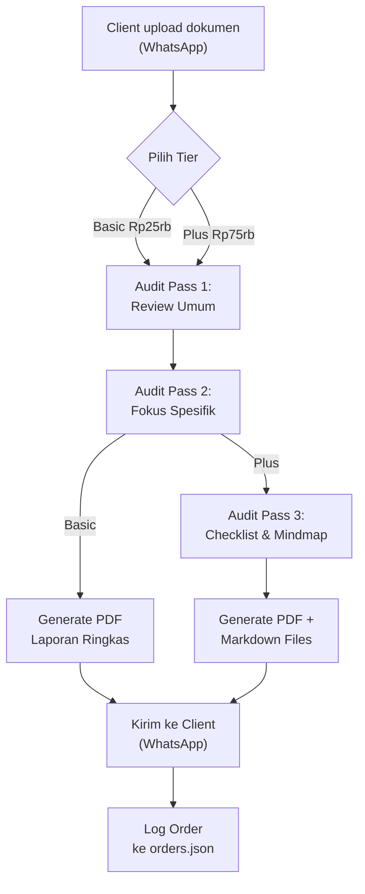

# PRD — AuditDok v1.1: Jasa Audit Dokumen Berbasis AI

> **Versi:** 1.1 — Realistis v1  
> **Tanggal:** 21 Juni 2026  
> **Pemilik Produk:** Ajie Bariandono  

---

## 1. Ringkasan Eksekutif

**AuditDok** adalah layanan audit dokumen profesional berbasis AI yang menawarkan review, koreksi, dan penyempurnaan dokumen secara cepat dan terjangkau. Layanan ini ditujukan bagi mahasiswa, profesional, dan pelaku UMKM yang membutuhkan kualitas audit dokumen setara konsultan namun dengan biaya yang jauh lebih rendah dibandingkan berlangganan tools AI premium secara mandiri.

### Value Proposition Utama

> **"Kenapa bayar Rp400.000/bulan untuk langganan AI yang belum tentu kamu pakai setiap hari? Cukup bayar per dokumen, dapat hasil audit profesional."**

| Perbandingan | Langganan Claude/ChatGPT Pro | AuditDok |
|:---|:---|:---|
| Biaya | Rp400.000/bulan (flat) | Mulai Rp25.000/dokumen |
| Skill prompt engineering | Harus punya sendiri | Sudah dikerjakan tim |
| Output | Raw text, perlu diolah | Deliverable siap pakai |
| Konsistensi kualitas | Tergantung prompt user | Standar audit terjamin |
| Dukungan format | Copy-paste manual | Upload file, terima hasil |

---

## 2. Jenis Dokumen yang Dilayani (v1)

> [!NOTE]
> v1 fokus pada 3 kategori dokumen yang paling banyak dicari dan sudah memiliki skill audit yang teruji.

| No | Jenis Dokumen | Skill File | Target Pengguna |
|:---:|:---|:---|:---|
| 1 | **Makalah Akademik** | `makalah.md` | Mahasiswa S1/S2 |
| 2 | **Proposal Skripsi / Tesis** | `proposal_skripsi.md` | Mahasiswa tingkat akhir |
| 3 | **Laporan Keuangan** (LRA, Neraca, CALK) | `laporan_keuangan.md` | PNS, akuntan, bendahara |

### Roadmap Dokumen (v2+)
Kategori berikut akan ditambahkan setelah v1 stabil dan memiliki klien aktif:
- Surat Dinas & Nota Dinas
- CV / Resume Profesional
- Proposal Bisnis / Pitch Deck
- Laporan Pertanggungjawaban (LPJ)
- Standard Operating Procedure (SOP)

---

## 3. Tier Layanan

### Filosofi Tier

```
Basic  →  "Cek cepat, tahu masalahnya"      (2-pass audit)
Plus   →  "Dapat arahan perbaikan lengkap"   (3-pass audit)
```

---

### 3.1 🟢 BASIC — Quick Audit (2-Pass)

**Tagline:** *"2x tembak, langsung tahu kelemahan dokumenmu."*

| Aspek | Detail |
|:---|:---|
| **Harga** | **Rp25.000** / dokumen |
| **Jumlah pass audit** | 2 kali (Pass 1: Review Umum + Pass 2: Fokus Spesifik) |
| **Maks halaman** | 20 halaman |
| **Waktu pengerjaan** | ≤ 2 jam |

**Deliverable:**
- [x] **Laporan Audit Ringkas** (PDF)
  - Skor kualitas dokumen (skala 1–10)
  - Daftar temuan utama dengan contoh sebelum/sesudah
  - Rekomendasi umum perbaikan
- [x] **Highlight Error** — Daftar kesalahan ejaan, tata bahasa, dan inkonsistensi format

**Tidak termasuk:**
- ❌ Checklist tindakan terstruktur
- ❌ Mindmap & diagram
- ❌ Rewrite / penulisan ulang

---

### 3.2 🔵 PLUS — Guided Audit (3-Pass)

**Tagline:** *"Bukan cuma tahu salahnya, tapi tahu cara betulinnya."*

| Aspek | Detail |
|:---|:---|
| **Harga** | **Rp75.000** / dokumen |
| **Jumlah pass audit** | 3 kali (Pass 1: Review Umum + Pass 2: Fokus Spesifik + Pass 3: Checklist & Mindmap) |
| **Maks halaman** | 50 halaman |
| **Waktu pengerjaan** | ≤ 6 jam |

**Deliverable (semua yang ada di Basic, ditambah):**
- [x] **PRD / Checklist Perbaikan** — Dokumen markdown berisi:
  - Checklist item-per-item yang harus diperbaiki
  - Prioritas perbaikan (Kritis / Penting / Opsional)
  - Contoh kalimat perbaikan untuk setiap temuan
- [x] **Mindmap Konsep Bertingkat** — Visualisasi struktur dokumen dalam nested bullet points
- [x] **Diagram Alur Logika** — Kode Mermaid.js yang bisa dirender
- [x] **Catatan Editor** — Komentar naratif tentang kekuatan dan kelemahan dokumen

---

## 4. Perbandingan Tier (Ringkas)

| Fitur | 🟢 Basic | 🔵 Plus |
|:---|:---:|:---:|
| **Harga** | Rp25rb | Rp75rb |
| Pass Audit | 2x | 3x |
| Laporan Audit (PDF) | ✅ | ✅ |
| Highlight Error | ✅ | ✅ |
| PRD / Checklist Perbaikan | ❌ | ✅ |
| Mindmap Konsep | ❌ | ✅ |
| Diagram Mermaid | ❌ | ✅ |
| Catatan Editor | ❌ | ✅ |
| Maks Halaman | 20 | 50 |
| Waktu Pengerjaan | ≤ 2 jam | ≤ 6 jam |

---

## 5. User Flow



---

## 6. Strategi Pricing & Positioning

### Mengapa Lebih Murah dari Langganan AI?

| Skenario | Biaya |
|:---|:---|
| Langganan Claude Pro 1 bulan | **Rp400.000** |
| Langganan ChatGPT Plus 1 bulan | **Rp320.000** |
| AuditDok Basic × 5 dokumen | **Rp125.000** |
| AuditDok Plus × 3 dokumen | **Rp225.000** |

> [!TIP]
> **Pitch ke client:** *"Dengan Rp125 ribu kamu bisa audit 5 dokumen. Itu kurang dari sepertiga harga langganan Claude yang belum tentu kamu pakai tiap hari. Dan hasilnya? Deliverable siap pakai, bukan raw text yang harus kamu olah sendiri."*

---

## 7. Channel Distribusi & Go-to-Market

### Phase 1 — Soft Launch (Bulan 1–2)
- **WhatsApp Business** sebagai channel utama order & delivery
- Target awal: mahasiswa UPB Pontianak dan kolega ASN
- Promosi via Instagram story + testimoni awal
- Order diproses via CLI internal, hasil dikirim manual via WA

### Phase 2 — Scale (Bulan 3–4)
- Landing page sederhana (1 halaman, form order + pricing)
- Integrasi pembayaran QRIS (Dana/GoPay/OVO)
- Ekspansi ke grup Telegram mahasiswa se-Kalbar
- Tambah kategori dokumen baru (Surat Dinas, CV)

### Phase 3 — Automate (Bulan 5+)
- Bot WhatsApp untuk order & tracking status
- Dashboard sederhana untuk tracking order & revenue
- Tambah tier Pro & Ultra jika demand memadai

---

## 8. Tech Stack Operasional (Internal)

| Komponen | Tools |
|:---|:---|
| AI Engine | Gemini API (primary), Claude API (fallback) |
| Document Parsing | Python `docx`, `pdfplumber` |
| PDF Generation | Python `reportlab` (font Arial Unicode MS) |
| Skills Library | File `.md` per jenis dokumen |
| Order Tracking | `orders.json` (lokal) |
| Delivery | WhatsApp Business, Google Drive |
| Payment | QRIS, Transfer bank |

---

## 9. Risiko & Mitigasi

| Risiko | Dampak | Mitigasi |
|:---|:---|:---|
| Client submit dokumen rahasia/sensitif | Kebocoran data | NDA sederhana, hapus file setelah 7 hari |
| Kualitas AI output tidak konsisten | Reputasi turun | Multi-pass audit + SOP review manual |
| Volume order melebihi kapasitas | Delay pengerjaan | Batasi slot per hari |
| Plagiarisme / akademik dishonesty | Masalah etika | Disclaimer: "Audit & saran, bukan ghostwriting" |
| Biaya API AI naik | Margin tergerus | Monitor usage, adjust pricing quarterly |

---

## 10. Metrik Keberhasilan (KPI)

| Metrik | Target Bulan 1 | Target Bulan 3 |
|:---|:---:|:---:|
| Jumlah order | 15 dokumen | 40 dokumen |
| Revenue | Rp750.000 | Rp3.000.000 |
| Repeat customer rate | 15% | 30% |
| Rating kepuasan (1–5) | ≥ 4.0 | ≥ 4.5 |
| Waktu pengerjaan rata-rata | Sesuai SLA | < 80% SLA |

---

## 11. Open Questions

> [!IMPORTANT]
> Keputusan yang perlu ditentukan sebelum launch:

1. **Nama brand final:** AuditDok? DokPeriksa? CekDokumen?
2. **Format disclaimer etika** untuk menghindari tuduhan ghostwriting akademik
3. **Kebijakan refund** jika client tidak puas
4. **Batas file size** per upload (saat ini belum ada validasi)
