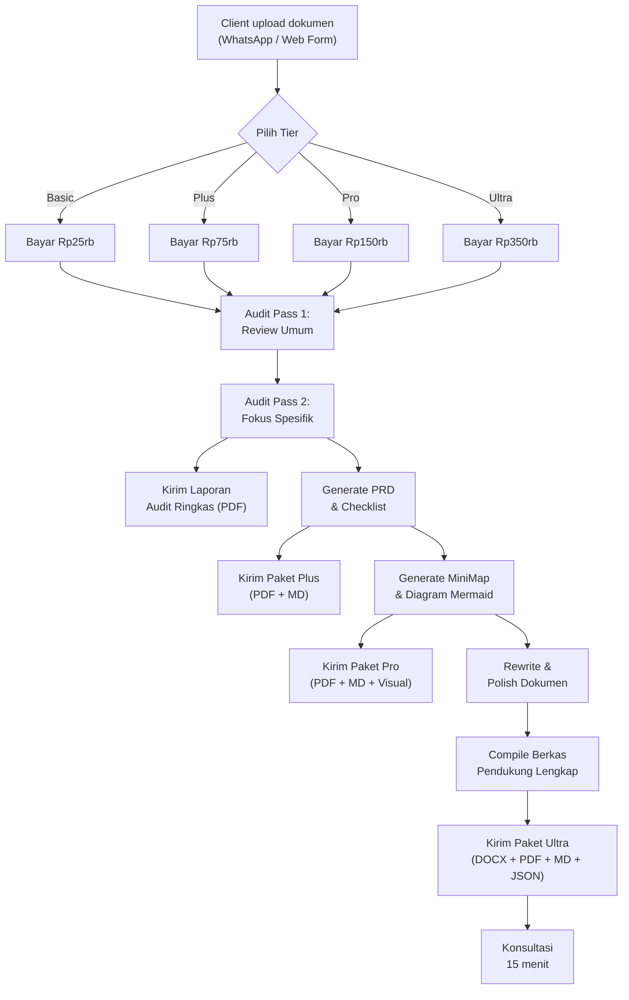

# PRD — AuditDok: Jasa Audit Dokumen Berbasis AI

> **Versi:** 1.0 — Draft  
> **Tanggal:** 20 Juni 2026  
> **Pemilik Produk:** Ajie Bariandono  

---

## 1. Ringkasan Eksekutif

**AuditDok** adalah layanan audit dokumen profesional berbasis AI yang menawarkan review, koreksi, dan penyempurnaan dokumen secara cepat dan terjangkau. Layanan ini ditujukan bagi mahasiswa, profesional, dan pelaku UMKM yang membutuhkan kualitas audit dokumen setara konsultan namun dengan biaya yang jauh lebih rendah dibandingkan berlangganan tools AI premium secara mandiri.

### Value Proposition Utama

> **"Kenapa bayar Rp400.000/bulan untuk langganan AI yang belum tentu kamu pakai setiap hari? Cukup bayar per dokumen, dapat hasil audit profesional."**

| Perbandingan | Langganan Claude/ChatGPT Pro | AuditDok |
|:---|:---|:---|
| Biaya | Rp400.000/bulan (flat) | Mulai Rp25.000/dokumen |
| Skill prompt engineering | Harus punya sendiri | Sudah dikerjakan tim |
| Output | Raw text, perlu diolah | Deliverable siap pakai |
| Konsistensi kualitas | Tergantung prompt user | Standar audit terjamin |
| Dukungan format | Copy-paste manual | Upload file, terima hasil |

---

## 2. Jenis Dokumen yang Dapat Diaudit

Berikut **13 kategori dokumen** yang dilayani AuditDok:

| No | Jenis Dokumen | Target Pengguna |
|:---:|:---|:---|
| 1 | **Laporan Keuangan** (LRA, Neraca, CALK) | PNS, akuntan, bendahara |
| 2 | **Makalah Akademik** | Mahasiswa S1/S2 |
| 3 | **Proposal Skripsi / Tesis** | Mahasiswa tingkat akhir |
| 4 | **Laporan Kerja Praktik / PKL** | Mahasiswa D3/D4/S1 |
| 5 | **Surat Dinas & Nota Dinas** | ASN, staf kantor pemerintah |
| 6 | **Proposal Bisnis / Pitch Deck** | Startup, UMKM, freelancer |
| 7 | **Laporan Tahunan Organisasi** | OPD, yayasan, NGO |
| 8 | **Terms of Reference (TOR/KAK)** | Pejabat pengadaan, PPK |
| 9 | **Dokumen Tender / Penawaran** | Vendor, CV, PT rekanan |
| 10 | **Jurnal Ilmiah (draft pre-submit)** | Dosen, peneliti |
| 11 | **Laporan Pertanggungjawaban (LPJ)** | Bendahara, panitia kegiatan |
| 12 | **Standard Operating Procedure (SOP)** | Manajer operasional, QA |
| 13 | **CV / Resume Profesional** | Job seeker, fresh graduate |

---

## 3. Tier Layanan

### Filosofi Tier

```
Basic  →  "Cek cepat, tahu masalahnya"
Plus   →  "Dapat arahan perbaikan yang actionable"  
Pro    →  "Dapat peta visual + rekomendasi restrukturisasi"
Ultra  →  "Terima dokumen jadi, tinggal pakai"
```

---

### 3.1 🟢 BASIC — Quick Audit

**Tagline:** *"2x tembak, langsung tahu kelemahan dokumenmu."*

| Aspek | Detail |
|:---|:---|
| **Harga** | **Rp25.000** / dokumen |
| **Jumlah prompt audit** | 2 kali (1 audit umum + 1 audit fokus) |
| **Maks halaman** | 20 halaman |
| **Waktu pengerjaan** | ≤ 2 jam |

**Deliverable:**
- [x] **Laporan Audit Ringkas** (1–2 halaman, format PDF)
  - Skor kualitas dokumen (skala 1–10)
  - Daftar temuan utama (maks 10 poin)
  - Rekomendasi umum perbaikan
- [x] **Highlight Error** — Daftar kesalahan ejaan, tata bahasa, dan inkonsistensi format

**Tidak termasuk:**
- ❌ Rewrite / penulisan ulang
- ❌ Analisis struktur mendalam
- ❌ File output selain PDF ringkasan

---

### 3.2 🔵 PLUS — Guided Audit

**Tagline:** *"Bukan cuma tahu salahnya, tapi tahu cara betulinnya."*

| Aspek | Detail |
|:---|:---|
| **Harga** | **Rp75.000** / dokumen |
| **Jumlah prompt audit** | 5 kali (multi-angle review) |
| **Maks halaman** | 50 halaman |
| **Waktu pengerjaan** | ≤ 6 jam |

**Deliverable (semua yang ada di Basic, ditambah):**
- [x] **PRD / Checklist Perbaikan** — Dokumen markdown berisi:
  - Checklist item-per-item yang harus diperbaiki
  - Prioritas perbaikan (Kritis / Penting / Opsional)
  - Contoh kalimat perbaikan untuk setiap temuan
  - Referensi regulasi/pedoman yang relevan (jika ada)
- [x] **Analisis Konsistensi** — Cek konsistensi istilah, singkatan, format penomoran, dan gaya sitasi di seluruh dokumen
- [x] **Catatan Editor** — Komentar naratif dari auditor tentang kekuatan dan kelemahan dokumen secara keseluruhan

---

### 3.3 🟣 PRO — Visual Audit

**Tagline:** *"Lihat peta dokumenmu. Tahu mana yang kuat, mana yang rapuh."*

| Aspek | Detail |
|:---|:---|
| **Harga** | **Rp150.000** / dokumen |
| **Jumlah prompt audit** | 10 kali (deep-dive per bagian) |
| **Maks halaman** | 100 halaman |
| **Waktu pengerjaan** | ≤ 12 jam |

**Deliverable (semua yang ada di Plus, ditambah):**
- [x] **Markdown MiniMap** — Visualisasi struktur dokumen dalam format markdown interaktif:
  - Peta hierarki bab/subbab dengan indikator warna kualitas (🟢 Baik / 🟡 Perlu Perbaikan / 🔴 Kritis)
  - Diagram alur logika argumen (Mermaid diagram)
  - Ringkasan per-bagian dengan skor kualitas individual
- [x] **Laporan Audit Mendalam** (5–10 halaman PDF):
  - Analisis koherensi antar-bab
  - Evaluasi kekuatan argumentasi
  - Gap analysis terhadap pedoman/template standar
  - Rekomendasi restrukturisasi (jika diperlukan)
- [x] **Comparison Table** — Tabel perbandingan sebelum vs. sesudah untuk setiap temuan kritis

---

### 3.4 🟠 ULTRA — Full Service Audit

**Tagline:** *"Serahkan draft kasarmu. Terima dokumen profesional."*

| Aspek | Detail |
|:---|:---|
| **Harga** | **Rp350.000** / dokumen |
| **Jumlah prompt audit** | Unlimited (sampai final) |
| **Maks halaman** | 150 halaman |
| **Waktu pengerjaan** | ≤ 24 jam |
| **Revisi** | 2x revisi gratis |

**Deliverable (semua yang ada di Pro, ditambah):**
- [x] **Dokumen Final yang Sudah Dipoles** — File .docx/.pdf yang sudah di-rewrite dan diperbaiki:
  - Prose yang dipoles (gaya bahasa alami, bukan AI-kaku)
  - Tabel dan grafik yang dirapikan
  - Format sesuai pedoman (APA, Turabian, template kampus, dll)
  - Header/footer, penomoran halaman, daftar isi otomatis
- [x] **Berkas Pendukung Utama:**
  - PRD / Checklist Perbaikan (✅ dari tier Plus)
  - Markdown MiniMap + Mermaid Diagram (✅ dari tier Pro)
  - Executive Summary (1 halaman, siap cetak)
  - Changelog / Riwayat Perubahan (diff sebelum vs sesudah)
  - Metadata JSON (statistik dokumen: jumlah kata, halaman, sitasi, dll)
- [x] **Konsultasi Singkat** — 15 menit voice call / chat untuk klarifikasi dan diskusi hasil audit

---

## 4. Perbandingan Tier (Ringkas)

| Fitur | 🟢 Basic | 🔵 Plus | 🟣 Pro | 🟠 Ultra |
|:---|:---:|:---:|:---:|:---:|
| **Harga** | Rp25rb | Rp75rb | Rp150rb | Rp350rb |
| Laporan Audit Ringkas | ✅ | ✅ | ✅ | ✅ |
| Highlight Error | ✅ | ✅ | ✅ | ✅ |
| PRD / Checklist Perbaikan | ❌ | ✅ | ✅ | ✅ |
| Analisis Konsistensi | ❌ | ✅ | ✅ | ✅ |
| Catatan Editor | ❌ | ✅ | ✅ | ✅ |
| Markdown MiniMap | ❌ | ❌ | ✅ | ✅ |
| Diagram Alur (Mermaid) | ❌ | ❌ | ✅ | ✅ |
| Laporan Audit Mendalam | ❌ | ❌ | ✅ | ✅ |
| Dokumen Final (rewrite) | ❌ | ❌ | ❌ | ✅ |
| Berkas Pendukung Lengkap | ❌ | ❌ | ❌ | ✅ |
| Konsultasi Voice/Chat | ❌ | ❌ | ❌ | ✅ |
| Revisi Gratis | ❌ | ❌ | ❌ | 2x |
| Maks Halaman | 20 | 50 | 100 | 150 |
| Waktu Pengerjaan | ≤ 2 jam | ≤ 6 jam | ≤ 12 jam | ≤ 24 jam |

---

## 5. User Flow



---

## 6. Strategi Pricing & Positioning

### 6.1 Mengapa Lebih Murah dari Langganan AI?

| Skenario | Biaya |
|:---|:---|
| Langganan Claude Pro 1 bulan | **Rp400.000** |
| Langganan ChatGPT Plus 1 bulan | **Rp320.000** |
| AuditDok Basic × 5 dokumen | **Rp125.000** |
| AuditDok Plus × 3 dokumen | **Rp225.000** |
| AuditDok Ultra × 1 dokumen | **Rp350.000** |

> [!TIP]
> **Pitch ke client:** *"Dengan Rp125 ribu kamu bisa audit 5 dokumen. Itu kurang dari sepertiga harga langganan Claude yang belum tentu kamu pakai tiap hari. Dan hasilnya? Deliverable siap pakai, bukan raw text yang harus kamu olah sendiri."*

### 6.2 Paket Bundling (Opsional)

| Paket | Isi | Harga | Hemat |
|:---|:---|:---:|:---:|
| **Mahasiswa Hemat** | 3× Basic + 1× Plus | Rp140.000 | 10% |
| **Skripsi Warrior** | 1× Ultra (skripsi) + 2× Basic (revisi bab) | Rp380.000 | 5% |
| **Kantor Pack** | 5× Plus | Rp340.000 | 9% |
| **All-In Semester** | 2× Ultra + 5× Basic | Rp800.000 | 7% |

---

## 7. Channel Distribusi & Go-to-Market

### Phase 1 — Soft Launch (Bulan 1–2)
- **WhatsApp Business** sebagai channel utama order & delivery
- Target awal: mahasiswa UPB Pontianak dan kolega ASN
- Promosi via Instagram story + testimoni awal

### Phase 2 — Scale (Bulan 3–4)
- Landing page sederhana (1 halaman, form order + pricing)
- Integrasi pembayaran QRIS (Dana/GoPay/OVO)
- Ekspansi ke grup Telegram mahasiswa se-Kalbar

### Phase 3 — Automate (Bulan 5+)
- Bot WhatsApp untuk order & tracking status
- Dashboard sederhana untuk tracking order & revenue
- Sistem referral: ajak teman dapat diskon 10%

---

## 8. Tech Stack Operasional (Internal)

| Komponen | Tools |
|:---|:---|
| AI Engine | Claude API / Gemini API |
| Document Processing | `docx.js`, `pdf-parse`, Python `docx` |
| Visual Output | Mermaid.js, Markdown renderer |
| Delivery | WhatsApp Business, Google Drive |
| Payment | QRIS, Transfer bank |
| Tracking | Notion database / Google Sheets |

---

## 9. Risiko & Mitigasi

| Risiko | Dampak | Mitigasi |
|:---|:---|:---|
| Client submit dokumen rahasia/sensitif | Kebocoran data | NDA sederhana, hapus file setelah 7 hari |
| Kualitas AI output tidak konsisten | Reputasi turun | SOP review manual sebelum kirim |
| Volume order melebihi kapasitas | Delay pengerjaan | Batasi slot per hari (maks 5 Ultra) |
| Plagiarisme / akademik dishonesty | Masalah etika | Disclaimer: "Audit & saran, bukan ghostwriting" |
| Biaya API AI naik | Margin tergerus | Monitor usage, adjust pricing quarterly |

---

## 10. Metrik Keberhasilan (KPI)

| Metrik | Target Bulan 1 | Target Bulan 3 |
|:---|:---:|:---:|
| Jumlah order | 20 dokumen | 60 dokumen |
| Revenue | Rp1.500.000 | Rp5.000.000 |
| Repeat customer rate | 20% | 40% |
| Rating kepuasan (1–5) | ≥ 4.0 | ≥ 4.5 |
| Waktu pengerjaan rata-rata | Sesuai SLA | < 80% SLA |

---

## 11. Open Questions

> [!IMPORTANT]
> Beberapa keputusan yang perlu ditentukan sebelum launch:

1. **Nama brand final:** AuditDok? DokPeriksa? CekDokumen? Atau nama lain?
2. **Apakah perlu landing page dari awal**, atau cukup WhatsApp dulu untuk validasi?
3. **Format disclaimer etika** yang tepat untuk menghindari tuduhan ghostwriting akademik
4. **Apakah tier Ultra harus include konsultasi voice call**, atau cukup chat saja?
5. **Kebijakan refund** jika client tidak puas dengan hasil audit
