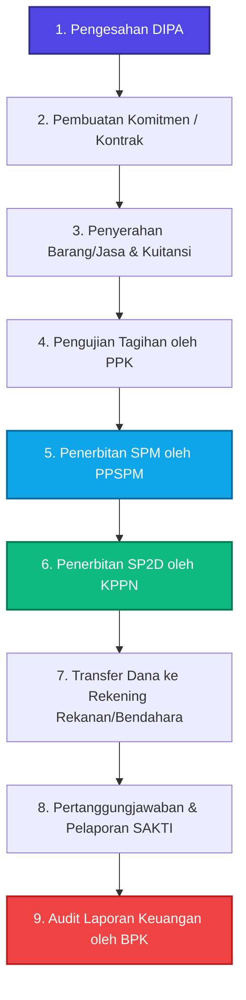
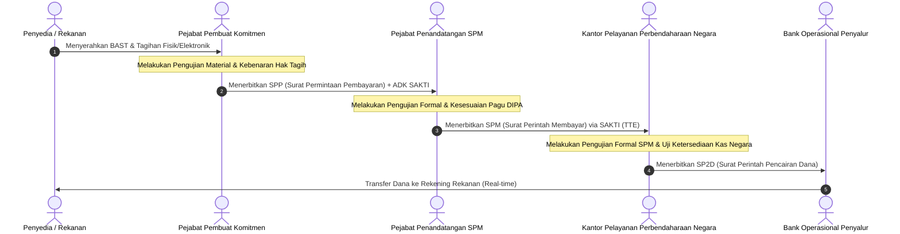
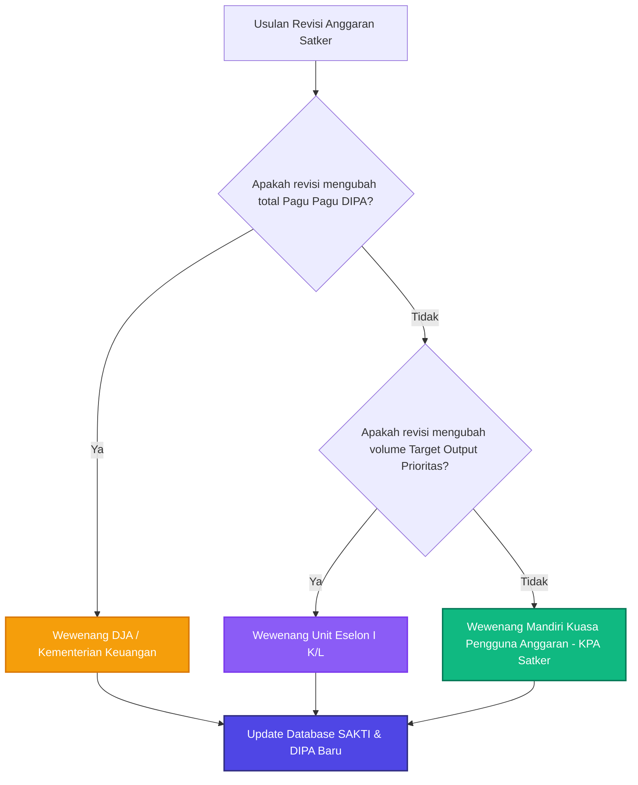

# 📊 FOLDER 2: VISUAL FLOWCHART ALUR PELAKSANAAN APBN
## Bedah PP 50/2018 & PMK 62/2023 (Koleksi Diagram untuk Skripsi & Tugas)

> **Cara Penggunaan:** Kumpulan diagram di bawah ini ditulis menggunakan format **Mermaid.js**. Anda bisa meng-copy kode diagram di bawah ini langsung ke Notion, GitHub, atau situs [Mermaid Live Editor](https://mermaid.live) untuk mendownloadnya secara gratis dalam format **PNG, SVG, atau PDF** berkualitas tinggi untuk ditempel di Bab II/III skripsi Anda.

---

## 📌 Diagram 1: Alur Makro Pelaksanaan Anggaran Belanja Negara
*Menjelaskan siklus makro pelaksanaan anggaran di tingkat Satker dari terbitnya DIPA sampai audit.*

---

## 📌 Diagram 2: Alur Penerbitan SPP - SPM - SP2D (Sistem Pengeluaran Kas Negara)
*Menjelaskan proses verifikasi formal dan material dari penagihan sampai pencairan dana.*

---

## 📌 Diagram 3: Alur Fleksibilitas Revisi Anggaran (Berdasarkan PMK 62/2023)
*Menunjukkan delegasi wewenang baru yang memotong birokrasi pengurusan revisi pagu.*

---

## 💡 Kunci Penjelasan untuk Ujian/Bab Skripsi:
1.  **Pengujian Material (Oleh PPK):** Menguji apakah barang benar-benar dikirim sesuai spesifikasi kontrak, harga wajar, dan dokumen kuitansi sah. Bertanggung jawab mutlak atas kerugian negara jika ada kesalahan bayar.
2.  **Pengujian Formal (Oleh PPSPM & KPPN):** Menguji kelengkapan administrasi, tidak melampaui pagu anggaran, kesesuaian tanda tangan pejabat, dan keabsahan dokumen elektronik.
3.  **IKPA (Indikator Kinerja Pelaksanaan Anggaran):** Flowchart 2 sangat mempengaruhi nilai IKPA satker pada aspek **Ketepatan Waktu Penyampaian SPM** (maksimal 5 hari kerja setelah SPP diterbitkan).
