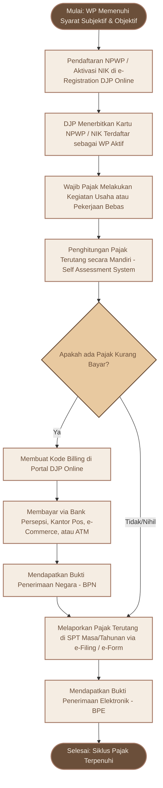

# FLOWCHART ALUR ADMINISTRASI PAJAK (KUP)
*Visualisasi Langkah-Langkah Menjadi Wajib Pajak Aktif: Dari NPWP s.d Pelaporan SPT*

Diagram di bawah ini digambar menggunakan format **Mermaid.js**. Anda bisa meng-copy teks kode di bawah langsung ke dalam Notion, Obsidian, GitHub, atau merendernya menjadi gambar menggunakan editor online seperti [mermaid.live](https://mermaid.live).

---

## 📊 Kode Mermaid Diagram

---

## 📝 Deskripsi Alur Proses

1.  **Syarat Subjektif & Objektif:** Siklus hidup perpajakan dimulai saat seseorang atau entitas badan memenuhi syarat subjektif (misal: lahir di Indonesia, tinggal lebih dari 183 hari) dan objektif (misal: memiliki penghasilan di atas PTKP).
2.  **Pendaftaran (NPWP):** Pendaftaran dilakukan secara daring di situs resmi DJP. Saat ini, bagi orang pribadi, NIK KTP diaktifkan sebagai NPWP.
3.  **Self Assessment System:** Indonesia menganut sistem di mana Wajib Pajak dipercaya untuk **menghitung sendiri**, **menyetor sendiri**, dan **melaporkan sendiri** pajaknya.
4.  **Penyetoran Pajak:** Jika ada pajak yang harus dibayar (Kurang Bayar), wajib membuat kode billing (15 digit) terlebih dahulu. Pembayaran tanpa kode billing tidak akan diterima sistem bank.
5.  **Bukti Penerimaan Negara (BPN):** Simpan BPN (yang berisi NTPN - Nomor Transaksi Penerimaan Negara) sebagai bukti setoran yang sah.
6.  **Pelaporan (SPT):** Pelaporan wajib dilakukan melalui e-Filing. Batas lapor SPT Tahunan Orang Pribadi adalah 31 Maret tahun berikutnya, sedangkan Badan adalah 30 April tahun berikutnya.
