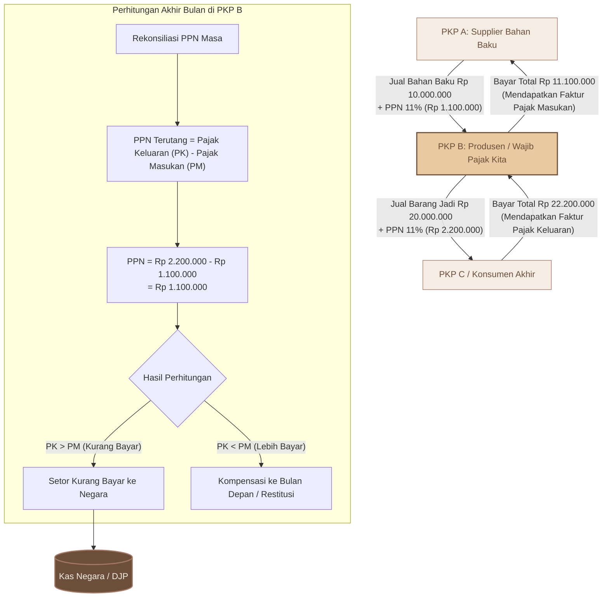

# FLOWCHART MEKANISME PAJAK PERTAMBAHAN NILAI (PPN)
*Visualisasi Kredit Pajak Masukan vs Pajak Keluaran Bagi Pengusaha Kena Pajak (PKP)*

Mekanisme PPN di Indonesia menggunakan sistem **Faktur Pajak** untuk mencatat Pajak Masukan (saat membeli) dan Pajak Keluaran (saat menjual). Diagram Mermaid.js di bawah ini menunjukkan alur transaksi dan perhitungan PPN di akhir bulan.

---

## 📊 Kode Mermaid Diagram

---

## 📝 Konsep & Terminologi PPN yang Wajib Dipahami

1.  **Pajak Masukan (PM):** PPN yang dipungut oleh PKP lain ketika kita membeli Barang Kena Pajak (BKP) atau Jasa Kena Pajak (JKP). PM ini merupakan **piutang pajak** (aset) bagi kita karena merupakan uang muka pajak yang dapat dikreditkan.
2.  **Pajak Keluaran (PK):** PPN yang kita pungut ketika menyerahkan/menjual BKP atau JKP kepada pelanggan. PK ini merupakan **utang pajak** (kewajiban) bagi kita yang harus disetorkan ke negara.
3.  **Pengkreditan PPN:** Proses mengurangi utang Pajak Keluaran dengan piutang Pajak Masukan yang sah.
4.  **Kondisi Akhir Masa:**
    *   **Kurang Bayar (Net Liability):** Kita memungut pajak dari pembeli lebih banyak daripada pajak yang kita bayar ke supplier. Selisihnya harus disetorkan ke kas negara paling lambat akhir bulan berikutnya (sebelum lapor SPT Masa PPN).
    *   **Lebih Bayar (Net Asset):** Kita membayar pajak ke supplier lebih banyak daripada yang kita pungut dari pembeli (biasanya terjadi saat perusahaan banyak melakukan pembelian aset/stok bahan baku, atau melakukan ekspor dengan tarif PPN 0%). Lebih bayar ini tidak hangus, melainkan dikompensasikan ke masa pajak berikutnya atau diminta kembali (restitusi).
