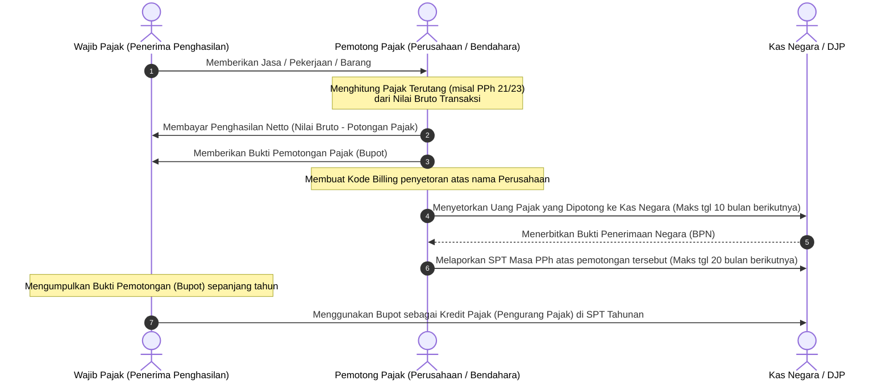

# FLOWCHART MEKANISME WITHHOLDING TAX SYSTEM
*Visualisasi Alur Kerja Pemotongan & Pemungutan Pajak oleh Pihak Ketiga (PPh 21, 22, 23, 4(2))*

Diagram Mermaid.js di bawah ini menggambarkan interaksi tiga arah antara **Wajib Pajak (WP) Penerima Penghasilan**, **Pemotong/Pemungut Pajak (Pemberi Kerja/Perusahaan/Bendahara)**, dan **Negara (Kas Negara/DJP)**.

---

## 📊 Kode Mermaid Diagram

---

## 📝 Penjelasan Penting Mekanisme Withholding Tax

1.  **Definisi Withholding Tax:** Sistem pemungutan pajak di mana pihak ketiga (biasanya pemberi kerja atau pembeli jasa) diberikan wewenang dan kewajiban oleh undang-undang untuk memotong sebagian penghasilan yang dibayarkan kepada penerima penghasilan.
2.  **Penghasilan Netto:** Wajib Pajak (karyawan/rekanan jasa) menerima pembayaran dalam jumlah bersih yang sudah dikurangi potongan pajak.
3.  **Bukti Pemotongan (Bupot):** Bupot adalah dokumen sangat penting. Dokumen ini membuktikan bahwa pajak Anda telah dipotong dan disetorkan ke negara oleh pihak pemotong. **Jangan sampai hilang!**
4.  **Kredit Pajak:** Pada akhir tahun pajak, saat wajib pajak menghitung PPh tahunan mereka secara mandiri, seluruh Bukti Pemotongan yang dikumpulkan dari pihak ketiga ini berfungsi sebagai **Uang Muka Pajak (kredit pajak)** yang akan mengurangi total PPh terutang akhir tahun. 
    *   Jika PPh Terutang Akhir Tahun > Kredit Pajak $\rightarrow$ **Kurang Bayar (PPh Pasal 29)**.
    *   Jika PPh Terutang Akhir Tahun < Kredit Pajak $\rightarrow$ **Lebih Bayar (PPh Pasal 28A)**.
