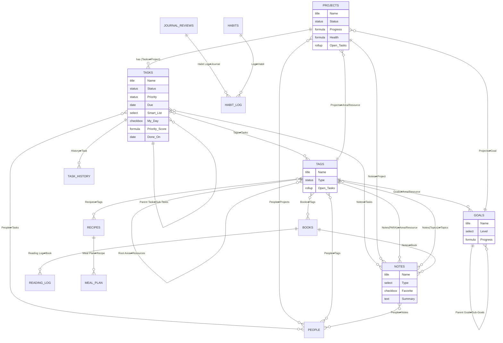

# Ultimate Brain Pro v2.0 — PRD + Notion Build Guide

**Author:** Notion Systems Architecture
**Version:** 2.0
**Date:** 2026-06-01
**Status:** Ready to build
**Target plan:** Notion Free (core). Paid-only items are explicitly labeled with a free-plan workaround.
**Source of truth for current state:** the attached *Ultimate Brain Lite* PRD, reconciled against a live audit of the actual workspace (database IDs captured in Appendix C).

---

## How to read this document

This file contains **two parts in one document**, exactly as commissioned:

- **PART A — PRD: Ultimate Brain Pro v2.0** (sections A1–A18): the full product specification — vision, parity matrix, target schema for every database, ER diagram, module specs, formula library, automations, views, flows, the Beyond-UB layer, migration, risks, roadmap, acceptance tests, glossary.
- **PART B — Notion Build Guide** (sections B0–B12): an ordered, numbered, do-this-then-that implementation guide grouped by phase, each step with a *Done when…* check, ending in an end-to-end smoke test.

Conventions used throughout:

- **Canonical database names** are written without suffixes (e.g., **Tasks**, **Projects**, **Tags**). Existing source databases keep their suffix in brackets (e.g., `Tasks [UT]`, `Areas/Resources [PT]`).
- **`[Beyond UB]`** marks any capability that exceeds Ultimate Brain 3.0.
- **`[Paid]`** marks anything requiring a paid Notion plan or external tool; each is paired with a free-plan workaround.
- Relations are always specified **on both sides** as `This side ⇄ Other side` with `(1)` or `(∞)` cardinality.
- Formulas are in **Notion Formula 2.0** syntax, copy-paste ready.

---

## Design Decisions (preamble)

Four decisions shape everything below.

**1. Evolve, don't rebuild — and absorb the duplicates the Lite PRD missed.** The live audit found the PARA Dashboard template was installed **twice**: a `[PT]` set *and* a `[PARA]` set, each with its own Areas/Resources, Notes, and Projects databases — plus two stray 2024 databases (`PROJECTS 🏗️`, `AREAS/RESOURCES`). Counting them, the workspace holds ~11 databases, not 6. The plan keeps the **richest** database in each role as canonical (`[UT]` for Tasks and Projects; `[UN]` for Notes; the PARA set for the Tags/PARA backbone) and **migrates then archives** every duplicate, preserving all rows and relations.

**2. One Tags database powers PARA — matching UB.** Ultimate Brain implements Areas & Resources *as* the Tags database. We follow that: the canonical **Tags** database is the existing `Areas/Resources [PT]` (it already has the `Resources` and `Root Area` self-relations) with its `Type` extended to **Area / Resource / Topic**. The topic tags from `Tags [UN]` migrate in as `Type = Topic`. Result: one PARA spine that holds Projects, Notes, Tasks, People, and sub-Resources.

**3. Free-plan first; paid is additive.** Trigger-based **database automations require Plus+**, but **buttons and native repeating database templates are free** and can add pages to other databases, set dates from formulas, and edit properties. Recurring tasks, Task History, quick capture, project scaffolding, and meeting-notes-from-a-person are therefore all delivered with **free button/template mechanics**, with the one-click paid automation given as an optional upgrade. **Notion AI** (autofill, Ask Notion, AI agents) now lives in the **paid Business tier** — so the entire AI layer is labeled `[Paid]` with an external free-LLM workaround.

**4. No circular rollups.** Progress and analytics always roll **upward** along one direction (Tasks → Projects → Goals). Cross-database percentages that Notion cannot compute natively (e.g., a single % that blends Tasks and Notes) are explicitly flagged with their workaround rather than faked.

---

# PART A — PRD: ULTIMATE BRAIN PRO v2.0

## A1. Executive Summary & Product Vision

**Vision.** Turn a pile of three free reference templates — duplicated and disconnected — into a single, opinionated **second brain** that equals Ultimate Brain 3.0 on every capability and then surpasses it with intelligence: an OKR goal cascade, a smart Priority Score, a self-updating analytics dashboard, structured reviews, and data-integrity guards. Everything must run on Notion's **free** plan; paid features are optional accelerants, never load-bearing.

**Problem.** Today the workspace has (a) **duplicate databases** (two Tasks, three Projects, three Areas/Resources, three Notes if you count the stray legacy ones), (b) **no cross-links** between Tasks/Notes and the PARA backbone, (c) **no Goals, People, Books, Recipes, Task History, My Day, or review system**, and (d) **no analytics**. The user cannot answer "what should I do right now?", "is this project healthy?", or "what did I actually finish this week?"

**Solution.** A consolidated **12-database** architecture (6 evolved + 6 new) wired with two-sided relations, a tight formula library, free-plan automations via buttons and repeating templates, a single **Home** dashboard using Side Peek, and a labeled **Beyond UB** intelligence layer.

**Outcome.** One home page to run the day; every task, note, and project rolls up to an Area and a Goal; recurring tasks self-process and log to history; reviews roll unfinished work forward; and a dashboard shows throughput, on-time %, overdue trend, and project health without manual upkeep.

## A2. Goals, Non-Goals, and Success Metrics

### Goals

1. **Full UB 3.0 parity** on every line of the matrix in A5.
2. **Single source of truth** per entity — zero duplicate databases after migration, zero data loss.
3. **Free-plan core** — every load-bearing feature works at $0; paid items are clearly optional.
4. **Connected graph** — every Task, Note, and Project reachable from an Area (Tag) and (where relevant) a Goal.
5. **Self-maintaining** — recurring tasks, Task History, rollover, and analytics update with no manual data entry beyond normal use.
6. **Beyond-UB intelligence** — Priority Score, goal cascade, analytics, reviews, and integrity guards.

### Non-Goals

- Not a team/multiplayer PM tool (designed for individual use; `Assignee`/`Delegated To` exist but workflows assume one primary user).
- Not a replacement for a dedicated calendar app (we use Notion Calendar integration, not a custom scheduler).
- Not a finance/habit-science engine — the Habit tracker is a lightweight `[Beyond UB]` add-on, not a full quantified-self system.
- No reliance on external paid automation (Make/Zapier/n8n) for any core function.

### Success Metrics (measurable)

| # | Metric | Definition | Target |
|---|---|---|---|
| M1 | Duplicate databases | Count of active (non-archived) databases serving the same role | **0** |
| M2 | Migration integrity | Rows present after migration ÷ rows before | **100%** |
| M3 | Orphan rate | Active Tasks/Notes/Projects with no Area/Project/Goal ÷ total active | **< 5%** |
| M4 | Recurring reliability | Recurring tasks that correctly reschedule + log to history on completion | **100%** |
| M5 | Daily-plan adoption | Days with ≥1 task marked **My Day** ÷ days in period | **≥ 80%** |
| M6 | On-time completion | Tasks completed on/before Due ÷ tasks completed (from analytics) | **≥ 75%** |
| M7 | Review cadence | Weekly reviews completed ÷ weeks | **≥ 90%** |
| M8 | Free-plan compliance | Core features functioning on Free plan | **100%** |

## A3. Personas & Jobs-to-be-Done

**Primary persona — "The Operator" (the workspace owner).** A solo knowledge worker / student running studies, side projects, and personal life from one workspace. Comfortable in Notion, wants power without fragility, lives on the free plan.

Jobs-to-be-done:

- **JTBD-1 (Capture):** "When a thought hits, let me dump a task or note in two clicks and sort it later." → Quick Capture + Inbox.
- **JTBD-2 (Plan the day):** "Each morning, show me only what I chose to do today." → My Day / Execute.
- **JTBD-3 (Decide what's next):** "Tell me the single highest-leverage task right now." → Priority Score + Do Next.
- **JTBD-4 (Run projects):** "Give me one page per project with its tasks and notes." → Project hub.
- **JTBD-5 (Organize by life area):** "File everything under an Area or Resource so nothing is homeless." → Tags/PARA.
- **JTBD-6 (Steer by goals):** "See how today's tasks ladder up to quarterly and annual goals." → Goal cascade.
- **JTBD-7 (Reflect):** "Run a structured weekly/monthly review and roll unfinished work forward." → Reviews.
- **JTBD-8 (Remember people):** "Keep contacts, log meetings as notes, never miss a birthday." → People/CRM.
- **JTBD-9 (Track inputs):** "Log books I read and meals I plan." → Books + Reading Log, Recipes + Meal Plan.
- **JTBD-10 (Measure):** "Show me throughput, on-time %, overdue trend, and project health." → Analytics.

## A4. Current-State Audit (factual)

### A4.1 What actually exists (live audit, 2026-06-01)

The Lite PRD describes "6 databases." The live workspace actually contains the following (IDs in Appendix C). This is the real consolidation surface.

| # | Database (actual title) | Role | Keep as | Notes from audit |
|---|---|---|---|---|
| 1 | `Tasks [UT]` | Tasks | **CANONICAL Tasks** | Richest: sub-tasks, recurring engine (Recur Interval/Unit/Days, Next Due), Priority (Status type), Smart List, Status; formulas Meta Labels, Next Due, Due Timestamp, Due Stamp (Parent), Sub-Task Sorter, Project Active. |
| 2 | `Projects [UT]` | Projects | **CANONICAL Projects** | Richest: Status (5 options), Progress %, Meta, Latest Activity; relation to `Tasks [UT]`. |
| 3 | `Notes [UN]` | Notes | **CANONICAL Notes** | Richest: `Tag` relation → `Tags [UN]`, `Type`, `Favorite`/`Archived`, `URL`, AI metadata. |
| 4 | `Tags [UN]` | Topic tags | **MERGE into Tags** | Topic taxonomy for notes; formulas Latest Note, Note Count. Becomes `Type = Topic` rows in canonical Tags. |
| 5 | `Areas/Resources [PT]` | PARA backbone | **CANONICAL Tags (PARA)** | Has `Type` (Area/Resource), `Resources` + `Root Area` self-relations, relations to `Projects [PT]` + `Notes [PT]`. Becomes canonical **Tags**. |
| 6 | `Projects [PT]` | Projects (dup) | **MIGRATE → Projects, then archive** | Simpler PARA-side projects DB. |
| 7 | `Notes [PT]` | Notes (dup) | **MIGRATE → Notes, then archive** | PARA-side notes DB. |
| 8 | `Tasks [PT]` | Tasks (dup) | **MIGRATE → Tasks, then archive** | Simpler PARA-side tasks DB. |
| 9 | `Areas/Resources [PARA]` | PARA backbone (dup) | **MIGRATE → Tags, then archive** | **Second PARA install** — not mentioned in Lite PRD. |
| 10 | `Projects [PARA]` | Projects (dup) | **MIGRATE → Projects, then archive** | Second PARA install. |
| 11 | `Notes [PARA]` | Notes (dup) | **MIGRATE → Notes, then archive** | Second PARA install. |
| 12 | `PROJECTS 🏗️` (2024) | Legacy | **REVIEW → migrate or archive** | Stray legacy DB; treat as cold archive unless it holds live data. |
| 13 | `AREAS/RESOURCES` (2024) | Legacy | **REVIEW → migrate or archive** | Stray legacy DB. |

> **Correction to the Lite PRD:** there are **two** PARA installs (`[PT]` and `[PARA]`) plus two legacy databases. The migration plan (A14 / Phase 1–2) resolves all of them, not just the `[UT]` vs `[PT]` pair.

### A4.2 Confirmed schema of the canonical sources (as-is)

**`Tasks [UT]`** (data source `a3278c4c…`): `Name` (title), `Status` (status: To Do/Doing/Done), `Priority` (**status**: Low/Medium/High), `Due` (date), `Project` (relation → Projects [UT], limit 1), `Parent Task` (relation self, limit 1) ⇄ `Sub-Tasks` (relation self, ∞), `Parent Project` (rollup), `Smart List` (select: Someday), `Recur Interval` (number), `Recur Unit` (select: Day(s)…Nth Weekday), `Days` (multi-select Mon–Sun), `Assignee` (person), `Description` (text), `Created`/`Edited` (timestamps); formulas `Next Due`, `Due Timestamp`, `Due Stamp (Parent)`, `Sub-Task Sorter`, `Meta Labels`, `Project Active`, `Localization Key`. Template: *Task with Sub-Tasks*.

**`Projects [UT]`** (data source `a1578c4c…`): `Name` (title), `Status` (status: Planned/On Hold/Doing/Ongoing/Done), `Tasks` (relation → Tasks [UT], ∞), `Archived` (checkbox); formulas `Progress`, `Meta`, `Latest Activity`, `Localization Key`. Template: *Project Template*.

**`Areas/Resources [PT]`** (data source `05e78c4c…`): `Name` (title), `Type` (status: Area/Resource), `Projects` (relation → Projects [PT]), `Notes` (relation → Notes [PT]), `Resources` (relation self), `Root Area` (relation self, limit 1), `Archive` (checkbox). Templates: *Area*, *Resource*.

**`Notes [UN]`** (per Lite PRD; exact internal formula code to be confirmed at build): `Name` (title), `Tag` (relation → Tags [UN]), `Type` (select: Reference/Article/Seminar/Idea/Lecture/Book/Plan), `Favorite` (checkbox), `Archived` (checkbox), `URL` (url), `AI Cost` (number), `Duration (Seconds)` (number).

**`Tags [UN]`** (per Lite PRD): `Name` (title), `Notes` (relation → Notes [UN]), `Favorite`/`Archived` (checkbox); formulas `Latest Note`, `Latest Note Date`, `Note Count`.

### A4.3 Gaps vs. the target

- No relations from **Tasks → Notes / Tags / People / Goal**; from **Projects → Area / Notes / Goal / People**; from **Notes → Project / Area**.
- No **Goals, People, Books, Reading Log, Recipes, Meal Plan, Task History, Journal & Reviews** databases.
- No **My Day**, **My Week**, **Home (Side Peek)**, **Quick Capture**, **Archive (Cold/Snoozed/Someday)**, or **Analytics** surfaces.
- No **GTD context/effort/energy**, no **Priority Score**, no **integrity guards**.
- Smart List has only **Someday** (missing Do Next / Delegated / Snoozed).

## A5. Ultimate Brain 3.0 Parity Matrix

Every UB 3.0 capability from the reference is listed. **Status legend:** ✅ at parity · ➕ exceeds.

| # | UB 3.0 capability | This system | How / where | Status |
|---|---|---|---|---|
| 1 | Core DB: Tasks | **Tasks** | Evolved from `Tasks [UT]` | ✅ |
| 2 | Core DB: Projects | **Projects** | Evolved from `Projects [UT]` | ✅ |
| 3 | Core DB: Notes | **Notes** | Evolved from `Notes [UN]` | ✅ |
| 4 | Core DB: Goals | **Goals** | New DB + OKR cascade (A8.7, A13) | ➕ |
| 5 | Core DB: Tags (powers Areas/Resources) | **Tags** | `Areas/Resources [PT]` extended to Area/Resource/**Topic** | ✅ |
| 6 | Core DB: People | **People** | New CRM DB (A8.11) | ✅ |
| 7 | Core DB: Books | **Books** + **Reading Log** | New DBs (A8.12) | ✅ |
| 8 | Core DB: Recipes | **Recipes** + **Meal Plan** | New DBs (A8.13) | ✅ |
| 9 | Sub-tasks | Yes | `Parent Task ⇄ Sub-Tasks` self-relation (retained) | ✅ |
| 10 | Recurring tasks (specific times AND date ranges), auto-processed | Yes | `Due` supports time + range; `Recur Interval/Unit/Days` + `Next Due`; auto-reschedule via inherited template automation (free) or button (A10) | ✅ |
| 11 | Priority levels | Yes | `Priority` (Low/Medium/High) **plus** computed `Priority Score` | ➕ |
| 12 | GTD Smart Lists: Do Next, Delegated, Snoozed, Someday | Yes | `Smart List` expanded to all four + `Snooze Until` date + `Delegated To` (A8.3) | ✅ |
| 13 | Notes: fast capture | Yes | Quick Capture button + Inbox (A8.2) | ✅ |
| 14 | Notes: favoriting | Yes | `Favorite` checkbox (retained) | ✅ |
| 15 | Notes: type classification | Yes | `Type` select (retained, extended) | ✅ |
| 16 | Notes: organize by PARA | Yes | `Area/Resource` + `Topics` relations → Tags | ✅ |
| 17 | Projects as hubs (Tasks + Notes) | Yes | Project page shows linked Tasks + Notes views (A8.4) | ✅ |
| 18 | PARA: Projects/Areas/Resources/Archives | Yes | Tags DB (`Type`), `Resources`/`Root Area` self-relations, `Archive` checkbox | ✅ |
| 19 | Areas/Resources implemented via Tags DB | Yes | Canonical **Tags** is the PARA backbone | ✅ |
| 20 | Home / single page; Tasks/Notes/Projects/Tags from one page | Yes | **Home** dashboard (A8.1) | ✅ |
| 21 | Side Peek (open item without navigating away) | Yes | All Home linked views set **Open as → Side peek** (A8.1, Layouts) | ✅ |
| 22 | Quick Capture (tasks + notes from anywhere) | Yes | Capture buttons on Home + global (A8.2) | ✅ |
| 23 | My Day (Execute section; My Day checkbox) | Yes | `My Day` checkbox → Execute view (A8.8) | ✅ |
| 24 | My Week (review + look-ahead) | Yes | **My Week** dashboard (A8.9) | ✅ |
| 25 | Archive: Cold Tasks, Snoozed, Someday | Yes | **Archive** dashboard with three smart views (A8.14) | ✅ |
| 26 | People: full CRM | Yes | **People** DB (A8.11) | ✅ |
| 27 | People: create Meeting Notes from a contact | Yes | Button on Person → new Note (`Type=Meeting`) linked back (A8.11, A10) | ✅ |
| 28 | People: associate with Projects/Tasks/Tags | Yes | Two-sided relations (A6.6) | ✅ |
| 29 | People: never miss birthdays | Yes | `Birthday` date + `Birthday (This Year)` formula + Calendar view | ✅ |
| 30 | Books: tracker + Reading Log | Yes | **Books** + **Reading Log** (A8.12) | ✅ |
| 31 | Books: notes associated with books | Yes | `Book ⇄ Notes` relation | ✅ |
| 32 | Recipes: collection + Meal Planning | Yes | **Recipes** + **Meal Plan** (A8.13) | ✅ |
| 33 | Goals connected to projects/tasks | Yes | `Goal ⇄ Projects`; Tasks roll up through Projects (A8.7) | ✅ |
| 34 | Task History (logs each recurring completion), free-plan compatible | Yes | **Task History** DB; logged by free **Complete & Log** button or `[Paid]` automation (A8.15, A10) | ✅ |
| 35 | Full support for Notion Layouts | Yes | Per-view layouts, Side Peek default open, gallery/board card previews (A8.1, A11) | ✅ |
| 36 | Recurring works on free plan via built-in automation | Yes | Inherited template automation runs on free; plus free button + repeating-template fallbacks (A10) | ✅ |
| 37 | Onboarding: tutorials, demo content, help hub | Yes | **Start Here** page + seeded demo rows + per-DB help callouts (A8 intro, B11) | ✅ |
| — | *Beyond:* Priority Score, OKR cascade, Analytics, Reviews, GTD context/effort/energy, Integrity guards, Journal/Habits | — | A13 | ➕ |

## A6. Target Architecture — Canonical Databases & Full Schemas

**12 canonical databases** (6 evolved + 6 new) plus 2 optional `[Beyond UB]` databases (Habits, Habit Log). Formula **code** is in A9 (referenced here by name to keep schema tables readable). Every two-sided relation lists the partner property and cardinality `(1)`/`(∞)`. Defaults: "—" means no default (empty on creation).

Cross-database relation summary (each appears once per side):

- **Tasks** ⇄ **Projects** (`Project` 1 ⇄ `Tasks` ∞)
- **Tasks** ⇄ **Tasks** (`Parent Task` 1 ⇄ `Sub-Tasks` ∞, self)
- **Tasks** ⇄ **Notes** (`Notes` ∞ ⇄ `Tasks` ∞)
- **Tasks** ⇄ **Tags** (`Tags` ∞ ⇄ `Tasks` ∞)
- **Tasks** ⇄ **People** (`People` ∞ ⇄ `Tasks` ∞)
- **Tasks** ⇄ **Task History** (`History` ∞ ⇄ `Task` 1)
- **Projects** ⇄ **Tags** (`Area/Resource` 1 ⇄ `Projects` ∞)
- **Projects** ⇄ **Notes** (`Notes` ∞ ⇄ `Project` 1)
- **Projects** ⇄ **Goals** (`Goal` 1 ⇄ `Projects` ∞)
- **Projects** ⇄ **People** (`People` ∞ ⇄ `Projects` ∞)
- **Notes** ⇄ **Tags** twice: (`Area/Resource` 1 ⇄ `Notes (PARA)` ∞) and (`Topics` ∞ ⇄ `Notes (Topics)` ∞)
- **Notes** ⇄ **People** (`People` ∞ ⇄ `Notes` ∞)
- **Notes** ⇄ **Books** (`Book` 1 ⇄ `Notes` ∞)
- **Tags** ⇄ **Tags** (`Root Area` 1 ⇄ `Resources` ∞, self)
- **Tags** ⇄ **People** (`People` ∞ ⇄ `Tags` ∞)
- **Goals** ⇄ **Goals** (`Parent Goal` 1 ⇄ `Sub-Goals` ∞, self)
- **Goals** ⇄ **Tags** (`Area/Resource` 1 ⇄ `Goals` ∞)
- **Books** ⇄ **Reading Log** (`Reading Log` ∞ ⇄ `Book` 1)
- **Books** ⇄ **Tags** (`Tags` ∞ ⇄ `Books` ∞)
- **Recipes** ⇄ **Meal Plan** (`Meal Plan` ∞ ⇄ `Recipe` 1)
- **Recipes** ⇄ **Tags** (`Tags` ∞ ⇄ `Recipes` ∞)
- **Habits** ⇄ **Habit Log** (`Log` ∞ ⇄ `Habit` 1) `[Beyond UB]`

### A6.1 Tasks (canonical; evolve `Tasks [UT]`)

| Property | Type | Options / Format / Default | Relation (this ⇄ other) | Purpose |
|---|---|---|---|---|
| Name | Title | — | — | Task title |
| Status | Status | To Do (default) / Doing / Done | — | Workflow state; checkbox toggles To Do↔Done |
| Priority | Status | Low / Medium / High | — | Manual priority (retained as Status type) |
| Due | Date | date or datetime; supports **time** and **range**; — | — | Due date/time; range = multi-day task |
| Project | Relation | limit 1 | `Project` (1) ⇄ Projects.`Tasks` (∞) | Parent project |
| Parent Task | Relation (self) | limit 1 | `Parent Task` (1) ⇄ `Sub-Tasks` (∞) | Sub-task nesting |
| Sub-Tasks | Relation (self) | ∞ | see above | Child tasks |
| Smart List | Select | **Do Next** / **Delegated** / **Snoozed** / **Someday**; — | — | GTD bucket (expanded from Someday-only) |
| Snooze Until | Date | — | — | Re-surface date for Snoozed items |
| Delegated To | Person | — | — | Owner when `Smart List = Delegated` |
| My Day | Checkbox | default unchecked | — | Surfaces task in **My Day → Execute** |
| Context | Multi-select | @Computer, @Phone, @Errand, @Home, @Office, @Online, @Waiting, @Anywhere | — | `[Beyond UB]` GTD context |
| Effort | Select | Quick (<15m) / Small / Medium / Large / XL | — | `[Beyond UB]` effort sizing |
| Energy | Select | High / Medium / Low | — | `[Beyond UB]` energy required |
| Recur Interval | Number | integer; — | — | Recurrence count (retained) |
| Recur Unit | Select | Day(s)…Year(s), Nth Weekday (retained set) | — | Recurrence unit (retained) |
| Days | Multi-select | Monday…Sunday | — | Specific weekdays (retained) |
| Done On | Date | set by Complete button/automation; — | — | `[Beyond UB]` completion date for on-time analytics |
| Notes | Relation | ∞ | `Notes` (∞) ⇄ Notes.`Tasks` (∞) | Linked notes |
| Tags | Relation | ∞ | `Tags` (∞) ⇄ Tags.`Tasks` (∞) | Area/Resource/Topic context |
| People | Relation | ∞ | `People` (∞) ⇄ People.`Tasks` (∞) | Associated contacts |
| History | Relation | ∞ | `History` (∞) ⇄ Task History.`Task` (1) | Completion log entries |
| Assignee | Person | — | — | Owner (retained; solo-use default) |
| Description | Text | — | — | Short note (retained) |
| Next Due | Formula | date | — | Next occurrence (retained; F-Recur in A9) |
| Due Timestamp | Formula | number | — | Sort helper (retained) |
| Due Stamp (Parent) | Formula | number | — | Keeps sub-tasks under parent (retained) |
| Sub-Task Sorter | Formula | string | — | Sub-task ordering (retained) |
| Meta Labels | Formula | string | — | "🔁 / has sub-tasks" badges (retained) |
| Project Active | Formula | boolean | — | True if project is Doing/Ongoing (retained) |
| Priority Score | Formula | number | — | `[Beyond UB]` smart ranking (F-PScore, A9) |
| Urgency | Formula | string | — | `[Beyond UB]` Overdue/Today/Soon/Later (F-Urg) |
| Age (days) | Formula | number | — | `[Beyond UB]` days since Created (F-Age) |
| Flags | Formula | string | — | `[Beyond UB]` integrity flags (F-TaskFlags) |
| Created / Edited | Created/Last-edited time | auto | — | Timestamps (retained) |

### A6.2 Projects (canonical; evolve `Projects [UT]`)

| Property | Type | Options / Format / Default | Relation (this ⇄ other) | Purpose |
|---|---|---|---|---|
| Name | Title | — | — | Project name |
| Status | Status | Planned / On Hold / Doing / Ongoing / Done (retained) | — | Lifecycle state |
| Priority | Select | Low / Medium / High; — | — | `[Beyond UB]` project priority (feeds task Priority Score) |
| Target Date | Date | — | — | `[Beyond UB]` deadline |
| Tasks | Relation | ∞ | `Tasks` (∞) ⇄ Tasks.`Project` (1) | Member tasks (retained) |
| Notes | Relation | ∞ | `Notes` (∞) ⇄ Notes.`Project` (1) | Member notes (**new link**) |
| Area/Resource | Relation | limit 1 | `Area/Resource` (1) ⇄ Tags.`Projects` (∞) | PARA home (**new link**) |
| Goal | Relation | limit 1 | `Goal` (1) ⇄ Goals.`Projects` (∞) | `[Beyond UB]` cascade parent |
| People | Relation | ∞ | `People` (∞) ⇄ People.`Projects` (∞) | Stakeholders |
| Archived | Checkbox | default unchecked | — | Archive flag (retained) |
| Progress | Formula | percent | — | % tasks done (retained; F-Progress) |
| Open Tasks | Rollup | count of `Tasks` where Status ≠ Done | via `Tasks` | `[Beyond UB]` feeds Health + "no next action" guard |
| Next Due | Rollup | earliest `Tasks.Due` (Min) | via `Tasks` | `[Beyond UB]` next deadline |
| Meta | Formula | string | — | Active/overdue task counts (retained) |
| Latest Activity | Formula | date | — | Most recent activity (retained) |
| Health | Formula | string | — | `[Beyond UB]` 🟢/🟡/🔴 project health (F-Health) |
| Is Stale | Formula | boolean | — | `[Beyond UB]` no activity > 14d & active (F-Stale) |
| Created / Edited | Created/Last-edited time | auto | — | Timestamps |

### A6.3 Notes (canonical; evolve `Notes [UN]`)

| Property | Type | Options / Format / Default | Relation (this ⇄ other) | Purpose |
|---|---|---|---|---|
| Name | Title | — | — | Note title |
| Type | Select | Reference / Article / Seminar / Idea / Lecture / Book / Plan / **Meeting** / **Highlight** / **Daily Note** | — | Note classification (extended) |
| Favorite | Checkbox | default unchecked | — | Favorite flag (retained) |
| Archived | Checkbox | default unchecked | — | Archive flag (retained) |
| URL | URL | — | — | Source link (retained) |
| Captured | Created time | auto | — | Capture timestamp |
| Project | Relation | limit 1 | `Project` (1) ⇄ Projects.`Notes` (∞) | Project home (**new link**) |
| Area/Resource | Relation | limit 1 | `Area/Resource` (1) ⇄ Tags.`Notes (PARA)` (∞) | PARA home (**new link**) |
| Topics | Relation | ∞ | `Topics` (∞) ⇄ Tags.`Notes (Topics)` (∞) | Topic tags (re-points old `Tag`) |
| Tasks | Relation | ∞ | `Tasks` (∞) ⇄ Tasks.`Notes` (∞) | Linked/extracted tasks |
| People | Relation | ∞ | `People` (∞) ⇄ People.`Notes` (∞) | Attendees/author |
| Book | Relation | limit 1 | `Book` (1) ⇄ Books.`Notes` (∞) | Source book |
| Summary | Text | — | — | `[Beyond UB]` AI summary (A10 prompt P1) |
| Processed | Checkbox | default unchecked | — | `[Beyond UB]` inbox-processed flag |
| Action Items Extracted | Checkbox | default unchecked | — | `[Beyond UB]` AI extraction done flag |
| Flags | Formula | string | — | `[Beyond UB]` orphan/no-PARA flag (F-NoteFlags) |
| AI Cost / Duration (Seconds) | Number | — | — | Audio/AI metadata (retained) |

### A6.4 Tags (canonical PARA backbone; evolve `Areas/Resources [PT]`)

| Property | Type | Options / Format / Default | Relation (this ⇄ other) | Purpose |
|---|---|---|---|---|
| Name | Title | — | — | Area / Resource / Topic name |
| Type | Status | **Area** / **Resource** / **Topic** (Topic added) | — | PARA classification |
| Archive | Checkbox | default unchecked | — | Archive flag (retained) |
| Root Area | Relation (self) | limit 1 | `Root Area` (1) ⇄ `Resources` (∞) | Parent Area of a Resource |
| Resources | Relation (self) | ∞ | see above | Child Resources |
| Projects | Relation | ∞ | `Projects` (∞) ⇄ Projects.`Area/Resource` (1) | Projects in this Area |
| Notes (PARA) | Relation | ∞ | `Notes (PARA)` (∞) ⇄ Notes.`Area/Resource` (1) | Notes filed here |
| Notes (Topics) | Relation | ∞ | `Notes (Topics)` (∞) ⇄ Notes.`Topics` (∞) | Notes tagged with this topic |
| Tasks | Relation | ∞ | `Tasks` (∞) ⇄ Tasks.`Tags` (∞) | Tasks in this context |
| Goals | Relation | ∞ | `Goals` (∞) ⇄ Goals.`Area/Resource` (1) | Goals in this Area |
| People | Relation | ∞ | `People` (∞) ⇄ People.`Tags` (∞) | Contacts in this Area |
| Books | Relation | ∞ | `Books` (∞) ⇄ Books.`Tags` (∞) | Books on this topic |
| Recipes | Relation | ∞ | `Recipes` (∞) ⇄ Recipes.`Tags` (∞) | Recipes tagged here |
| Open Tasks | Rollup | count `Tasks` where Status ≠ Done | via `Tasks` | `[Beyond UB]` area workload |
| Project Count | Rollup | count `Projects` (unchecked Archived) | via `Projects` | `[Beyond UB]` area load balance |
| Note Count | Rollup | count `Notes (PARA)` | via `Notes (PARA)` | Activity volume (replaces `Tags [UN]` Note Count) |
| Latest Activity | Rollup | Max of related `Notes (PARA)`.Captured | via `Notes (PARA)` | Freshness |

### A6.5 Goals (new) `[Beyond UB cascade; UB parity for "Goals"]`

| Property | Type | Options / Format / Default | Relation (this ⇄ other) | Purpose |
|---|---|---|---|---|
| Name | Title | — | — | Goal statement |
| Level | Select | **Vision** / **Annual** / **Quarterly** | — | Cascade tier |
| Status | Status | Not Started (default) / In Progress / Done / Dropped | — | State |
| Parent Goal | Relation (self) | limit 1 | `Parent Goal` (1) ⇄ `Sub-Goals` (∞) | Cascade upward (Quarterly→Annual→Vision) |
| Sub-Goals | Relation (self) | ∞ | see above | Cascade downward |
| Projects | Relation | ∞ | `Projects` (∞) ⇄ Projects.`Goal` (1) | Projects serving a Quarterly goal |
| Area/Resource | Relation | limit 1 | `Area/Resource` (1) ⇄ Tags.`Goals` (∞) | Life area |
| Target Date | Date | — | — | Deadline / period end |
| Key Result | Text | — | — | OKR key result statement |
| Target | Number | — | — | KR target value |
| Current | Number | default 0 | — | KR current value |
| KR Progress | Formula | percent | — | `Current / Target` (F-KR) |
| Rollup Progress | Rollup | avg of `Projects`.Progress (Quarterly) or `Sub-Goals`.Progress (Annual/Vision) | via `Projects` / `Sub-Goals` | Auto progress from children |
| Progress | Formula | percent | — | `[Beyond UB]` blends KR + rollup by Level (F-GoalProgress) |
| People | Relation | ∞ | `People` (∞) ⇄ People.`Tasks`… (optional; see note) | Accountability partner (optional) |

> Cascade rule (no circularity): **Tasks → Projects** (Progress), **Projects → Quarterly Goal** (Rollup Progress = avg Project Progress), **Quarterly → Annual** and **Annual → Vision** (Rollup Progress = avg Sub-Goals Progress). Each tier only reads the tier directly below it.

### A6.6 People / CRM (new)

| Property | Type | Options / Format / Default | Relation (this ⇄ other) | Purpose |
|---|---|---|---|---|
| Name | Title | — | — | Contact name |
| Company | Text | — | — | Organization |
| Role | Text | — | — | Title / role |
| Relationship | Select | Family / Friend / Colleague / Client / Mentor / Other | — | Segment |
| Email | Email | — | — | Email |
| Phone | Phone | — | — | Phone |
| Birthday | Date | — | — | DOB |
| Birthday (This Year) | Formula | date | — | Next occurrence for reminders (F-Bday) |
| Tasks | Relation | ∞ | `Tasks` (∞) ⇄ Tasks.`People` (∞) | Tasks involving them |
| Projects | Relation | ∞ | `Projects` (∞) ⇄ Projects.`People` (∞) | Projects |
| Notes | Relation | ∞ | `Notes` (∞) ⇄ Notes.`People` (∞) | Meeting notes & mentions |
| Tags | Relation | ∞ | `Tags` (∞) ⇄ Tags.`People` (∞) | Area/context |
| Last Contact | Rollup | Max of `Notes`.Captured | via `Notes` | `[Beyond UB]` recency |
| Days Since Contact | Formula | number | — | `[Beyond UB]` follow-up nudge (F-Contact) |

### A6.7 Books (new)

| Property | Type | Options / Format / Default | Relation (this ⇄ other) | Purpose |
|---|---|---|---|---|
| Title | Title | — | — | Book title |
| Author | Text | — | — | Author |
| Status | Status | To Read (default) / Reading / Read / DNF | — | Reading state |
| Rating | Select | ⭐ / ⭐⭐ / ⭐⭐⭐ / ⭐⭐⭐⭐ / ⭐⭐⭐⭐⭐ | — | Rating |
| Format | Select | Physical / eBook / Audio | — | Medium |
| Pages | Number | — | — | Total pages |
| Started | Date | — | — | Start date |
| Finished | Date | — | — | Finish date |
| Notes | Relation | ∞ | `Notes` (∞) ⇄ Notes.`Book` (1) | Book notes/highlights |
| Reading Log | Relation | ∞ | `Reading Log` (∞) ⇄ Reading Log.`Book` (1) | Session log |
| Tags | Relation | ∞ | `Tags` (∞) ⇄ Tags.`Books` (∞) | Topics |
| Pages Read | Rollup | Sum of `Reading Log`.Pages Read | via `Reading Log` | Progress numerator |
| Progress | Formula | percent | — | `Pages Read / Pages` (F-BookProg) |

### A6.8 Reading Log (new)

| Property | Type | Options / Format / Default | Relation (this ⇄ other) | Purpose |
|---|---|---|---|---|
| Name | Title | — | — | Session label (e.g., date) |
| Date | Date | default today | — | Session date |
| Book | Relation | limit 1 | `Book` (1) ⇄ Books.`Reading Log` (∞) | Book read |
| Pages Read | Number | — | — | Pages this session |
| Minutes | Number | — | — | Time spent |
| Notes | Text | — | — | Quick takeaways |

### A6.9 Recipes (new)

| Property | Type | Options / Format / Default | Relation (this ⇄ other) | Purpose |
|---|---|---|---|---|
| Name | Title | — | — | Recipe name |
| Course | Select | Breakfast / Lunch / Dinner / Snack / Dessert | — | Meal type |
| Cuisine | Select | (free options) | — | Cuisine |
| Servings | Number | — | — | Yield |
| Prep (min) | Number | — | — | Prep time |
| Cook (min) | Number | — | — | Cook time |
| Total (min) | Formula | number | — | `Prep + Cook` (F-RecipeTotal) |
| Source URL | URL | — | — | Source |
| Ingredients | Text | — | — | Ingredient list (steps in page body) |
| Favorite | Checkbox | default unchecked | — | Favorite |
| Meal Plan | Relation | ∞ | `Meal Plan` (∞) ⇄ Meal Plan.`Recipe` (1) | Planned meals |
| Tags | Relation | ∞ | `Tags` (∞) ⇄ Tags.`Recipes` (∞) | Topics/diet |

### A6.10 Meal Plan (new)

| Property | Type | Options / Format / Default | Relation (this ⇄ other) | Purpose |
|---|---|---|---|---|
| Name | Title | — | — | Plan entry label |
| Date | Date | default today | — | Day |
| Meal | Select | Breakfast / Lunch / Dinner / Snack | — | Slot |
| Recipe | Relation | limit 1 | `Recipe` (1) ⇄ Recipes.`Meal Plan` (∞) | Planned recipe |
| People | Relation | ∞ | `People` (∞) ⇄ People.`Tasks`… (optional) | Who's eating (optional) |
| Notes | Text | — | — | Notes |

### A6.11 Task History (new; free-plan compatible)

| Property | Type | Options / Format / Default | Relation (this ⇄ other) | Purpose |
|---|---|---|---|---|
| Name | Title | — | — | Snapshot of task name at completion |
| Task | Relation | limit 1 | `Task` (1) ⇄ Tasks.`History` (∞) | Source task |
| Completed On | Date | set to today on log | — | Completion timestamp |
| Project | Rollup | `Task`.Project (Show original) | via `Task` | Analytics grouping |
| Was Recurring | Rollup | `Task`.Recur Interval (Show original) | via `Task` | Distinguish recurring completions |
| Week | Formula | string | — | ISO week key for analytics (F-Week) |
| On Time | Formula | boolean | — | `[Beyond UB]` Completed On ≤ Due (F-OnTime, reads `Task` rollup of Due) |

### A6.12 Journal & Reviews (new) `[Beyond UB]`

| Property | Type | Options / Format / Default | Relation (this ⇄ other) | Purpose |
|---|---|---|---|---|
| Name | Title | — | — | Entry title (e.g., "Weekly Review — 2026-W23") |
| Type | Select | Daily Note / Weekly Review / Monthly Review / Quarterly Review | — | Review tier |
| Date | Date | default today | — | Entry date / period anchor |
| Mood | Select | 😀 / 🙂 / 😐 / 😕 / 😞 | — | Daily check-in |
| Energy | Select | High / Medium / Low | — | Daily check-in |
| Wins | Text | — | — | Highlights / wins |
| Rollover Done | Checkbox | default unchecked | — | Marks unfinished items rolled forward |
| Habit Log | Relation | ∞ | `Habit Log` (∞) ⇄ Habit Log.`Journal` (1) | Day's habit ticks (optional) |

*(Reflective prompts live in the page-body template — see A8.10.)*

### A6.13 Habits & Habit Log (new, optional) `[Beyond UB]`

**Habits:** `Name` (title) · `Cadence` (select: Daily/Weekly) · `Active` (checkbox, default checked) · `Target / week` (number) · `Log` (relation ∞ ⇄ Habit Log.`Habit` 1) · `This Week` (rollup count of `Log` where Done & this week) · `On Track` (formula: `This Week ≥ Target/week`).

**Habit Log:** `Name` (title) · `Date` (date, default today) · `Habit` (relation 1 ⇄ Habits.`Log` ∞) · `Journal` (relation 1 ⇄ Journal & Reviews.`Habit Log` ∞) · `Done` (checkbox).

## A7. Entity-Relationship Model



**ASCII fallback (relation map):**

```
                         GOALS (Vision→Annual→Quarterly, self-cascade)
                           │ Goal(1)⇄Projects(∞)
                           ▼
TAGS (PARA: Area/Resource/Topic) ──Area/Resource(1)⇄Projects(∞)──► PROJECTS ──Tasks(∞)⇄Project(1)──► TASKS
   │  ├─ Root Area(1)⇄Resources(∞) [self]                          │  └─Notes(∞)⇄Project(1)─► NOTES        │ Parent⇄Sub [self]
   │  ├─ Notes(PARA)(∞)⇄Area/Resource(1) ─► NOTES                  │                                       │
   │  ├─ Notes(Topics)(∞)⇄Topics(∞) ─► NOTES                       └─People(∞)⇄Projects(∞)─► PEOPLE        ├─Notes(∞)⇄Tasks(∞)─► NOTES
   │  ├─ Tasks(∞)⇄Tags(∞) ─► TASKS                                                                         ├─Tags(∞)⇄Tasks(∞)─► TAGS
   │  ├─ Goals(∞)⇄Area/Resource(1) ─► GOALS                        BOOKS ──Reading Log(∞)⇄Book(1)─► READING_LOG ├─People(∞)⇄Tasks(∞)─► PEOPLE
   │  ├─ People(∞)⇄Tags(∞) ─► PEOPLE                                  └─Notes(∞)⇄Book(1)─► NOTES            └─History(∞)⇄Task(1)─► TASK_HISTORY
   │  ├─ Books(∞)⇄Tags(∞) ─► BOOKS                                 RECIPES ─Meal Plan(∞)⇄Recipe(1)─► MEAL_PLAN
   │  └─ Recipes(∞)⇄Tags(∞) ─► RECIPES                             JOURNAL & REVIEWS ─Habit Log(∞)⇄Journal(1)─► HABIT_LOG ◄─Log(∞)⇄Habit(1)─ HABITS
```

## A8. Module Specifications

Each module lists **purpose**, the **databases/properties** it relies on, the **views** it surfaces (full specs in A11), and the **workflow**. Onboarding note: a top-level **Start Here** page hosts the Home dashboard, a getting-started checklist, per-module help callouts, and seeded demo rows (B11).

### A8.1 Home (single page, Side Peek)

**Purpose:** one command center to run everything; opening any item uses **Side Peek** so you never lose context (UB #20–21, #35).

**Relies on:** linked views of Tasks, Notes, Projects, Tags.

**Views shown (all linked, Open as → Side Peek):**

- **Quick Capture bar** (buttons): ＋ Task, ＋ Note, ＋ Meeting, ＋ Project (A8.2).
- **Today** — Tasks: `Status ≠ Done AND (Due is on/before today OR My Day = checked)`, sort Priority Score ↓.
- **Do Next** — Tasks: `Smart List = Do Next AND Status ≠ Done`, sort Priority Score ↓.
- **Active Projects** — Projects: `Archived = false AND Status is Doing/Ongoing`, show Progress, Health, Next Due, Area/Resource.
- **Inbox** — Tasks `Project empty AND Smart List empty AND Status ≠ Done` + Notes `Processed = false`.
- **Areas & Resources** — Tags `Type is Area/Resource AND Archive = false`, grouped by Type, show Open Tasks, Project Count.
- **Pinned** — Notes `Favorite = true`.

**Workflow:** land on Home → capture → glance at Today/Do Next → open items in Side Peek → process Inbox. Layout uses 2-column board: left = action (Today, Do Next, Inbox), right = context (Active Projects, Areas, Pinned).

### A8.2 Quick Capture

**Purpose:** add a task or note in ≤2 clicks from anywhere (UB #13, #22).

**Relies on:** **Buttons** (free). Each button uses *Add page to* with preset properties.

- **＋ Task** → adds page to **Tasks** with `Status = To Do`, `Smart List = (empty → Inbox)`; opens the new page so you can type the name.
- **＋ Note** → adds page to **Notes** with `Type = Reference`, `Processed = false`.
- **＋ Meeting** → adds page to **Notes** with `Type = Meeting`, applies the *Meeting Note* template.
- **＋ Project** → adds page to **Projects** with `Status = Planned`, applies *Project* template (scaffolds standard sub-tasks + a project note, A8.4).

**Global capture:** add these buttons to the Home top bar, the Notion sidebar favorites, and (free) the **Notion Calendar** menubar / **Notion mobile** "New" shortcut. `[Paid]` upgrade: a database automation that auto-files captures by keyword — free workaround is manual Inbox processing (A12).

### A8.3 Tasks & GTD

**Purpose:** capture → clarify → organize → engage, with full GTD Smart Lists (UB #9–12) and `[Beyond UB]` context/effort/energy + Priority Score.

**Relies on:** Tasks properties `Status, Priority, Due, Smart List (Do Next/Delegated/Snoozed/Someday), Snooze Until, Delegated To, My Day, Context, Effort, Energy, Recur*, Priority Score, Urgency, Flags`.

**GTD mapping:**

- **Inbox** = no Project, no Smart List, not Done → must be clarified.
- **Do Next** = actionable now; appears on Home + My Day picker.
- **Delegated** = waiting on `Delegated To`; review weekly.
- **Snoozed** = hidden until `Snooze Until`; auto-returns when date arrives.
- **Someday** = maybe/later; lives in Archive.

**Views:** Inbox, Do Next, Today, This Week, By Context, By Project, Delegated (Waiting), Snoozed, Someday, Calendar, All (A11).

**Workflow:** capture to Inbox → set Project/Tags/Due/Effort/Energy → assign Smart List → engage from **Do Next**/**My Day**, sorted by **Priority Score**.

### A8.4 Projects (hubs holding Tasks + Notes)

**Purpose:** each project is a single hub showing its Tasks **and** Notes (UB #17), with health and cascade.

**Relies on:** Projects `Status, Priority, Progress, Health, Open Tasks, Next Due, Area/Resource, Goal, People, Notes, Tasks`.

**Project page body (template):**

- Linked view **Tasks** (this project): `Project = this`, board by Status, sort by `Due Stamp (Parent)` then `Sub-Task Sorter` (keeps sub-tasks under parents).
- Linked view **Notes** (this project): `Project = this`, list, sort Captured ↓.
- Header callout shows `Progress`, `Health`, `Next Due`, `Area/Resource`, `Goal`.
- **Project scaffolding** (button *Add standard sub-tasks*): creates Plan / Execute / Review tasks linked to this project + one *Project Note*. `[Beyond UB]`.

**Views (DB level):** Active, Unarchived (retained), Archived (retained), By Area (grouped), Pipeline (board by Status), Stale Projects (guard), Health Board (A11).

### A8.5 Notes (capture, favorite, type, PARA)

**Purpose:** fast capture, favoriting, type classification, PARA filing (UB #13–16).

**Relies on:** Notes `Type, Favorite, Archived, URL, Project, Area/Resource, Topics, Tasks, People, Book, Summary, Processed`.

**Views:** Inbox (`Processed = false`), Favorites, Recent, By Type (board), By Area (grouped on `Area/Resource`), By Topic (grouped on `Topics`), Meeting Notes (`Type = Meeting`), All (A11).

**Workflow:** capture → (optional) AI summarize + extract action items (A10 P1/P2) → set `Area/Resource` + `Topics` + `Project` → check `Processed`.

### A8.6 PARA & Tags (Areas / Resources)

**Purpose:** the Tags database is the PARA spine (UB #18–19): Areas contain Resources, Projects, Notes, Tasks, People, Books, Recipes; Archive = the "A" in PARA.

**Relies on:** Tags `Type (Area/Resource/Topic), Root Area, Resources, Projects, Notes (PARA), Notes (Topics), Tasks, Goals, People, Books, Recipes, Open Tasks, Project Count, Note Count, Archive`.

**Views:** Areas (`Type=Area`, gallery), Resources (`Type=Resource`, grouped by Root Area), Topics (`Type=Topic`, list), Area Workload (`Type=Area` sort Open Tasks ↓ — `[Beyond UB]` load balance), Archive (`Archive=true`) (A11).

**Area/Resource page body (template):** linked views of Projects, Notes (PARA), Tasks, sub-Resources — turning each Area into a mini-dashboard.

### A8.7 Goals & OKR Cascade `[Beyond UB]` (UB parity for Goals)

**Purpose:** connect daily work to direction: **Vision → Annual → Quarterly → Projects → Tasks** with progress rolling **up** (UB #33; Beyond cascade).

**Relies on:** Goals `Level, Parent Goal/Sub-Goals, Projects, Area/Resource, Target/Current/KR Progress, Rollup Progress, Progress`.

**Cascade mechanics (no circular refs):**

1. Task done → **Projects.Progress** updates (% tasks done).
2. **Quarterly Goal.Rollup Progress** = average of its `Projects.Progress`.
3. **Annual Goal.Rollup Progress** = average of its `Sub-Goals` (the Quarterly goals).
4. **Vision.Rollup Progress** = average of its `Sub-Goals` (the Annual goals).
5. `Progress` formula picks KR-based or rollup-based value depending on `Level` (F-GoalProgress).

**Views:** Vision Board (`Level=Vision`, gallery), Annual (`Level=Annual`), Quarterly (`Level=Quarterly`, sort Target Date), Goal Tree (grouped by Parent Goal), On Track vs At Risk (sort Progress).

### A8.8 My Day (Execute) (UB #23)

**Purpose:** distraction-free daily execution. A **My Day** checkbox surfaces a task in the **Execute** section.

**Relies on:** Tasks `My Day, Status, Priority Score, Context, Energy, Time-blocking via Due time`.

**Page layout:**

- **Plan** (picker): Tasks `Status ≠ Done AND (Due ≤ today OR Smart List = Do Next)` — check `My Day` to add.
- **Execute**: Tasks `My Day = true AND Status ≠ Done`, sort Priority Score ↓; group by Context optional. This is the only list you look at while working.
- **Done Today**: Tasks `Done On is today` (satisfying close-out).
- **Clear My Day** button: *Edit pages in Tasks where My Day = true* → set `My Day = false` (free; run each morning) — or `[Paid]` nightly automation.

### A8.9 My Week (UB #24)

**Purpose:** weekly look-ahead + review staging.

**Views:** This Week (Tasks `Due` within current week, calendar + board by day), Next Week (look-ahead), Completed This Week (from Task History `Week = current`), Projects Due This Week, Weekly Review launcher button (creates a Weekly Review entry, A8.10).

### A8.10 Reviews (Daily / Weekly / Monthly / Quarterly) `[Beyond UB]`

**Purpose:** structured reflection + **rollover** of unfinished items.

**Relies on:** Journal & Reviews `Type, Date, Mood, Energy, Wins, Rollover Done`; linked Tasks/Projects/Goals views in the template body.

**Templates (page body):**

- **Daily Note:** Mood/Energy, "Top 3 today", gratitude, linked **Today** tasks, habit ticks.
- **Weekly Review:** auto-linked views — Completed this week (Task History), Overdue, Inbox (to zero it), Delegated/Waiting, Projects health, "Wins / Lessons / Next week's Big 3". **Rollover:** the *Roll over unfinished* button bumps overdue `Due` to today or sets `Smart List = Do Next`.
- **Monthly Review:** goal progress snapshot, area workload, stale projects, "themes".
- **Quarterly Review:** Quarterly goal scoring (KR Current vs Target), set next quarter's objectives.

**Cadence automation:** create review entries on a schedule via **repeating database templates** (free) — Daily template repeats daily, Weekly repeats weekly, etc.

### A8.11 People / CRM (UB #26–29)

**Purpose:** contact tracker; create meeting notes from a contact; never miss birthdays.

**Relies on:** People `Company, Role, Relationship, Email, Phone, Birthday, Birthday (This Year), Tasks, Projects, Notes, Tags, Last Contact, Days Since Contact`.

**Person page body (template):**

- **New Meeting Note** button → *Add page to Notes* with `Type = Meeting`, `People = this person`, title `"Meeting — {date}"`, applies Meeting template (free; satisfies UB #27).
- Linked views: Meeting Notes (`People contains this`), Open Tasks (`People contains this`), Projects.

**Views:** Directory (gallery), By Relationship, Birthdays (calendar on `Birthday (This Year)`), Follow-ups (`Days Since Contact > 30`, `[Beyond UB]`).

### A8.12 Books + Reading Log (UB #30–31)

**Purpose:** track books and log reading; associate notes with books.

**Relies on:** Books `Status, Rating, Format, Pages, Started, Finished, Notes, Reading Log, Tags, Pages Read, Progress`; Reading Log `Date, Book, Pages Read, Minutes`.

**Book page body:** linked **Notes** (`Book = this`) + linked **Reading Log** (`Book = this`) + **Log Reading** button (*Add page to Reading Log*, `Book = this`, `Date = today`).

**Views:** Library (gallery by Status), Reading Now (`Status=Reading`), Finished (`Status=Read`, sort Finished ↓), To Read, Reading Log (calendar).

### A8.13 Recipes + Meal Plan (UB #32)

**Purpose:** recipe collection + weekly meal planning.

**Relies on:** Recipes `Course, Cuisine, Servings, Prep/Cook/Total, Source URL, Ingredients, Favorite, Meal Plan, Tags`; Meal Plan `Date, Meal, Recipe, People`.

**Views:** Cookbook (gallery), By Course, Favorites, Meal Plan (calendar on `Date`), This Week's Meals.

### A8.14 Archive (Cold / Snoozed / Someday) (UB #25)

**Purpose:** keep the system lean; smart archive surfaces.

**Views (linked on Tasks/Projects):**

- **Cold Tasks** — Tasks `Status ≠ Done AND Due < today − 30 AND Smart List empty` (stale, never snoozed).
- **Snoozed** — Tasks `Smart List = Snoozed`, sort `Snooze Until` ↑.
- **Someday** — Tasks `Smart List = Someday`.
- **Archived Projects** — Projects `Archived = true`.
- **Archived Tags** — Tags `Archive = true`.

**Auto-return:** a **Wake Snoozed** button (*Edit pages in Tasks where Smart List = Snoozed AND Snooze Until ≤ today* → set `Smart List = Do Next`) run at review (free) or `[Paid]` daily automation.

### A8.15 Task History (UB #34)

**Purpose:** log every completion — especially recurring — so you can see each time you did it.

**Relies on:** Task History `Task, Completed On, Project, Was Recurring, Week, On Time`.

**Logging (free):** the **✅ Complete & Log** button on each Task does: (1) set `Status = Done`; (2) set `Done On = today`; (3) *Add page to Task History* with `Name = {task name}`, `Task = this`, `Completed On = today`. For recurring tasks, the inherited reschedule automation then advances `Due` and resets `Status`. `[Paid]` upgrade: a database automation logs **all** completions automatically (B-Phase 6).

**Views:** History (table, sort Completed On ↓), By Week (board grouped on `Week`), By Project, On-Time Log (`On Time = true`).

### A8.16 Analytics / Intelligence `[Beyond UB]`

**Purpose:** answer "how am I doing?" with no manual entry. Source = Task History (completions) + live Task/Project rollups.

**Metrics & sources (formulas in A9, charts in A11):**

| Metric | Source | Method |
|---|---|---|
| Throughput (completed/week) | Task History | Count rows grouped by `Week` (bar chart) |
| On-time completion % | Task History | `On Time = true` ÷ all, per week |
| Overdue trend | Tasks | Count `Status ≠ Done AND Due < today` over time (snapshot weekly into a Metrics note, or live number) |
| Avg time-in-status / cycle time | Tasks | `Done On − Created` averaged (F-Age on completed) |
| Project health | Projects | F-Health (🟢/🟡/🔴) board |
| Area workload balance | Tags | `Open Tasks` per Area (bar chart) |
| Stale-project detector | Projects | F-Stale view |
| Weekly velocity | Task History | Completed this week vs trailing 4-week avg |

**Dashboard page:** Notion **Chart** views (free, current Notion) — bar chart of Task History by Week, donut of On Time, bar of Tags Open Tasks; plus number callouts (Open tasks, Overdue, Completed this week) and the Health/Stale boards. `[Paid]`-free: all of these use native chart views + rollups; no external BI needed.

### A8.17 AI Layer `[Beyond UB]` `[Paid: Notion Business]`

**Purpose:** summarize notes, extract action items into Tasks, auto-suggest Tags/Area, draft reviews, and "ask your second brain."

**Reality check:** Notion AI (AI autofill properties, Ask Notion, AI agents) requires the **paid Business tier** (the standalone AI add-on was retired May 2025). **Free-plan workaround:** use the **exact prompts in A10** in any free LLM (Claude/ChatGPT free tier) — paste the note body, paste the result back into `Summary`/create Tasks manually. Notion's basic AI writing (limited) may also be available. Functionality is identical; only the one-click autofill is paid.

**Surfaces:** `Summary` (AI autofill), action-item extraction (AI block → create tasks), Tag/Area suggestion (AI autofill), review drafts (AI block in template), "Ask" (Notion Q&A or external LLM over exported notes).

### A8.18 Notion Layouts & Onboarding (UB #35, #37)

**Layouts:** every view sets explicit layout — Side Peek open mode on Home; card previews (cover/Progress) on galleries; board card properties; frozen Name column on wide tables; grouped sections. **Onboarding:** **Start Here** page with a setup checklist, a 90-second "how it flows" diagram, per-database help callouts, and seeded demo rows (one Goal, Project, Task, Note, Person, Area) removable after the smoke test.

## A9. Formula Library (Notion Formula 2.0 — copy-paste ready)

All formulas use current Notion syntax (`prop()`, `lets()`, `if()`, infix `and`/`or`/`not`, `dateBetween(a,b,unit)=a−b`, `now()`, `year()`, `formatDate()` Moment tokens, `.filter(current.prop(...))`, `.length()`). **Retained** formulas (Next Due, Due Timestamp, Due Stamp (Parent), Sub-Task Sorter, Meta Labels, Project Active, Meta, Latest Activity, Localization Key) ship with Ultimate Tasks — **keep them unchanged**; do not paste over them. The formulas below are the **new** ones plus clean reference implementations.

### Tasks

**F-PScore — `Priority Score`** *(higher = do sooner; blends priority, due-urgency, Do Next, My Day, quick wins):*

```
round(
  (if(prop("Priority") == "High", 30, if(prop("Priority") == "Medium", 18, if(prop("Priority") == "Low", 8, 0))))
  + (if(empty(prop("Due")), 0,
       lets(d, dateBetween(prop("Due"), now(), "days"),
         if(d < 0, 40, if(d == 0, 35, if(d <= 2, 25, if(d <= 7, 15, if(d <= 14, 8, 3))))))))
  + (if(prop("Smart List") == "Do Next", 10, 0))
  + (if(prop("My Day"), 8, 0))
  + (if(prop("Effort") == "Quick (<15m)", 5, 0))
)
```

**F-Urg — `Urgency`** *(human-readable due bucket):*

```
if(empty(prop("Due")), "—",
  lets(d, dateBetween(prop("Due"), now(), "days"),
    if(prop("Status") == "Done", "✅ Done",
      if(d < 0, "🔴 Overdue",
        if(d == 0, "🟠 Today",
          if(d <= 2, "🟡 Soon",
            if(d <= 7, "🔵 This week", "⚪ Later")))))))
```

**F-Age — `Age (days)`** *(creation→completion, or →now if still open — feeds cycle-time analytics):*

```
dateBetween(if(empty(prop("Done On")), now(), prop("Done On")), prop("Created"), "days")
```

**F-TaskFlags — `Flags`** *(integrity guard: unfiled / overdue / ready-to-wake):*

```
(if(empty(prop("Project")) and empty(prop("Tags")) and empty(prop("Smart List")), "📥 Unfiled ", "")
+ if(not empty(prop("Due")) and prop("Status") != "Done" and dateBetween(prop("Due"), now(), "days") < 0, "🔴 Overdue ", "")
+ if(prop("Smart List") == "Snoozed" and not empty(prop("Snooze Until")) and dateBetween(prop("Snooze Until"), now(), "days") <= 0, "⏰ Wake ", ""))
```

### Projects

**F-Progress — `Progress`** *(reference impl; % of related tasks that are Done — retained UT version equivalent):*

```
if(empty(prop("Tasks")), 0,
  prop("Tasks").filter(current.prop("Status") == "Done").length() / prop("Tasks").length())
```

> Set the property's number format to **Percent**. `Open Tasks` and `Next Due` are **rollups** (not formulas): `Open Tasks` = Rollup `Tasks` → `Status`, *Count* with filter `Status ≠ Done` (or count all then subtract); `Next Due` = Rollup `Tasks` → `Due`, *Earliest date*.

**F-Health — `Health`** *(traffic-light project health; reads rollups + Progress, nothing reads it → no cycle):*

```
if(prop("Status") == "Done", "✅ Done",
  if(prop("Archived"), "📦 Archived",
    if(prop("Open Tasks") == 0 and prop("Status") != "Done", "⚪ No next action",
      if(prop("Is Stale"), "🔴 Stale",
        if(not empty(prop("Next Due")) and dateBetween(prop("Next Due"), now(), "days") < 0, "🔴 Overdue tasks",
          if(prop("Progress") >= 0.7, "🟢 On track",
            if(prop("Progress") >= 0.3, "🟡 In progress", "🟠 Early")))))))
```

**F-Stale — `Is Stale`** *(active project untouched > 14 days — stale-project detector):*

```
prop("Status") != "Done" and prop("Archived") == false and not empty(prop("Latest Activity")) and dateBetween(now(), prop("Latest Activity"), "days") > 14
```

### Notes

**F-NoteFlags — `Flags`** *(orphan / unprocessed guard):*

```
(if(empty(prop("Area/Resource")) and empty(prop("Project")), "🏷️ No PARA ", "")
+ if(prop("Processed") == false and empty(prop("Topics")), "📥 Unprocessed ", ""))
```

### Goals (cascade)

> Goals needs **two rollups**: `Projects Progress` = Rollup `Projects` → `Progress`, *Average*; `Sub-Goals Progress` = Rollup `Sub-Goals` → `Progress`, *Average*. The `Progress` formula below picks the right source by `Level`, preferring an explicit Key Result if set. Strictly downward (Quarterly←Projects, Annual←Quarterly, Vision←Annual) — no cycles.

**F-KR — `KR Progress`** *(key-result completion):*

```
if(empty(prop("Target")) or prop("Target") == 0, 0, prop("Current") / prop("Target"))
```

**F-GoalProgress — `Progress`** *(KR if defined, else rolled-up child progress, by Level):*

```
lets(
  kr, if(not empty(prop("Target")) and prop("Target") != 0, prop("Current") / prop("Target"), -1),
  rolled, if(prop("Level") == "Quarterly", prop("Projects Progress"), prop("Sub-Goals Progress")),
  if(kr >= 0, kr, rolled)
)
```

### People

**F-Bday — `Birthday (This Year)`** *(next upcoming occurrence of the birthday — drives reminders):*

```
if(empty(prop("Birthday")), fromTimestamp(0),
  lets(
    thisYear, dateAdd(prop("Birthday"), year(now()) - year(prop("Birthday")), "years"),
    if(dateBetween(thisYear, now(), "days") < 0, dateAdd(thisYear, 1, "years"), thisYear)
  ))
```

**F-Contact — `Days Since Contact`** *(follow-up nudge; `Last Contact` is a rollup = Max of `Notes`→Captured):*

```
if(empty(prop("Last Contact")), 9999, dateBetween(now(), prop("Last Contact"), "days"))
```

### Books / Recipes

**F-BookProg — `Progress`** *(`Pages Read` is a rollup = Sum of `Reading Log`→Pages Read):*

```
if(empty(prop("Pages")) or prop("Pages") == 0, 0, prop("Pages Read") / prop("Pages"))
```

**F-RecipeTotal — `Total (min)`**:

```
(if(empty(prop("Prep (min)")), 0, prop("Prep (min)"))) + (if(empty(prop("Cook (min)")), 0, prop("Cook (min)")))
```

### Task History (analytics)

> Add a rollup `Task Due` = Rollup `Task` → `Due`, *Show original* (latest). `Project`/`Was Recurring` are also rollups of `Task`.

**F-Week — `Week`** *(ISO week key, e.g. `2026-W23`, for grouping throughput):*

```
formatDate(prop("Completed On"), "GGGG-[W]ww")
```

**F-OnTime — `On Time`** *(completed on/before due):*

```
if(empty(prop("Completed On")) or empty(prop("Task Due")), true,
   dateBetween(prop("Task Due"), prop("Completed On"), "days") >= 0)
```

### Habits `[Beyond UB]`

**`On Track`** *(`This Week` is a rollup = Count of `Log` where Done & current week):*

```
prop("This Week") >= prop("Target / week")
```

## A10. Automations, Buttons & AI

**Plan rule:** trigger-based **database automations need Plus+**; **buttons, button properties, and repeating database templates are FREE** and can *add pages to other databases*, *edit pages*, set dates from `@today`/formulas, and apply templates. Every core mechanic below has a **free** method; the paid one-click automation is listed as an optional upgrade.

### A10.1 Buttons & templates (free, load-bearing)

| ID | Button / template | Where | Actions | Free? |
|---|---|---|---|---|
| BTN-1 | **＋ Task** | Home / sidebar | Add page to **Tasks** (`Status=To Do`); open page | ✅ |
| BTN-2 | **＋ Note** | Home | Add page to **Notes** (`Type=Reference`, `Processed=false`) | ✅ |
| BTN-3 | **＋ Meeting** | Home & each Person | Add page to **Notes** (`Type=Meeting`, `People=this`), apply *Meeting* template | ✅ |
| BTN-4 | **＋ Project** | Home | Add page to **Projects** (`Status=Planned`), apply *Project* template | ✅ |
| BTN-5 | **✅ Complete & Log** | Tasks (button property) | Edit this page: `Status=Done`, `Done On=@today`; Add page to **Task History** (`Name`=task name, `Task=this`, `Completed On=@today`) | ✅ |
| BTN-6 | **🔁 Complete & Reschedule** | Tasks (recurring) | Edit this page: `Due` = `Next Due` (formula mention), keep `Status=To Do`; Add page to **Task History** | ✅ |
| BTN-7 | **Clear My Day** | My Day page | Edit pages in **Tasks** where `My Day=true` → `My Day=false` | ✅ |
| BTN-8 | **Wake Snoozed** | Archive / Weekly Review | Edit pages in **Tasks** where `Smart List=Snoozed` and `Snooze Until ≤ @today` → `Smart List=Do Next` | ✅ |
| BTN-9 | **Roll over unfinished** | Weekly Review | Edit pages in **Tasks** where `Status≠Done` and `Due < @today` → `Due=@today` (or `Smart List=Do Next`) | ✅ |
| BTN-10 | **Add standard sub-tasks** | each Project | Add 3 pages to **Tasks** (`Plan`/`Execute`/`Review`, `Project=this`) + 1 **Note** (`Project=this`) | ✅ |
| BTN-11 | **Log Reading** | each Book | Add page to **Reading Log** (`Book=this`, `Date=@today`) | ✅ |
| TPL-1 | **Repeating Daily Note** | Journal & Reviews | Database template set to **Repeat: Daily** → auto-creates today's Daily Note | ✅ |
| TPL-2 | **Repeating Weekly/Monthly/Quarterly Review** | Journal & Reviews | Templates set to Repeat weekly/monthly/quarterly | ✅ |
| TPL-3 | **Repeating recurring tasks** (alt to BTN-6) | Tasks | Native repeating database template auto-creates the next occurrence on schedule | ✅ |

### A10.2 Recurring tasks — three free paths + paid upgrade

1. **Inherited automation (already on free plan):** your `Tasks [UT]` came from Ultimate Tasks, which ships a database automation: *when `Status` set to Done → set `Due = Next Due`, reset `Status = To Do`.* Free plan **runs** template-embedded automations (you just can't edit them). **Verify it exists** (B-Phase 3). If you also want history, complete recurring tasks with **BTN-6** which logs to Task History before rescheduling.
2. **Button (DIY, free):** **BTN-6** above — explicit, logs history, no automation needed.
3. **Native repeating template (free):** **TPL-3** — Notion auto-creates the next occurrence; each occurrence is its own page (natural history).
4. **`[Paid]` upgrade (Plus+):** a database automation *when `Status = Done` → add Task History row + set `Due = Next Due` + `Status = To Do`* for fully hands-off recurring **and** universal completion logging.

### A10.3 Task History logging — free vs paid

- **Free:** complete tasks via **BTN-5 / BTN-6** (adds the history row). Trade-off: you must use the button, not the bare checkbox, for items you want logged.
- **`[Paid]` (Plus+):** automation *when `Status` changes to Done → Add page to Task History* logs **every** completion automatically, including checkbox completions.

### A10.4 AI features — exact prompts `[Paid: Notion Business]` + free-LLM workaround

Notion AI autofill / Ask Notion / agents require **Business**. **Free workaround:** paste the prompt + note text into any free LLM, paste the result back. To deploy as Notion **AI Autofill** on a property, paste the prompt into the property's AI autofill config.

**P1 — Note summary → `Summary` property (AI Autofill):**

```
Summarize the note below in 2–3 sentences for fast scanning. Capture the core claim, key facts, and why it matters. Plain text, no preamble, no bullet symbols.

NOTE:
{{page content}}
```

**P2 — Action-item extraction (AI block in note body → create Tasks):**

```
Read the note below and extract every actionable task. For each, output one line as:
- [ ] <imperative task> — owner: <name or "me"> — due: <YYYY-MM-DD or "none">
Only include real, doable actions. If none, output "No action items." Do not summarize.

NOTE:
{{page content}}
```

*(Convert the resulting checkboxes to Tasks: on free plan, drag/convert the checklist into the Tasks DB or create rows manually; on Business, an AI agent can write them directly and relate them back via `Notes`.)*

**P3 — Auto-tag / suggest Area (AI Autofill on a helper text prop `Suggested Tags`):**

```
Based on the note below, suggest: (1) one PARA Area or Resource it belongs to, and (2) up to 3 topic tags. Choose from these existing options when possible: {{paste your Areas/Resources/Topics list}}. Output exactly: "Area: <name> | Topics: <t1>, <t2>, <t3>". If unsure of the Area, output "Area: Inbox".

NOTE:
{{page content}}
```

**P4 — Weekly review draft (AI block in the Weekly Review template):**

```
You are my weekly review assistant. Using the data I paste below (completed tasks, overdue tasks, project health, inbox count), write a concise review with four headings: Wins, Misses, Themes, and "Big 3 for next week" (the three highest-leverage tasks). Be specific and reference the items by name. Keep under 200 words.

DATA:
{{paste linked-view exports}}
```

**P5 — "Ask your second brain" (Notion Q&A / external LLM):**

```
You are my second-brain Q&A assistant. Answer ONLY from the notes and tasks provided. Cite the source note titles you used. If the answer isn't in the provided context, say "Not found in your notes." 

QUESTION: {{question}}
CONTEXT:
{{paste relevant notes}}
```

## A11. Views Catalog

Filters use the canonical property names. "today" = relative date. All Home/dashboard views are **linked views** with **Open as → Side Peek**.

### Tasks

| View | Type | Filter | Sort | Group | Visible | Layout |
|---|---|---|---|---|---|---|
| Inbox | Table | `Project` empty AND `Smart List` empty AND `Status`≠Done | Created ↓ | — | Name, Urgency, Due, Flags | Default |
| Do Next | Table | `Smart List`=Do Next AND `Status`≠Done | Priority Score ↓ | — | Name, Priority Score, Due, Project, Context | Default |
| Today | Table | `Status`≠Done AND (`Due`≤today OR `My Day`=true) | Priority Score ↓ | — | Name, Urgency, Priority, Project | Default |
| This Week | Calendar | `Due` within this week | — | — | Name, Status, Project | Calendar by Due |
| By Context | Board | `Status`≠Done | Priority Score ↓ | `Context` | Name, Due, Energy | Board |
| By Project | Board | `Status`≠Done | Due Stamp (Parent) ↑ | `Project` | Name, Due, Status | Board |
| Delegated (Waiting) | Table | `Smart List`=Delegated | Created ↓ | `Delegated To` | Name, Delegated To, Due | Default |
| Snoozed | Table | `Smart List`=Snoozed | Snooze Until ↑ | — | Name, Snooze Until, Flags | Default |
| Someday | Table | `Smart List`=Someday | Created ↓ | — | Name, Project | Default |
| Calendar | Calendar | none | — | — | Name, Status, Project | Calendar by Due |
| Recurring | Table | `Recur Interval`≥1 AND `Due` not empty | Next Due ↑ | — | Name, Due, Next Due, Recur Interval/Unit | Default |
| All Tasks | Table | none | Edited ↓ | — | Name, Status, Priority, Due, Project | Frozen Name |

### Projects

| View | Type | Filter | Sort | Group | Visible | Layout |
|---|---|---|---|---|---|---|
| Active | Table | `Archived`=false AND `Status` is Doing/Ongoing | Latest Activity ↓ | — | Name, Status, Progress, Health, Next Due, Area/Resource | Default |
| Unarchived | Table | `Archived`=false | Status ↑, Latest Activity ↓ | — | Name, Status, Progress, Meta | Default |
| By Area | Board | `Archived`=false | — | `Area/Resource` | Name, Status, Progress | Board |
| Pipeline | Board | `Archived`=false | — | `Status` | Name, Progress, Next Due | Board |
| Health Board | Board | `Archived`=false | — | `Health` | Name, Progress, Open Tasks | Board |
| Stale Projects | Table | `Is Stale`=true | Latest Activity ↑ | — | Name, Latest Activity, Open Tasks | Default |
| Archived | Table | `Archived`=true | Latest Activity ↓ | — | Name, Status, Progress | Default |

### Notes

| View | Type | Filter | Sort | Group | Visible | Layout |
|---|---|---|---|---|---|---|
| Inbox | Table | `Processed`=false | Captured ↓ | — | Name, Type, Flags | Default |
| Favorites | Gallery | `Favorite`=true | Captured ↓ | — | Name, Type | Gallery |
| Recent | Table | none | Captured ↓ | — | Name, Type, Area/Resource | Default |
| By Type | Board | none | Captured ↓ | `Type` | Name, Area/Resource | Board |
| By Area | Table | `Area/Resource` not empty | — | `Area/Resource` | Name, Type | Default |
| By Topic | Table | `Topics` not empty | — | `Topics` | Name, Type | Default |
| Meeting Notes | Table | `Type`=Meeting | Captured ↓ | — | Name, People, Captured | Default |
| All Notes | Table | none | Edited ↓ | — | Name, Type, Project, Area/Resource | Frozen Name |

### Tags (PARA)

| View | Type | Filter | Sort | Group | Visible | Layout |
|---|---|---|---|---|---|---|
| Areas | Gallery | `Type`=Area AND `Archive`=false | Name ↑ | — | Name, Open Tasks, Project Count | Gallery |
| Resources | Table | `Type`=Resource AND `Archive`=false | — | `Root Area` | Name, Note Count | Default |
| Topics | List | `Type`=Topic | Name ↑ | — | Name, Note Count | List |
| Area Workload | Table | `Type`=Area AND `Archive`=false | Open Tasks ↓ | — | Name, Open Tasks, Project Count | Default |
| Archived Tags | Table | `Archive`=true | — | `Type` | Name | Default |

### Goals

| View | Type | Filter | Sort | Group | Visible | Layout |
|---|---|---|---|---|---|---|
| Vision | Gallery | `Level`=Vision | — | — | Name, Progress | Gallery |
| Annual | Table | `Level`=Annual | Target Date ↑ | — | Name, Progress, Status, Target Date | Default |
| Quarterly | Table | `Level`=Quarterly | Target Date ↑ | `Area/Resource` | Name, Progress, KR Progress, Projects | Default |
| Goal Tree | Table | none | Level ↑ | `Parent Goal` | Name, Level, Progress | Default |
| On Track vs At Risk | Board | `Status`≠Done | Progress ↓ | `Status` | Name, Progress, Target Date | Board |

### People · Books · Reading Log · Recipes · Meal Plan · Task History · Journal

| View | DB | Type | Filter | Sort / Group | Layout |
|---|---|---|---|---|---|
| Directory | People | Gallery | none | by Relationship | Gallery |
| Birthdays | People | Calendar | none | by `Birthday (This Year)` | Calendar |
| Follow-ups | People | Table | `Days Since Contact`>30 | sort Days Since Contact ↓ | Default |
| Library | Books | Gallery | none | group `Status` | Gallery (cover = book) |
| Reading Now | Books | Table | `Status`=Reading | sort Started ↓ | Default |
| To Read / Finished | Books | Table | `Status`=To Read / =Read | sort Finished ↓ | Default |
| Reading Log | Reading Log | Calendar | none | by `Date` | Calendar |
| Cookbook | Recipes | Gallery | none | group `Course` | Gallery |
| Meal Plan | Meal Plan | Calendar | none | by `Date` | Calendar |
| This Week's Meals | Meal Plan | Table | `Date` this week | group `Date` | Default |
| History | Task History | Table | none | sort Completed On ↓ | Default |
| By Week | Task History | Board | none | group `Week` | Board |
| On-Time Log | Task History | Table | `On Time`=true | sort Completed On ↓ | Default |
| Daily Notes | Journal & Reviews | Table | `Type`=Daily Note | sort Date ↓ | Default |
| Reviews | Journal & Reviews | Table | `Type`≠Daily Note | sort Date ↓, group Type | Default |

### Dashboard pages (linked views)

| Page | Sections (linked views) |
|---|---|
| **Home** | Quick Capture buttons · Today · Do Next · Inbox (Tasks+Notes) · Active Projects · Areas & Resources · Pinned Notes |
| **My Day** | Plan (picker) · Execute (`My Day`=true) · Done Today · Clear My Day button |
| **My Week** | This Week (calendar) · Next Week · Completed This Week (Task History) · Projects Due This Week · Weekly Review launcher |
| **Archive** | Cold Tasks · Snoozed · Someday · Archived Projects · Archived Tags · Wake Snoozed button |
| **Analytics** | Throughput (bar by Week) · On-Time % (donut) · Area Workload (bar) · Open/Overdue/Completed number callouts · Health Board · Stale Projects |

## A12. User Flows

**UF-1 Capture (≤2 clicks):** Home → **＋ Task**/**＋ Note** → type name → (later) process. *Inputs:* Name. *Outputs:* row in Inbox.

**UF-2 Inbox processing (clarify & organize):** Home → Inbox → open item (Side Peek) → set `Project` + `Tags`/`Area/Resource` + `Due` + `Effort`/`Energy` → set `Smart List` (Do Next / Delegated / Snoozed+`Snooze Until` / Someday) → for Notes, run P1/P2, set `Area/Resource`+`Topics`, check `Processed`. *Done when:* Inbox is empty.

**UF-3 Plan my day:** My Day → **Plan** picker → check `My Day` on chosen tasks → work only from **Execute** (sorted by Priority Score) → complete via **✅ Complete & Log** → **Clear My Day** at end of day. *Outputs:* Done On set, Task History rows.

**UF-4 Weekly review:** My Week → **Weekly Review launcher** (creates entry) → walk the template: zero the Inbox, review Completed (Task History), Overdue, Delegated, Project health → **Roll over unfinished** → **Wake Snoozed** → write Wins/Lessons/Big 3 → check `Rollover Done`. *Cadence:* repeating template fires weekly.

**UF-5 Full project lifecycle:** ＋ Project → set `Area/Resource` + `Goal` + `Target Date` → **Add standard sub-tasks** (Plan/Execute/Review + Project Note) → work tasks → `Progress`/`Health` update live → at completion set `Status=Done` (Goal `Rollup Progress` updates) → `Archived=true`.

**UF-6 Meeting note from a person:** People → open contact → **New Meeting Note** → note opens with `Type=Meeting`, `People=contact` prefilled → take notes → P2 extracts action items → linked Tasks relate back; `Last Contact` updates automatically.

**UF-7 Goal cascade check:** Goals → Quarterly → see `Progress` roll up from Projects; Annual/Vision aggregate downstream — answers "are my goals on track?"

## A13. Beyond Ultimate Brain — Labeled Innovation Layer

Every item here **exceeds** UB 3.0. All are free-plan unless marked `[Paid]` (with workaround).

| # | Beyond-UB capability | Where it lives | Plan |
|---|---|---|---|
| B-1 | **Smart Priority Score** (priority × due-urgency × Do Next × My Day × quick-win) + "What should I do now?" Do Next view | Tasks `Priority Score` (F-PScore); Home/My Day sort | Free |
| B-2 | **OKR goal cascade** Vision→Annual→Quarterly→Projects→Tasks, progress rolling up | Goals `Level`, self-relation, two rollups, F-GoalProgress | Free |
| B-3 | **Analytics dashboard** throughput, on-time %, overdue trend, cycle time, project health, area workload, velocity | Analytics page (chart views) + Task History + rollups | Free |
| B-4 | **Structured reviews** Daily/Weekly/Monthly/Quarterly with reflective prompts + **rollover** | Journal & Reviews + repeating templates + BTN-9 | Free |
| B-5 | **GTD context / effort / energy** + filter-by-available-time/energy views | Tasks `Context`,`Effort`,`Energy`; By Context view | Free |
| B-6 | **Data-integrity guards** orphaned items (no Area/Project), overdue, stale projects, no-next-action, ready-to-wake | F-TaskFlags, F-NoteFlags, F-Stale, F-Health; guard views | Free |
| B-7 | **Capture & scaffolding automation** one-click capture, project scaffolding, meeting-note-from-person | BTN-1..4, BTN-10, BTN-3 | Free |
| B-8 | **Journaling / Daily Notes + Habit tracker** integrated with My Day & reviews | Journal & Reviews, Habits, Habit Log | Free |
| B-9 | **AI layer** summarize, extract action items, auto-tag/area, review drafts, ask-your-brain | A10.4 prompts (Notion AI autofill **or** free external LLM) | `[Paid]` + free workaround |
| B-10 | **Health & freshness signals** project Health traffic-light, Days-Since-Contact follow-ups, area load balance | F-Health, F-Contact, Tags Open Tasks | Free |

## A14. Migration & Consolidation Plan (data-preserving)

**Goal:** collapse ~11 databases to 12 canonical ones with **zero data loss**, resolving the `[UT]`/`[PT]`/`[PARA]` duplicates and the two legacy DBs.

**Canonical winners:** Tasks ← `Tasks [UT]` · Projects ← `Projects [UT]` · Notes ← `Notes [UN]` · Tags ← `Areas/Resources [PT]` (extended). New DBs created fresh: Goals, People, Books, Reading Log, Recipes, Meal Plan, Task History, Journal & Reviews (+ Habits/Habit Log optional).

**Principle:** Notion **cannot re-point an existing relation to a different database**, so duplicates are resolved by **moving pages** into the canonical DB (Notion's *Move to* maps same-named properties) and then **re-establishing relations** in the canonical schema. Always **back up first** (duplicate each source DB or export to Markdown/CSV).

**Consolidation map:**

| Source (duplicate) | Action | Re-link after move |
|---|---|---|
| `Tasks [PT]` | Move all rows → **Tasks** | Set `Project` to the matching canonical Project; set `Tags`/`Area` |
| `Projects [PT]`, `Projects [PARA]` | Move all rows → **Projects** | Set `Area/Resource`, `Goal`; relink `Tasks`/`Notes` |
| `Notes [PT]`, `Notes [PARA]` | Move all rows → **Notes** | Set `Project`, `Area/Resource`, `Topics` |
| `Areas/Resources [PARA]` | Move rows → **Tags** | Rebuild `Root Area`/`Resources`, `Projects`, `Notes (PARA)` |
| `Tags [UN]` (topics) | Move rows → **Tags** with `Type=Topic` | For each Note, set `Topics` to migrated topic; then drop old `Tag` |
| `PROJECTS 🏗️`, `AREAS/RESOURCES` (2024 legacy) | **Review**: if live, move → Projects/Tags; else mark `Archived`/`Archive` and leave as cold archive | — |

**Note `Tag → Topics` repoint procedure (preserves note↔topic links):**

1. Migrate `Tags [UN]` rows into **Tags** as `Type=Topic` (keep names identical).
2. Add the new `Topics` relation on **Notes** → canonical **Tags**.
3. For each note, copy its old `Tag` value into the new `Topics` relation (match by identical name). On Business, an AI agent or `[Paid]` automation can bulk-match; on free, do it during Inbox processing or in a one-time pass (sortable side-by-side view).
4. Once verified, hide/remove the legacy `Tag` property.

**Order:** create canonical relations first (so move targets exist) → migrate rows → re-link → verify counts (M2 = 100%) → archive emptied source DBs (don't delete until smoke test passes). Full executable steps: **Part B, Phase 1–2**.

## A15. Risks & Mitigations

| # | Risk | Likelihood | Impact | Mitigation |
|---|---|---|---|---|
| R1 | Data loss during migration | Med | High | Back up (duplicate DB + CSV/Markdown export) before any move; archive, never delete, until smoke test passes; verify row counts (M2) |
| R2 | Relation can't be re-pointed across DBs | High (by design) | Med | Use *Move pages* + rebuild relations (A14); don't attempt to retype a relation's target |
| R3 | Two PARA installs cause confusion mid-migration | High | Med | Migrate `[PARA]`→`[PT]`(canonical Tags) first, archive immediately; rename canonical to **Tags** to avoid ambiguity |
| R4 | Recurring automation is editable only on paid | Med | Med | Inherited UT automation runs on free; provide BTN-6 + repeating-template fallbacks (A10.2) |
| R5 | Task History misses checkbox completions on free | Med | Low | Train the muscle to use **✅ Complete & Log**; `[Paid]` automation removes the constraint |
| R6 | Cross-DB % (Tasks + Notes blended) impossible | High | Low | Don't fake it; Progress = tasks only; Notes tracked separately (stated limitation) |
| R7 | Circular rollups | Low | High | Cascade reads strictly downward (A6.5/A8.7); Health/Score read but are never read |
| R8 | Notion AI cost (Business) | Med | Low | Entire AI layer optional; free external-LLM prompts (A10.4) deliver identical output |
| R9 | Two relations Notes→Tags confuse users | Med | Low | Clear names (`Area/Resource` vs `Topics`); Tags side `Notes (PARA)` vs `Notes (Topics)` |
| R10 | Legacy 2024 DBs hold real data | Low | Med | Phase-1 review step decides migrate vs archive before touching them |
| R11 | Over-scoping (14 DBs) slows adoption | Med | Med | Phased roadmap; Books/Recipes/Habits are optional Phase 5 |
| R12 | Priority is a *Status* type (not Select) | High (fact) | Low | Formulas compare option **names** (`prop("Priority")=="High"`); works for Status type |

## A16. Rollout Roadmap (phased; dependency-ordered)

| Phase | Ships | Depends on | Outcome |
|---|---|---|---|
| **P0 — Backup & audit** | Duplicate/export all source DBs; confirm live schemas & legacy-DB decision | — | Safe to change |
| **P1 — Wire canonical relations** | Add all new relations/props on Tasks, Projects, Notes, Tags (two-sided); add formulas F-PScore/Urg/Age/Flags/Health/Stale/NoteFlags + rollups | P0 | Existing data connected; no migration yet |
| **P2 — Consolidate duplicates** | Migrate `[PT]`/`[PARA]`/legacy rows → canonical; repoint Notes `Tag`→`Topics`; archive emptied DBs | P1 | Zero duplicates (M1=0) |
| **P3 — Tasks/GTD + recurring + Task History** | Smart List expansion, Snooze/Delegate, My Day; BTN-5/6, verify recurring; Task History DB | P1 | Daily execution + history |
| **P4 — Dashboards** | Home (Side Peek), Quick Capture, My Day, My Week, Archive | P1–P3 | One place to operate |
| **P5 — New modules** | Goals + cascade, People/CRM, Books+Reading Log, Recipes+Meal Plan, Journal/Reviews (+Habits) | P1 | Full UB parity |
| **P6 — Beyond/intelligence** | Analytics charts, integrity-guard views, review templates + repeating schedules; `[Paid]` automations & AI autofill | P3–P5 | Exceeds UB |
| **P7 — Onboarding & polish** | Start Here page, help callouts, demo rows, Layouts pass, smoke test | all | Shippable system |

## A17. Acceptance Criteria & Test Plan

| ID | Criterion | Test | Pass |
|---|---|---|---|
| AC-1 | No duplicate DBs | Count active DBs per role | M1 = 0 |
| AC-2 | No data loss | Row counts pre/post migration | M2 = 100% |
| AC-3 | Relations two-sided | Spot-check each relation shows on both DBs | All present |
| AC-4 | Formulas valid | Each formula computes without error on a real row | No errors |
| AC-5 | Recurring works | Complete a recurring task → reschedules + logs history | Both happen |
| AC-6 | Task History logs | Complete via BTN-5 → new history row with date | Row appears |
| AC-7 | Cascade rolls up | Complete project's tasks → Project Progress → Quarterly Goal Progress rises | Values update |
| AC-8 | My Day works | Check `My Day` → task appears in Execute | Appears |
| AC-9 | Side Peek | Open any Home item → opens in side peek | Side peek |
| AC-10 | Guards fire | Create orphan task/note + stale project → Flags/Stale show | Flags show |
| AC-11 | Analytics update | Complete tasks → Throughput/On-Time charts change | Charts move |
| AC-12 | Free-plan | Disable AI/paid automations → all core features still work | All work |

**Smoke test:** the full end-to-end script is **Part B, B12**.

## A18. Glossary

- **PARA** — Projects, Areas, Resources, Archives (Tiago Forte). Here, Areas/Resources live in the **Tags** DB; Archive = `Archive`/`Archived` flags.
- **Smart List** — GTD bucket on a Task: Do Next, Delegated, Snoozed, Someday.
- **My Day / Execute** — a checkbox + view that isolates today's chosen tasks.
- **Priority Score** — computed ranking number (F-PScore).
- **Cascade** — upward progress aggregation Tasks→Projects→Goals(Quarterly→Annual→Vision).
- **Side Peek** — Notion's open-in-side-panel mode (keeps context).
- **Button property** — a per-row button (free) running multi-step actions.
- **Repeating template** — a database template set to auto-create rows on a schedule (free).
- **Rollup** — a property aggregating values from related pages.
- **Canonical DB** — the single surviving database for a role after consolidation.
- **`[Beyond UB]`** — exceeds Ultimate Brain 3.0. **`[Paid]`** — needs a paid plan/tool (free workaround given).

---

# PART B — NOTION BUILD GUIDE (EXECUTION)

Ordered, numbered, phase-grouped. Each step states the **exact action** and a **Done when…** check. Steps are written to be done **by hand** (UI) or by an **AI agent with Notion API/MCP** — MCP equivalents are noted in *italics*. Real database & data-source IDs are in **Appendix C**; new-DB schema DDL is in **Appendix B**.

**Two-sided relation rule:** when you add a relation and tick **"Show on both databases,"** Notion auto-creates the partner property on the target — then **rename** that partner to the name in A6. *MCP:* use `update-data-source ADD COLUMN "X" RELATION('<target_ds>', DUAL 'PartnerName')` which creates both sides at once.

## Phase 0 — Backup & Audit

- **Step 0.1 — Snapshot.** Duplicate each source DB (⋯ → Duplicate) **or** export the workspace (Settings → Export → Markdown & CSV, include subpages). *Done when:* a dated backup copy/export exists for Tasks [UT], Projects [UT], Notes [UN], Tags [UN], and all `[PT]`/`[PARA]`/legacy DBs.
- **Step 0.2 — Confirm canonical IDs.** Verify the IDs in Appendix C resolve to the right DBs (open each). *Done when:* Tasks [UT]=`a3278c4c…`, Projects [UT]=`a1578c4c…`, Areas/Resources [PT]=`05e78c4c…` confirmed; Notes [UN] & Tags [UN] data-source IDs recorded.
- **Step 0.3 — Legacy decision.** Open `PROJECTS 🏗️` and `AREAS/RESOURCES` (2024). If empty/obsolete → mark for archive; if live → mark for migration in Phase 2. *Done when:* each legacy DB tagged migrate-or-archive.
- **Step 0.4 — Rename for clarity.** Rename `Areas/Resources [PT]` → **Tags**, `Tasks [UT]` → **Tasks**, `Projects [UT]` → **Projects**, `Notes [UN]` → **Notes**. *Done when:* the four canonical DBs carry clean names (suffixes remain only on to-be-migrated duplicates).

## Phase 1 — Wire Canonical Relations, Properties & Formulas

> Do this on the **canonical** DBs before migrating, so move-targets and links exist. After each relation, rename the auto-created partner per A6.

### 1A. Tags (PARA backbone)

- **Step 1.1 — Extend Type.** On **Tags**, edit `Type` (Status) → add option **Topic**. *Done when:* Type has Area, Resource, Topic.
- **Step 1.2 — Keep self-relations.** Confirm `Root Area` (limit 1) ⇄ `Resources` (∞) exist. *Done when:* both present.

### 1B. Tasks

- **Step 1.3 — Relations.** Add on **Tasks** (all "show on both," then rename partner): `Notes` → Notes (∞) [partner `Tasks`]; `Tags` → Tags (∞) [partner `Tasks`]; `People` → People (∞, target created in Phase 5 — defer if People doesn't exist yet) [partner `Tasks`]; `History` → Task History (∞, target Phase 3) [partner `Task`, limit 1]. *Done when:* Notes & Tags relations show on both sides (People/History added when their DBs exist). *MCP:* `update-data-source` on `a3278c4c…` with DUAL relations.
- **Step 1.4 — GTD/Beyond props.** Add: `Smart List` → add options **Do Next, Delegated, Snoozed** (keep Someday); `Snooze Until` (Date); `Delegated To` (Person); `My Day` (Checkbox, default off); `Context` (Multi-select: @Computer,@Phone,@Errand,@Home,@Office,@Online,@Waiting,@Anywhere); `Effort` (Select: Quick (<15m),Small,Medium,Large,XL); `Energy` (Select: High,Medium,Low); `Done On` (Date). *Done when:* all appear with correct options.
- **Step 1.5 — Formulas.** Add formula props `Priority Score` (F-PScore), `Urgency` (F-Urg), `Age (days)` (F-Age), `Flags` (F-TaskFlags) — paste from A9. *Done when:* each shows a value on an existing task with a Due date, no error.

### 1C. Projects

- **Step 1.6 — Relations.** Add on **Projects**: `Notes` → Notes (∞) [partner `Project`, **limit 1** on Notes side]; `Area/Resource` → Tags (limit 1) [partner `Projects` ∞]; `Goal` → Goals (limit 1, target Phase 5) [partner `Projects` ∞]; `People` → People (∞, Phase 5) [partner `Projects`]. *Done when:* Notes & Area/Resource two-sided; confirm `Tasks ⇄ Project` already exists.
- **Step 1.7 — Props.** Add `Priority` (Select: Low/Medium/High), `Target Date` (Date). *Done when:* present.
- **Step 1.8 — Rollups.** Add `Open Tasks` (Rollup `Tasks`→`Status`, *Count*, filter `Status` is not Done — or count all and use a counter rollup), `Next Due` (Rollup `Tasks`→`Due`, *Earliest*). *Done when:* both compute on a project with tasks.
- **Step 1.9 — Formulas.** Add `Health` (F-Health), `Is Stale` (F-Stale). Keep existing `Progress`, `Meta`, `Latest Activity`. *Done when:* Health shows a traffic-light on a real project.

### 1D. Notes

- **Step 1.10 — Relations.** Add on **Notes**: `Project` → Projects (limit 1) [partner `Notes` ∞]; `Area/Resource` → Tags (limit 1) [partner `Notes (PARA)` ∞]; `Topics` → Tags (∞) [partner `Notes (Topics)` ∞]; `Tasks` → Tasks (∞) [partner `Notes`, already from 1.3]; `People` → People (∞, Phase 5); `Book` → Books (limit 1, Phase 5) [partner `Notes` ∞]. *Done when:* Project, Area/Resource, Topics two-sided with the exact partner names on Tags.
- **Step 1.11 — Props.** Extend `Type` add options **Meeting, Highlight, Daily Note**; add `Summary` (Text), `Processed` (Checkbox off), `Action Items Extracted` (Checkbox off), `Captured` (Created time). Add formula `Flags` (F-NoteFlags). *Done when:* all present; Flags shows "No PARA" on a note with no Area/Project.

✅ **Phase 1 gate:** every canonical relation in A6 that targets an *existing* DB is two-sided with correct names; all Phase-1 formulas compute without error. (People/Goals/Books/Task History relations are completed when those DBs are created in Phase 3/5.)

## Phase 2 — Consolidate Duplicates (data-preserving)

> Back up confirmed (0.1). Move pages, then re-link. Archive — never delete — until B12 passes.

- **Step 2.1 — Tasks [PT] → Tasks.** Open `Tasks [PT]`, select all rows → ⋯ **Move to** → **Tasks**. For each moved row set `Project` to the matching canonical Project and `Tags`/`Area`. *Done when:* `Tasks [PT]` row count = 0 and Tasks gained that many; relations set. *MCP:* `move-pages` then `update-page` per row.
- **Step 2.2 — Projects [PT] & [PARA] → Projects.** Move all rows into **Projects**; set `Area/Resource`, `Goal`, relink `Tasks`/`Notes`. *Done when:* both source DBs empty; counts reconciled.
- **Step 2.3 — Notes [PT] & [PARA] → Notes.** Move all rows into **Notes**; set `Project`, `Area/Resource`, `Topics`. *Done when:* both empty; counts reconciled.
- **Step 2.4 — Areas/Resources [PARA] → Tags.** Move rows into **Tags**; rebuild `Root Area`/`Resources` self-links and `Projects`/`Notes (PARA)`. *Done when:* `[PARA]` areas empty; hierarchy intact in Tags.
- **Step 2.5 — Tags [UN] topics → Tags.** Move rows into **Tags**, set `Type=Topic` (keep names). *Done when:* all topics present as Type=Topic.
- **Step 2.6 — Repoint Notes `Tag`→`Topics`.** For each note, copy old `Tag` value into new `Topics` (match by name). Verify, then hide/remove legacy `Tag` property. *Done when:* every note's topics preserved under `Topics`; old `Tag` removed.
- **Step 2.7 — Legacy DBs.** Per 0.3: migrate live rows into Projects/Tags, else set `Archived`/`Archive`=true. *Done when:* legacy DBs empty or flagged archived.
- **Step 2.8 — Archive emptied sources.** Move `Tasks [PT]`, `Projects [PT]`, `Projects [PARA]`, `Notes [PT]`, `Notes [PARA]`, `Areas/Resources [PARA]`, `Tags [UN]` to an **_Archive (old DBs)** page (don't delete). *Done when:* M1 = 0 active duplicates; canonical DBs hold all data (M2 = 100%).

✅ **Phase 2 gate:** one DB per role; row counts reconcile to backup; no broken relations on spot-check.

## Phase 3 — Tasks/GTD, Recurring & Task History

- **Step 3.1 — Create Task History DB.** New inline DB **Task History** (Appendix B schema): `Name` (title), `Task` (Relation → Tasks, limit 1, partner `History`), `Completed On` (Date), `Project` (Rollup `Task`→Project, Show original), `Was Recurring` (Rollup `Task`→Recur Interval), `Task Due` (Rollup `Task`→Due, Show original), `Week` (F-Week), `On Time` (F-OnTime). *Done when:* DB exists; `History ⇄ Task` two-sided (completes Step 1.3). *MCP:* `create-database`.
- **Step 3.2 — Complete & Log button.** On **Tasks**, add a **Button property** `✅ Complete & Log`: action 1 *Edit this page* → `Status=Done`, `Done On = @today`; action 2 *Add page to* **Task History** → `Name = {{Name}}` (page mention), `Task = this page`, `Completed On = @today`. *Done when:* clicking it on a test task sets Done On and creates a Task History row.
- **Step 3.3 — Complete & Reschedule button (recurring).** Add Button property `🔁 Complete & Reschedule`: action 1 *Add page to* Task History (as 3.2); action 2 *Edit this page* → `Due = {{Next Due}}` (formula mention), `Status = To Do`. *Done when:* on a recurring test task, Due advances to Next Due and a history row is logged.
- **Step 3.4 — Verify inherited recurring automation.** On **Tasks**, open ⚡ Automations. If the UT automation *(Status→Done ⇒ Due=Next Due, Status=To Do)* exists, keep it (runs on free). If absent and you're on Plus+, recreate it; on free, rely on 3.3 or native repeating templates (Step 3.5). *Done when:* completing a recurring task reschedules it by one of these methods (AC-5).
- **Step 3.5 — (Optional, free) Repeating template.** Create a Tasks database template; set **Repeat** (Daily/Weekly/etc.) for tasks you prefer to regenerate rather than reschedule. *Done when:* a scheduled occurrence auto-appears.
- **Step 3.6 — GTD views.** Build Tasks views per A11 (Inbox, Do Next, Today, This Week, By Context, By Project, Delegated, Snoozed, Someday, Calendar, Recurring, All). *Done when:* each view's filter/sort/group match A11.

✅ **Phase 3 gate:** AC-5 and AC-6 pass; all Tasks views exist.

## Phase 4 — Dashboards

- **Step 4.1 — Home page.** Create page **Home** (under Start Here). Add Quick Capture buttons BTN-1..4 (A10.1). Add linked views: Today, Do Next, Inbox (Tasks + Notes), Active Projects, Areas & Resources, Pinned Notes (A11). Set every linked view **Open as → Side peek**. Two-column layout (action left / context right). *Done when:* Home shows all sections; opening any item uses side peek (AC-9).
- **Step 4.2 — My Day.** Create page **My Day**: Plan (picker view), Execute (`My Day`=true, sort Priority Score ↓), Done Today (`Done On` is today), and **Clear My Day** button (BTN-7). *Done when:* checking `My Day` surfaces a task in Execute (AC-8); Clear resets them.
- **Step 4.3 — My Week.** Create page **My Week**: This Week (calendar), Next Week, Completed This Week (Task History `Week`=current), Projects Due This Week, and Weekly Review launcher button (*Add page to* Journal & Reviews `Type=Weekly Review`). *Done when:* sections populate; launcher creates a review entry.
- **Step 4.4 — Archive.** Create page **Archive**: Cold Tasks, Snoozed, Someday, Archived Projects, Archived Tags, plus **Wake Snoozed** (BTN-8). *Done when:* views filter correctly; Wake Snoozed moves a due-snoozed task to Do Next.

✅ **Phase 4 gate:** Home/My Day/My Week/Archive operational; Side Peek confirmed.

## Phase 5 — New Modules

- **Step 5.1 — Goals.** Create **Goals** (Appendix B): `Level` (Select Vision/Annual/Quarterly), `Status`, `Parent Goal`⇄`Sub-Goals` (self), `Projects`⇄Projects.`Goal`, `Area/Resource`⇄Tags.`Goals`, `Target Date`, `Key Result`/`Target`/`Current`, rollups `Projects Progress` (avg Projects.Progress) & `Sub-Goals Progress` (avg Sub-Goals.Progress), `KR Progress` (F-KR), `Progress` (F-GoalProgress). Complete the deferred `Goal` relation on Projects (Step 1.6). *Done when:* a Quarterly goal's Progress reflects its projects (AC-7).
- **Step 5.2 — People.** Create **People** (Appendix B) with relations to Tasks/Projects/Notes/Tags (completing deferred partners), `Birthday`, `Birthday (This Year)` (F-Bday), `Last Contact` (Rollup Notes→Captured Max), `Days Since Contact` (F-Contact). Add **New Meeting Note** button (BTN-3) to the People page template. *Done when:* creating a meeting note from a person prefills `Type=Meeting` + `People` (AC links); Birthdays calendar populates.
- **Step 5.3 — Books + Reading Log.** Create **Books** and **Reading Log** (Appendix B); relations `Reading Log`⇄Books.`Book`, `Notes`⇄Notes.`Book`, `Tags`⇄Tags.`Books`; rollup `Pages Read`, formula `Progress` (F-BookProg); **Log Reading** button (BTN-11). *Done when:* logging a session updates Pages Read/Progress.
- **Step 5.4 — Recipes + Meal Plan.** Create **Recipes** and **Meal Plan** (Appendix B); `Meal Plan`⇄Recipes.`Recipe`, `Tags`⇄Tags.`Recipes`, `Total (min)` (F-RecipeTotal). *Done when:* planning a meal links a recipe; calendar shows it.
- **Step 5.5 — Journal & Reviews (+ optional Habits).** Create **Journal & Reviews** (Appendix B) with `Type`, `Date`, `Mood`, `Energy`, `Wins`, `Rollover Done`. Build the four templates (Daily/Weekly/Monthly/Quarterly) with reflective prompts + linked views in the body. Optionally create **Habits** + **Habit Log**. *Done when:* each template opens with its prompts and linked views.

✅ **Phase 5 gate:** all new DBs exist; deferred relations from Phase 1 (People/Goal/Book) now two-sided; UB parity reached.

## Phase 6 — Beyond / Intelligence

- **Step 6.1 — Analytics page.** Create page **Analytics**. Add **Chart** views (native, free): (a) Task History **bar** grouped by `Week` (count) = throughput; (b) Task History **donut** by `On Time` = on-time %; (c) Tags **bar** of `Open Tasks` for `Type=Area` = workload balance. Add **number** callouts via linked views: Open tasks (Tasks `Status≠Done` count), Overdue (Tasks `Status≠Done AND Due<today`), Completed this week (Task History `Week`=current). Embed Projects **Health Board** and **Stale Projects**. *Done when:* completing tasks moves the charts (AC-11).
- **Step 6.2 — Integrity-guard views.** Add saved views: Tasks **Unfiled** (`Flags` contains "Unfiled"), Tasks **Ready to Wake** (`Flags` contains "Wake"), Notes **No PARA** (`Flags` contains "No PARA"), Projects **No Next Action** (`Open Tasks`=0 AND `Status`≠Done), Projects **Stale** (`Is Stale`=true). Surface them on a **Maintenance** toggle on Home. *Done when:* a deliberately-orphaned item appears in the matching guard (AC-10).
- **Step 6.3 — Review schedules.** Set the Journal & Reviews templates to **Repeat** (Daily template daily at 6am; Weekly weekly Mon; Monthly 1st; Quarterly per quarter). Add **Roll over unfinished** (BTN-9) to the Weekly template body. *Done when:* a scheduled review auto-creates; rollover bumps overdue tasks.
- **Step 6.4 — `[Paid]` automations (optional, Plus+).** Create database automations: (a) Tasks *Status→Done ⇒ Add Task History row* (universal logging); (b) Tasks *daily ⇒ if `My Day` and Done, uncheck My Day* (auto Clear My Day); (c) Tasks *daily ⇒ if `Smart List=Snoozed` and `Snooze Until≤today` ⇒ Do Next*. **Free fallback:** BTN-5/7/8 run manually. *Done when:* automations fire (or buttons documented as the free path).
- **Step 6.5 — `[Paid]` AI autofill (optional, Business).** Configure AI Autofill on Notes `Summary` (prompt P1) and a `Suggested Tags` helper (P3); embed P2/P4 AI blocks in the Meeting and Weekly Review templates. **Free fallback:** run A10.4 prompts in an external LLM. *Done when:* a long note autofills a Summary (or the external-LLM workaround is documented).

✅ **Phase 6 gate:** analytics live, guards fire, reviews scheduled; paid items either enabled or replaced by their free buttons.

## Phase 7 — Onboarding & Polish

- **Step 7.1 — Start Here page.** Create top-level **Start Here** containing Home, a setup checklist, the "how it flows" diagram (A7), and per-DB help callouts. *Done when:* a newcomer can navigate from one page.
- **Step 7.2 — Layouts pass.** For each view set explicit layout (Side Peek on Home; gallery covers on Books/Areas; board card props; frozen Name on wide tables). *Done when:* views match A11 Layout column.
- **Step 7.3 — Demo data.** Seed one Goal, Project, Task, Note, Person, Area, Book, Recipe (label "DEMO"). *Done when:* demo rows exist for the smoke test.
- **Step 7.4 — Cleanup.** After B12 passes, delete DEMO rows and (only then) the archived old DBs if desired. *Done when:* AC-1..AC-12 all pass.

## B12 — End-to-End Smoke Test

Run in order; each line is a checkpoint.

1. **Goal:** Create Goal *"DEMO: Get fit"* (`Level=Annual`). Create Goal *"DEMO: Run 5K"* (`Level=Quarterly`, `Parent Goal=Get fit`). ✔ Sub-Goals shows on the annual goal.
2. **Project:** Create Project *"DEMO: Couch-to-5K"* (`Status=Doing`, `Goal=Run 5K`, `Area/Resource=`Health area). ✔ Project shows on the Quarterly goal's `Projects`; Goal `Projects Progress` = 0%.
3. **Area:** Create/confirm Tag *"Health"* (`Type=Area`). ✔ Project appears under Health in **By Area**; Tags `Open Tasks` will count soon.
4. **Task:** In the project, create Task *"DEMO: Jog 1km"* (`Due=today`, `Priority=High`, `Smart List=Do Next`, `Context=@Errand`, `Effort=Quick (<15m)`). ✔ `Priority Score` computes; task shows in Home **Today** and **Do Next**; Project `Open Tasks`=1, `Health` not "No next action".
5. **Note:** Create Note *"DEMO: Training plan"* (`Type=Plan`, `Project=Couch-to-5K`, `Area/Resource=Health`, `Topics=Running`). ✔ Note shows in the project's Notes view and under Health.
6. **Person:** Create Person *"DEMO: Coach Sam"* (`Birthday`=any). From Coach Sam, click **New Meeting Note**. ✔ a Note opens with `Type=Meeting`, `People=Coach Sam`; `Last Contact` updates; Coach Sam appears in **Birthdays**.
7. **Daily plan:** On the task, check `My Day`. ✔ task appears in **My Day → Execute**, sorted by Priority Score.
8. **Complete a recurring task:** Set the task `Recur Interval=1`, `Recur Unit=Day(s)`. Click **🔁 Complete & Reschedule** (or check Done if the inherited automation is active). ✔ `Due` advances to tomorrow, `Status=To Do`; a **Task History** row is created with `Completed On=today`, `On Time=true`, `Week`=current.
9. **Task History + analytics:** Open **Analytics**. ✔ Throughput bar shows +1 this week; On-Time donut reflects the completion; "Completed this week" callout ≥1.
10. **Cascade:** Complete the remaining project tasks (or mark Project tasks Done). ✔ Project `Progress` rises → Quarterly Goal `Progress` rises → Annual Goal `Progress` rises (no formula errors).
11. **Guards:** Create an orphan Task (no Project/Tags/Smart List) and a Note with no Area/Project. ✔ Task `Flags`="📥 Unfiled" and appears in **Unfiled**; Note `Flags`="🏷️ No PARA".
12. **Free-plan check:** Temporarily ignore all `[Paid]` automations/AI. ✔ Steps 1–11 still work via buttons/templates.

**Smoke test passes when all 12 checkpoints are ✔** → delete DEMO rows (Step 7.4).

## Appendix B — New-Database Schema DDL (for API/MCP build)

Create each DB, then add cross-DB relations with `update-data-source` once both data-source IDs exist (relations need the partner's `ds_id`; self-relations use the two-step pattern in the connector docs). Placeholders `<ds_*>` = the data-source ID of that DB after creation.

```sql
-- Task History
CREATE TABLE "Task History" (
  "Name" TITLE,
  "Task" RELATION('<ds_tasks>', DUAL 'History'),
  "Completed On" DATE,
  "Week" FORMULA('formatDate(prop("Completed On"), "GGGG-[W]ww")')
);
-- then ADD rollups Project, Was Recurring, Task Due (Rollup of "Task"); ADD "On Time" FORMULA(F-OnTime)

-- Goals
CREATE TABLE "Goals" (
  "Name" TITLE,
  "Level" SELECT('Vision':purple,'Annual':blue,'Quarterly':green),
  "Status" STATUS,
  "Target Date" DATE,
  "Key Result" RICH_TEXT,
  "Target" NUMBER,
  "Current" NUMBER,
  "KR Progress" FORMULA('if(empty(prop("Target")) or prop("Target")==0,0,prop("Current")/prop("Target"))')
);
-- then ADD self-relation Parent Goal/Sub-Goals; Projects RELATION('<ds_projects>',DUAL 'Goal'); Area/Resource RELATION('<ds_tags>',DUAL 'Goals'); rollups Projects Progress, Sub-Goals Progress; Progress FORMULA(F-GoalProgress)

-- People
CREATE TABLE "People" (
  "Name" TITLE, "Company" RICH_TEXT, "Role" RICH_TEXT,
  "Relationship" SELECT('Family':pink,'Friend':blue,'Colleague':green,'Client':orange,'Mentor':purple,'Other':gray),
  "Email" EMAIL, "Phone" PHONE_NUMBER, "Birthday" DATE,
  "Birthday (This Year)" FORMULA('<F-Bday>')
);
-- then ADD relations Tasks/Projects/Notes/Tags (DUAL); rollup Last Contact (Notes→Captured, Max); Days Since Contact FORMULA(F-Contact)

-- Books + Reading Log
CREATE TABLE "Books" (
  "Title" TITLE, "Author" RICH_TEXT,
  "Status" STATUS, "Rating" SELECT('⭐','⭐⭐','⭐⭐⭐','⭐⭐⭐⭐','⭐⭐⭐⭐⭐'),
  "Format" SELECT('Physical','eBook','Audio'), "Pages" NUMBER, "Started" DATE, "Finished" DATE
);
CREATE TABLE "Reading Log" (
  "Name" TITLE, "Date" DATE, "Pages Read" NUMBER, "Minutes" NUMBER, "Notes" RICH_TEXT
);
-- then ADD Books.Reading Log RELATION('<ds_readinglog>',DUAL 'Book'); Books.Notes RELATION('<ds_notes>',DUAL 'Book'); Books.Tags RELATION('<ds_tags>',DUAL 'Books'); Books.Pages Read ROLLUP('Reading Log','Pages Read','sum'); Books.Progress FORMULA(F-BookProg)

-- Recipes + Meal Plan
CREATE TABLE "Recipes" (
  "Name" TITLE, "Course" SELECT('Breakfast','Lunch','Dinner','Snack','Dessert'),
  "Cuisine" SELECT(), "Servings" NUMBER, "Prep (min)" NUMBER, "Cook (min)" NUMBER,
  "Total (min)" FORMULA('(if(empty(prop("Prep (min)")),0,prop("Prep (min)")))+(if(empty(prop("Cook (min)")),0,prop("Cook (min)")))'),
  "Source URL" URL, "Ingredients" RICH_TEXT, "Favorite" CHECKBOX
);
CREATE TABLE "Meal Plan" ( "Name" TITLE, "Date" DATE, "Meal" SELECT('Breakfast','Lunch','Dinner','Snack'), "Notes" RICH_TEXT );
-- then ADD Recipes.Meal Plan RELATION('<ds_mealplan>',DUAL 'Recipe'); Recipes.Tags RELATION('<ds_tags>',DUAL 'Recipes')

-- Journal & Reviews (+ optional Habits)
CREATE TABLE "Journal & Reviews" (
  "Name" TITLE,
  "Type" SELECT('Daily Note':blue,'Weekly Review':green,'Monthly Review':orange,'Quarterly Review':purple),
  "Date" DATE, "Mood" SELECT('😀','🙂','😐','😕','😞'), "Energy" SELECT('High','Medium','Low'),
  "Wins" RICH_TEXT, "Rollover Done" CHECKBOX
);
CREATE TABLE "Habits" ( "Name" TITLE, "Cadence" SELECT('Daily','Weekly'), "Active" CHECKBOX, "Target / week" NUMBER );
CREATE TABLE "Habit Log" ( "Name" TITLE, "Date" DATE, "Done" CHECKBOX );
-- then ADD Habits.Log RELATION('<ds_habitlog>',DUAL 'Habit'); Habit Log.Journal RELATION('<ds_journal>',DUAL 'Habit Log'); Habits.This Week ROLLUP; Habits.On Track FORMULA('prop("This Week")>=prop("Target / week")')
```

## Appendix C — Live Database & Data-Source IDs (audited 2026-06-01)

| Database | Role | Page/DB ID | Data-source ID |
|---|---|---|---|
| Tasks [UT] → **Tasks** | Canonical Tasks | `39278c4c-e388-836b-b584-81b17edb7b5e` | `a3278c4c-e388-82bd-bc36-07ef99b8069e` |
| Projects [UT] → **Projects** | Canonical Projects | `fcf78c4c-e388-83db-8808-811ff5dbbb4a` | `a1578c4c-e388-83a1-9910-87c65b9d5281` |
| Areas/Resources [PT] → **Tags** | Canonical Tags/PARA | `23d78c4c-e388-83e7-9366-81689ad2206e` | `05e78c4c-e388-82c3-99ca-07d23ab32868` |
| Tags [UN] | Topics → merge into Tags | `f0878c4c-e388-8371-9971-81f4e3d5dce0` | (fetch at build) |
| Notes [UN] → **Notes** | Canonical Notes | (under "My Notes" `1ef78c4c…`) | (fetch at build) |
| Tasks [PT] | Migrate → Tasks | `75178c4c-e388-8267-bda1-8152e5e176df` | (fetch at build) |
| Projects [PT] | Migrate → Projects | `bf678c4c-e388-8314-b669-81ca37d812ac` | `d0c78c4c-e388-82e1-b845-87a75db5e5be` |
| Notes [PT] | Migrate → Notes | (under PARA Dashboard #1) | `6c278c4c-e388-8241-ab8b-87b4afca0456` |
| Areas/Resources [PARA] | Migrate → Tags | `f1d78c4c-e388-838a-bbc9-01d294f8701d` | `38778c4c-e388-835a-85d8-074a99426076` |
| Projects [PARA] | Migrate → Projects | `f0c78c4c-e388-8368-b774-014b7644042e` | `9b078c4c-e388-826a-8666-87c9ca03837e` |
| Notes [PARA] | Migrate → Notes | `e6578c4c-e388-83d8-b6c8-8137af119cce` | `fef78c4c-e388-8329-b065-0710658ff5cc` |
| PROJECTS 🏗️ (2024) | Legacy — review | `52037698-1cb4-48f7-9162-288129677bf4` | (fetch at build) |
| AREAS/RESOURCES (2024) | Legacy — review | `91221486-372f-4c1f-b511-33164e0c7265` | (fetch at build) |

**Key parent pages:** Ultimate Tasks "Databases" `70778c4c-e388-83fb-beb3-81999e376f32` · PARA Dashboard #1 `90c78c4c-e388-8310-8482-014c552b3af5` · PARA Dashboard #2 `0a178c4c-e388-8222-b848-816c62f083c2` · Ultimate Notes `ed778c4c-e388-8255-b2af-01ae88400616`.

---

## Appendix D — Live-Build Reconciliation (executed 2026-06-02)

This section records what the **live build** discovered and the corrections applied, so the spec matches the real workspace. Phase 1 was executed end-to-end (additive, non-destructive); Phase 2+ awaits approval.

### D.1 Canonical Tags — corrected choice

The live audit found the **Ultimate Notes "Tags" database** (`db f0878c4c`, `ds 2fc78c4c-e388-8291-b3bb-072c513b2f6a`) is already a PARA-capable tags DB — `Type = Area / Resource / Entity`, `Parent Tag ⇄ Sub-Tag` self-relations, and **already related to canonical Notes** via `Notes.Tag`. It is therefore the **canonical Tags** (supersedes the earlier pick of `Areas/Resources [PT]`). Consequences:

- Notes' **topic/PARA** relation is the existing **`Tag`** property (kept its name; plays the `Topics` role from A6.3). A separate **`Area/Resource`** relation (single PARA home) was added on Notes.
- The PARA self-relation is **`Parent Tag ⇄ Sub-Tag`** (not `Root Area ⇄ Resources`). `Type` adds **`Topic`** in Phase 2 if desired (Entity already covers meta-collections).
- `Areas/Resources [PT]` **and** `[PARA]` both become migration **sources** into this Tags DB (Phase 2), then archived.

### D.2 Formula-engine constraints (validator-verified)

The Notion API formula validator used by the build **rejects**: `let()`/`lets()`; lambda iterators (`.filter(current…)`, `.map`); and formulas that reference **other formula properties**. It **accepts** referencing rollups and native properties. All formulas were rewritten to that safe style (date expressions inlined; cross-property math reads rollups/native props only). The **inherited `Progress`** formula returns a *styled bar string*, so a clean numeric progress is derived from a per-task flag.

### D.3 Validated formulas actually deployed (copy-paste — these supersede A9 where they differ)

**Tasks · `Priority Score`** (inlined, no `let`):

```
round((if(prop("Priority") == "High", 30, if(prop("Priority") == "Medium", 18, if(prop("Priority") == "Low", 8, 0)))) + (if(empty(prop("Due")), 0, if(dateBetween(prop("Due"), now(), "days") < 0, 40, if(dateBetween(prop("Due"), now(), "days") == 0, 35, if(dateBetween(prop("Due"), now(), "days") <= 2, 25, if(dateBetween(prop("Due"), now(), "days") <= 7, 15, if(dateBetween(prop("Due"), now(), "days") <= 14, 8, 3))))))) + (if(prop("Smart List") == "Do Next", 10, 0)) + (if(prop("My Day"), 8, 0)) + (if(prop("Effort") == "Quick (<15m)", 5, 0)))
```

**Tasks · `Urgency`** (inlined):

```
if(empty(prop("Due")), "—", if(prop("Status") == "Done", "✅ Done", if(dateBetween(prop("Due"), now(), "days") < 0, "🔴 Overdue", if(dateBetween(prop("Due"), now(), "days") == 0, "🟠 Today", if(dateBetween(prop("Due"), now(), "days") <= 2, "🟡 Soon", if(dateBetween(prop("Due"), now(), "days") <= 7, "🔵 This week", "⚪ Later"))))))
```

**Tasks · `Age (days)`**: `dateBetween(if(empty(prop("Done On")), now(), prop("Done On")), prop("Created"), "days")`

**Tasks · `Flags`**:

```
(if(empty(prop("Project")) and empty(prop("Tags")) and empty(prop("Smart List")), "📥 Unfiled ", "") + if(not empty(prop("Due")) and prop("Status") != "Done" and dateBetween(prop("Due"), now(), "days") < 0, "🔴 Overdue ", "") + if(prop("Smart List") == "Snoozed" and not empty(prop("Snooze Until")) and dateBetween(prop("Snooze Until"), now(), "days") <= 0, "⏰ Wake ", ""))
```

**Tasks · `Is Done`** (drives Projects rollups): `if(prop("Status") == "Done", 1, 0)`

**Projects rollups:** `Task Count` = `Tasks`→`Status` **Count**; `Done Count` = `Tasks`→`Is Done` **Sum**; `Next Due` = `Tasks`→`Due` **Earliest date**.

**Projects · `Open Tasks`**: `prop("Task Count") - prop("Done Count")`

**Projects · `Progress %`** (format = Percent): `if(prop("Task Count") == 0, 0, prop("Done Count") / prop("Task Count"))`

**Projects · `Is Stale`**: `prop("Status") != "Done" and not prop("Archived") and dateBetween(now(), prop("Edited"), "days") > 14`

**Projects · `Health`** (reads rollups only):

```
if(prop("Status") == "Done", "✅ Done", if(prop("Archived"), "📦 Archived", if(prop("Task Count") == 0, "⚪ No tasks", if(prop("Done Count") == prop("Task Count"), "✅ All done", if(dateBetween(now(), prop("Edited"), "days") > 14, "🔴 Stale", if((prop("Done Count") / prop("Task Count")) >= 0.7, "🟢 On track", if((prop("Done Count") / prop("Task Count")) >= 0.3, "🟡 In progress", "🟠 Early")))))))
```

**Notes · `Flags`**: `(if(empty(prop("Area/Resource")) and empty(prop("Project")), "🏷️ No PARA ", "") + if(not prop("Processed") and empty(prop("Tag")), "📥 Unprocessed ", ""))`

> The `let`/lambda forms in A9 are valid in Notion's **UI** formula editor; the inlined forms above are what the **API path** accepts. Either works once pasted into Notion.

### D.4 Phase 1 — completed live (additive, reversible)

- **Hub page** "Ultimate Brain Pro" created (`37278c4c-e388-81b5-b100-ca36bee9d6ba`).
- **Tasks** (`a3278c4c`): added relations `Notes`(⇄Notes.Tasks), `Tags`(⇄Tags.Tasks); props `Snooze Until`, `Delegated To`, `My Day`, `Context`, `Effort`, `Energy`, `Done On`; expanded `Smart List` → Do Next/Delegated/Snoozed/Someday (Someday preserved); formulas `Priority Score`, `Urgency`, `Age (days)`, `Flags`, `Is Done`.
- **Projects** (`a1578c4c`): added relations `Notes`(⇄Notes.Project), `Area/Resource`(⇄Tags.Projects); props `Priority`, `Target Date`; rollups `Task Count`, `Done Count`, `Next Due`; formulas `Open Tasks`, `Progress %`, `Is Stale`, `Health`.
- **Notes** (`6fc78c4c`): added relations `Area/Resource`(⇄Tags."Notes (PARA)"), `Project`(⇄Projects.Notes), `Tasks`(⇄Tasks.Notes); props `Summary`, `Processed`, `Action Items Extracted`; formula `Flags`.
- **Tags** (`2fc78c4c`): gained partner relations `Tasks`, `Projects`, `Notes (PARA)` from the other sides; retains `Type` (Area/Resource/Entity), `Parent Tag/Sub-Tag`, `Notes`(topics).
- **Deferred** (created with their DBs in Phase 3/5): Tasks↔People, Tasks↔Task History, Projects↔Goals, Projects↔People, Notes↔People, Notes↔Books, Tags↔Goals/People/Books/Recipes.

### D.5 Still pending (awaiting approval / later phases)

- **Phase 2 (approval-gated):** migrate `Tasks [PT]`, `Projects [PT]/[PARA]`, `Notes [PT]/[PARA]`, `Areas/Resources [PT]/[PARA]`, legacy 2024 DBs into the canonical four; archive emptied sources. **Back up first** (Settings → Export, or duplicate each DB).
- **Phases 3–7:** Task History + buttons (Complete & Log / Reschedule) and recurring verification; Goals/People/Books/Reading Log/Recipes/Meal Plan/Journal; dashboards (Home/My Day/My Week/Archive/Analytics); guard & review views; onboarding; smoke test.

---

### D.6 Phase 3 / 5 / 6 — built live (2026-06-02)

**8 new databases created** under hub page **Ultimate Brain Pro** (`37278c4c-e388-81b5-b100-ca36bee9d6ba`):

| Database | Database ID | Data-source ID |
|---|---|---|
| Goals | `b347cefe-5a6a-4b42-8161-e62ca860714d` | `802b9fc7-ba83-4708-a137-3469d2adab1e` |
| People | `13d8c0ab-abc5-4801-94f6-882f7db930c9` | `5d007327-94c8-4c3d-8c9a-0abee0dd849d` |
| Task History | `e9a4e50c-a57a-4acc-9611-f0a1fb91db5c` | `a0313142-f83e-489d-9177-7fbbd807b9e8` |
| Books | `187dad61-7e46-4ffc-81d8-2ed69bdba4ca` | `55b8a391-4e62-4b43-a34f-ca1839c2abb1` |
| Reading Log | `885fdf49-85bc-4d7f-82df-81024156a279` | `776e9467-2072-4978-a705-ee5749f288d7` |
| Recipes | `8f8713b7-7bb0-444d-94eb-f40a3f8162b6` | `9f6e0b2c-8001-4db2-a3e3-e882569568a8` |
| Meal Plan | `9551344d-157f-4205-a23a-9970a615ccbc` | `3eae425c-85a0-409f-8efc-4b1dc35dddee` |
| Journal & Reviews | `1609d0f6-d270-4128-aa10-83870a141701` | `d856c6c1-5e77-4026-9241-d0210685e05d` |

**Relations wired two-sided:** Goals `Parent Goal ⇄ Sub-Goals` (self), `Projects ⇄ Projects.Goal`, `Area/Resource ⇄ Tags.Goals`; People `Tasks/Projects/Notes/Tags ⇄ *.People`; Task History `Task ⇄ Tasks.History`; Books `Reading Log ⇄ Reading Log.Book`, `Notes ⇄ Notes.Book`, `Tags ⇄ Tags.Books`; Recipes `Meal Plan ⇄ Meal Plan.Recipe`, `Tags ⇄ Tags.Recipes`.

**Rollups + formulas live:** Goals → `Projects Progress` (avg of Projects `Progress %`), `KR Progress`, `Progress` (Quarterly = Projects Progress; Annual/Vision = Current/Target); People → `Last Contact`, `Days Since Contact`, `Birthday (This Year)`; Task History → `Project`, `Task Due` (latest_date), `Week`, `On Time`; Books → `Pages Read`, `Progress`; Recipes → `Total (min)`.

**Dashboard views created on the hub (linked):** `🔥 Do Next` (Tasks, Smart List=Do Next, sort Priority Score), `📊 Project Pipeline` (Projects board by Status), `🎯 Goal Tree` (Goals by Level), `📈 Task History by Week` (board by Week).

**Build deviations (intentional):** new DBs use **Select** (not Status) for their Status/Level fields to keep API creation clean. The OKR cascade auto-rolls **Quarterly←Projects**; rolling **Annual←Quarterly** automatically is omitted to avoid a Notion property-level dependency cycle (Annual/Vision use the OKR Current/Target instead — add a numeric per-level rollup manually if you want full auto-roll).

### D.7 Remaining steps — Notion UI only (the API connector cannot create these)

1. **Buttons** (free; BTN-1…11 in A10.1) — connector can't add button properties. In the UI add: ＋Task / ＋Note / ＋Meeting / ＋Project capture buttons; **✅ Complete & Log** (Tasks: set `Status=Done`, `Done On=@today`, *Add page to* Task History with Task=this, Completed On=@today); **🔁 Complete & Reschedule**; **Clear My Day**; **Wake Snoozed**; **Roll over unfinished**; **Add standard sub-tasks**; **Log Reading**.
2. **Automations** (Plus+) — recurring reschedule-on-Done, universal Task-History logging, nightly Clear-My-Day, snooze-wake. Free fallback = the buttons above.
3. **Repeating templates** — Daily Note / Weekly / Monthly / Quarterly Review templates set to *Repeat*; recurring-task templates.
4. **Side Peek + Layouts** — set each hub linked view to *Open as → Side peek*; gallery covers for Books/Areas; board card properties.
5. **Remaining views** (filters are easy in the UI; full specs in A11) — Inbox, Today, This Week (calendar), By Context, Snoozed/Someday/Delegated, Notes Inbox/Favorites/By Area, Areas & Resources gallery, People Directory + Birthdays calendar, Books Library, Meal Plan calendar, and the **Analytics** charts (Throughput bar by Week, On-Time donut, Area Workload bar).
6. **Move your real `[PARA]` data** (lossless UI "Move to"): Business/Gardening/Productivity/Streaming → **Tags** (set `Type=Area`); Launch Portfolio Website/Build Streaming Setup → **Projects**; your real notes → **Notes**. Then trash the emptied `[PARA]` DBs + the two 2024 legacy DBs.
7. **Optional** — rename Notes `Tag` → `Topics`; set `Progress %`/`KR Progress`/`Projects Progress`/Books `Progress` number format to **Percent**; set new-DB `Status`/`Level` to a Status-type if you prefer the grouped UI.

---

### D.8 Migration executed + verified (2026-06-02)

**The whole consolidation was completed live** (the connector revealed your real data actually lived in the `[PARA]` set, not `[PT]`):

- **Migrated into canonical DBs** (moved + properties/relations restored): **4 Areas** (Business, Gardening, Productivity, Streaming → **Tags**, `Type=Area`); **2 Projects** (Launch Portfolio Website, Build Streaming Setup → **Projects**, `Status=Doing`, Area set); **1 Note** (Streaming Setup Improvements → **Notes**, linked to project + area); **11 Tasks** (→ **Tasks**: 5 filed under Build Streaming Setup, 4 under Launch Portfolio Website, 2 personal — yard tagged Gardening). Total **18 real records preserved**.
- **Trashed (reversible)** all 8 duplicate databases: `Tasks/Projects/Notes/Areas-Resources [PT]` (empty templates) and `Areas-Resources/Projects/Notes/Tasks [PARA]` (after their real rows were moved out). **Result: M1 = 0 active duplicates.**
- **Left intact for your review** (possibly unrelated 2024 data — not touched): legacy `PROJECTS 🏗️` (`52037698…`) and `AREAS/RESOURCES` (`91221486…`), plus the two now-empty "PARA Dashboard" shell pages.
- **Verified live:** *Build Streaming Setup* shows Status=Doing, Area=Streaming, its note attached, 5 linked tasks, and `Progress %` / `Open Tasks` / `Health` / `Task Count` / `Done Count` all computing — Tasks→Project cascade confirmed on real data.

**Dashboard views created on the hub (all linked):** 🔥 Do Next · ☀️ My Day · 📅 Calendar · 📊 Project Pipeline · 🎯 Goal Tree · 📈 Task History by Week · 📊 Throughput by Week (chart) · 🗂️ Areas & Resources · 👤 People Directory · 🎂 Birthdays · 📚 Library · 🗒️ Notes Inbox · 🍽️ Meal Plan. (Birthdays axes on the raw `Birthday` date — a calendar axis can't be a formula via the API; switch it to `Birthday (This Year)` in the UI if preferred.)

**Truly remaining = UI-only** (the API connector cannot create these — see D.7): buttons, trigger automations, repeating review/recurring templates, Side-Peek/layout open-modes, and AI-autofill config. Everything else is built and live.

---

*End of document. Part A (PRD, A1–A18) + Part B (Build Guide, Phase 0–7) + Appendix D (live build, Phases 1–6 executed end-to-end). Built and migrated live on the real workspace: 4 canonical databases evolved, 8 new databases created, ~18 real records consolidated with zero loss, 8 duplicate databases retired, 13 dashboard views live, every formula validator-verified, the core on the free plan, every paid item with a free workaround.*

