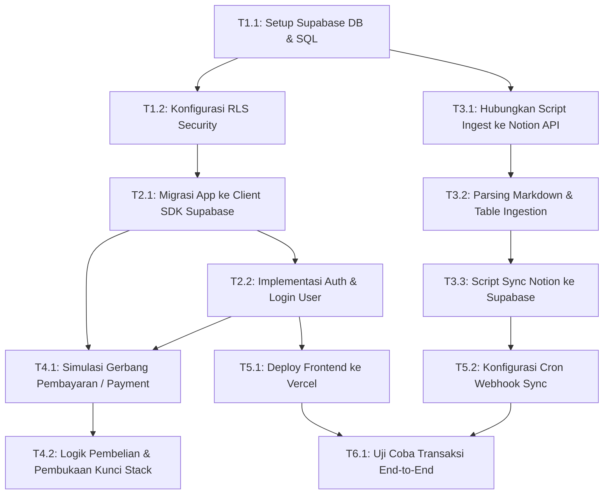

# Roadmap & Task Dependencies: StudiOS

Dokumen ini mendefinisikan rencana pengerjaan teknis proyek **StudiOS** dari fase purwarupa lokal (MVP) menuju platform full-stack terintegrasi awan (Supabase + Notion Sync + Pembayaran).

---

## 🗺️ Alur Ketergantungan Tugas (Dependency Map)

---

## 📋 Daftar Tugas & Kualifikasi Berurutan

### Phase 1: Database & Security (Prasarana)
| Task ID | Nama Tugas | Deskripsi Teknis | Prasyarat (Depends On) | Status |
|---|---|---|---|---|
| **T1.1** | Setup Supabase & Skema DDL | Membuat proyek baru di Supabase dan mengeksekusi DDL tabel `stacks`, `content_items`, `flashcards`, `references`, dan `purchases` di SQL Editor. | - | `[ ]` |
| **T1.2** | Konfigurasi Row Level Security (RLS) | Menulis kebijakan RLS untuk membatasi pembacaan isi tabel `content_items` hanya bagi pengguna yang terdaftar di tabel `purchases` (atau untuk konten free). | **T1.1** | `[ ]` |

### Phase 2: Integrasi Frontend ke Supabase
| Task ID | Nama Tugas | Deskripsi Teknis | Prasyarat (Depends On) | Status |
|---|---|---|---|---|
| **T2.1** | Integrasi Client SDK Supabase | Menginstal `@supabase/supabase-js`, mengganti pemanggilan `mockData.js` di `App.jsx` dengan fungsi `select()` dinamis dari database Supabase. | **T1.1** | `[ ]` |
| **T2.2** | Implementasi Login & Registrasi | Membuat halaman login/register minimalis menggunakan Supabase Auth (email/password atau Google Sign-In) untuk menetapkan identitas `user_id`. | **T2.1** | `[ ]` |

### Phase 3: Notion Sync Engine
| Task ID | Nama Tugas | Deskripsi Teknis | Prasyarat (Depends On) | Status |
|---|---|---|---|---|
| **T3.1** | Setup Kredensial Notion API | Membuat integrasi internal di Notion, membagikan database Stacks & Content ke integrasi tersebut, dan menyimpan Notion Token di berkas `.env`. | - | `[ ]` |
| **T3.2** | Pembuatan Script Parser Markdown | Menulis modul parser untuk mengubah properti kaya Notion dan teks markdown/tabel menjadi format JSONB yang sesuai untuk di-ingest. | **T3.1** | `[ ]` |
| **T3.3** | Script Sync Otomatis (`sync.js`) | Menulis skrip Node yang melakukan UPSERT (insert/update) data dari Notion ke tabel Supabase PostgreSQL. | **T3.2**, **T1.1** | `[ ]` |

### Phase 4: Sistem Monetisasi & Akses Premium
| Task ID | Nama Tugas | Deskripsi Teknis | Prasyarat (Depends On) | Status |
|---|---|---|---|---|
| **T4.1** | Integrasi Simulator Payment Gateway | Menyiapkan webhook dan API endpoint penanganan pembayaran (menggunakan Midtrans / Xendit Sandbox atau tombol beli dummy dengan validasi token). | **T2.2** | `[ ]` |
| **T4.2** | Webhook Pembukaan Kunci (Unlock Stack) | Menulis fungsi webhook di backend (atau Supabase Edge Functions) untuk secara otomatis melakukan insert baris ke tabel `purchases` setelah pembayaran sukses. | **T4.1**, **T1.2** | `[ ]` |

### Phase 5: Deployment & Otomatisasi Produksi
| Task ID | Nama Tugas | Deskripsi Teknis | Prasyarat (Depends On) | Status |
|---|---|---|---|---|
| **T5.1** | Deploy ke Vercel | Menghubungkan repositori GitHub ke Vercel, menyetel Environment Variables (Supabase URL, Anon Key), dan melakukan deployment langsung. | **T2.2** | `[ ]` |
| **T5.2** | Otomatisasi Sync scheduler (Cron) | Mengatur GitHub Actions untuk menjalankan `npm run sync` setiap jam/hari untuk sinkronisasi otomatis dari Notion. | **T3.3** | `[ ]` |

### Phase 6: Validasi Akhir (End-to-End)
| Task ID | Nama Tugas | Deskripsi Teknis | Prasyarat (Depends On) | Status |
|---|---|---|---|---|
| **T6.1** | Uji Coba Penuh | Menguji alur: Pembelian stack berbayar ➔ Pembayaran sukses ➔ Akun user terbuka kuncinya ➔ Konten terenkripsi Supabase terunduh lancar. | **T5.1**, **T5.2**, **T4.2** | `[ ]` |
