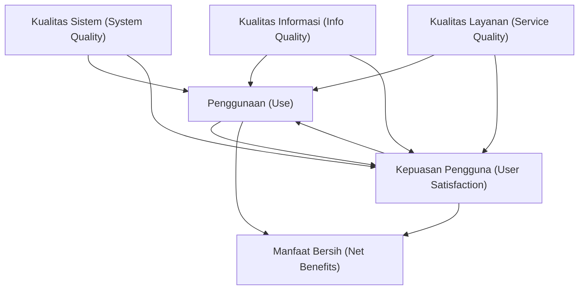

# 📊 Model Kesuksesan Sistem Informasi DeLone & McLean

Model Kesuksesan Sistem Informasi DeLone & McLean (*DeLone & McLean Information Systems Success Model*) dikembangkan oleh William H. DeLone dan Ephraim R. McLean pada tahun 1992, dan disempurnakan pada tahun 2003. Model ini merupakan kerangka kerja teoretis yang sangat populer untuk mengevaluasi efektivitas dan keberhasilan suatu Sistem Informasi Manajemen (SIM) dalam organisasi.

## 6 Dimensi Kesuksesan (Versi 2003)

Model DeLone & McLean mengusulkan enam dimensi pengukuran kesuksesan yang saling berkaitan secara interaktif:

### 1. Kualitas Sistem (*System Quality*)
Karakteristik teknis dari sistem informasi itu sendiri.
* **Fokus**: Keandalan server (*system reliability*), kecepatan respon, kemudahan navigasi, keamanan data, dan integrasi antar-modul.
* **Kasus SAKTI**: Kendala teknis berupa server mati (*downtime*) saat rekonsiliasi bulanan atau penguncian pagu merupakan isu utama dalam Kualitas Sistem.

### 2. Kualitas Informasi (*Information Quality*)
Karakteristik keluaran (*output*) berupa informasi atau laporan yang dihasilkan oleh sistem.
* **Fokus**: Akurasi angka, kelengkapan rincian transaksi, ketepatan waktu penyajian, serta relevansi format laporan dengan standar eksternal.
* **Kasus SAKTI**: Keandalan saldo akun keuangan dan otomatisasi pembentukan neraca serta Catatan atas Laporan Keuangan ([[Standar_Akuntansi_Pemerintah]]).

### 3. Kualitas Layanan (*Service Quality*)
Kualitas dukungan yang diterima oleh pengguna dari pengembang atau tim operasional bantuan teknis.
* **Fokus**: Kecepatan respons helpdesk, kompetensi teknis staf pendukung, ketersediaan materi panduan/pelatihan.
* **Kasus SAKTI**: Peran helpdesk KPPN Pontianak dan aplikasi tiket HAI DJPb dalam menangani kendala teknis satker.

### 4. Penggunaan (*Use*) & Kepuasan Pengguna (*User Satisfaction*)
* **Penggunaan**: Intensitas dan frekuensi interaksi pengguna dengan sistem.
* **Kepuasan Pengguna**: Respon emosional/sikap positif pengguna setelah menggunakan sistem informasi.

### 5. Manfaat Bersih (*Net Benefits*)
Dampak sistem terhadap kinerja pengguna secara personal dan organisasi secara keseluruhan.
* **Fokus**: Efisiensi kerja, akuntabilitas, transparansi, peningkatan kapasitas penyerapan anggaran, dan peningkatan nilai kinerja pelaksanaan anggaran ([[IKPA]]).
