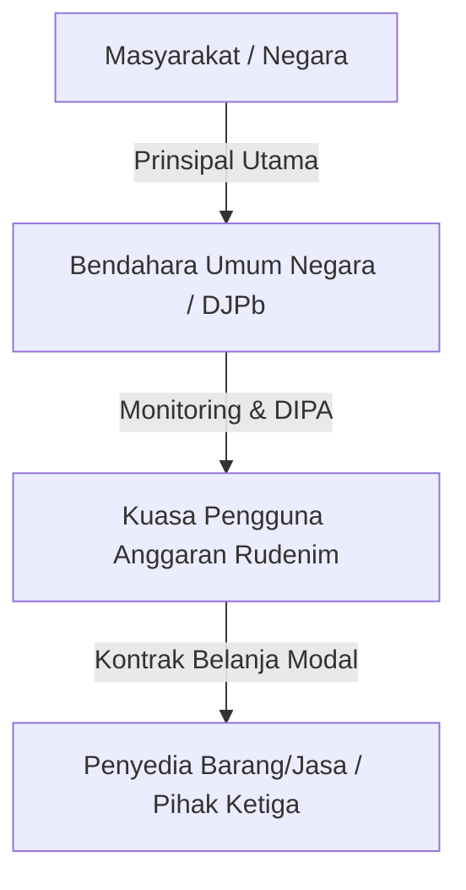

# 📊 Teori Keagenan (Agency Theory)

Teori Keagenan (*Agency Theory*) menjelaskan hubungan kontraktual antara **prinsipal (principal)** yang mendelegasikan wewenang pengambilan keputusan dan **agen (agent)** yang ditunjuk untuk melaksanakan tugas atas nama prinsipal (Jensen & Meckling, 1976).

## Penerapan dalam Skripsi Rudenim Pontianak
Dalam konteks tata kelola anggaran sektor publik di Indonesia, teori ini diadaptasi untuk menggambarkan rantai hubungan keagenan berlapis (*multilevel agency chain* — Lane, 2003):

### 1. BUN (DJPb) sebagai Prinsipal & Satker sebagai Agen
* **Mekanisme Kontrol**: Prinsipal menggunakan instrumen [[DIPA_Halaman_III]] dan penilaian [[IKPA]] untuk mengawasi kepatuhan dan presisi pelaksanaan anggaran oleh agen.
* **Agency Problem**: Terjadi akibat adanya **asimetri informasi**. Satker memiliki informasi operasional lapangan yang tidak diketahui oleh KPPN/DJPb secara real-time. Hal ini sering menimbulkan penyusunan RPD yang tidak realistis (moral hazard/adverse selection) sehingga memicu [[Deviasi_Anggaran]].

### 2. Satker sebagai Prinsipal & Penyedia (Kontraktor) sebagai Agen
* **Mekanisme Kontrol**: Ditandai dengan ikatan kontrak pengadaan barang/jasa (Perpres 16/2018 jo. Perpres 12/2021).
* **Agency Problem**: Keterlambatan kontraktor dalam menyelesaikan fisik bangunan atau melengkapi dokumen serah terima Berita Acara Serah Terima (BAST) memaksa termin pembayaran mundur dari jadwal RPD awal. Kontraktor bertindak oportunistik atau mengalami kendala kapasitas internal, yang menyebabkan satker menanggung *agency cost* berupa turunnya nilai kinerja [[IKPA]].
